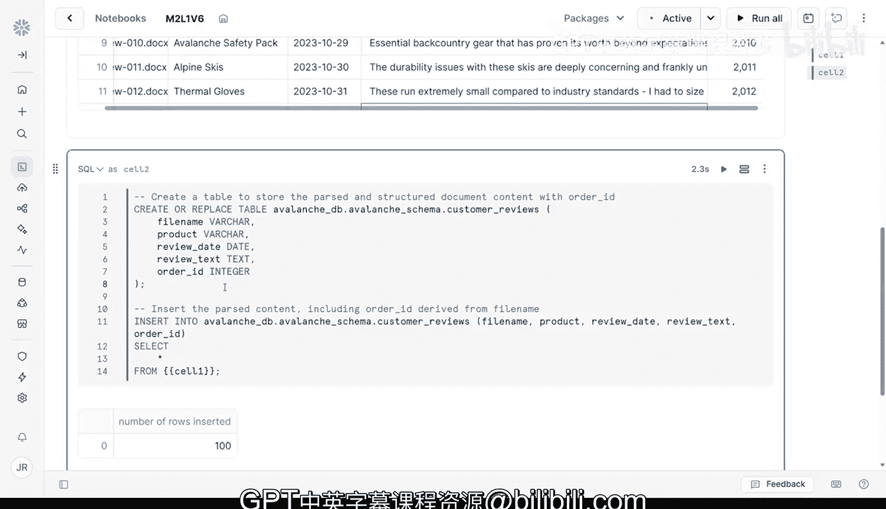

#  025：从内容中提取信息

在本节课中，我们将学习如何从上一节创建的原始内容表格中，提取出产品名称、评论日期和评论内容等具体信息，并将其整理成一个名为“customer reviews”的新表格。我们将使用 SQL 和正则表达式来完成这项任务。

上一节我们介绍了如何从上传的 docx 文件中提取原始内容并创建表格。本节中，我们来看看如何清理这些数据，提取出有价值的结构化信息。

你可以使用 Snowflake Notebook，通过 Python 或 SQL 来解析这些数据。由于所有 docx 文件的文本格式一致，这使得正则表达式特别有用。我们将使用 SQL 代码进行演示，因为它通常比 Python 处理得更快。你可以定义一个模式，然后将其应用到每一行数据。

以下是提取各项信息的具体步骤：

首先，提取产品名称。我们将使用正则表达式函数 `REGEXP_SUBSTR` 来搜索“product”这个词，然后捕获其后直到下一个换行符的所有内容。这样就能得到干净的产品名称。

接下来，提取评论日期。同样使用 `REGEXP_SUBSTR` 函数，但这次我们寻找一个特定的日期模式，例如 `yyyymmdd` 格式（如 20231013）。

然后，提取评论内容本身。这里我们将使用一个 `CASE` 语句来检查内容中是否存在“customer review”字样。如果存在，则提取其后的文本；如果不存在，则留空。

现在，进行一点创造性的处理。每个文件名中都包含一个三位数的编号。由于这些文件来自“batch2”，我们将通过在每个文件编号前加上数字“2”来创建一个唯一的 ID。这个 ID 将有助于后续将评论与发货记录关联起来。例如，如果文件编号是 045，那么唯一 ID 就变成 2045。

编写完整的 SQL 查询后，你可以在原始客户评论表上运行它，将数据整理成清晰的列，为分析做好准备。

现在到了最重要的部分：将结果保存为 Snowflake 上的一个表，以便后续使用。为此，你可以简单地添加一个 `CREATE TABLE` 语句。运行这个单元后，你将得到一个清理后的客户评论表，可以在下游任务中使用。

做得很好！在上一节中，你从一堆压缩的非结构化文件开始。现在，你已经有了一个名为“customer reviews”的、干净且可查询的表格，随时可以进行分析了。在下一节中，我们将切换数据集，开始探索可用的发货日志，为情感分析增加更多深度。

本节课中我们一起学习了如何使用 SQL 和正则表达式从原始文本中提取结构化信息，并创建了一个清晰、可查询的数据表，为后续的数据分析工作奠定了基础。