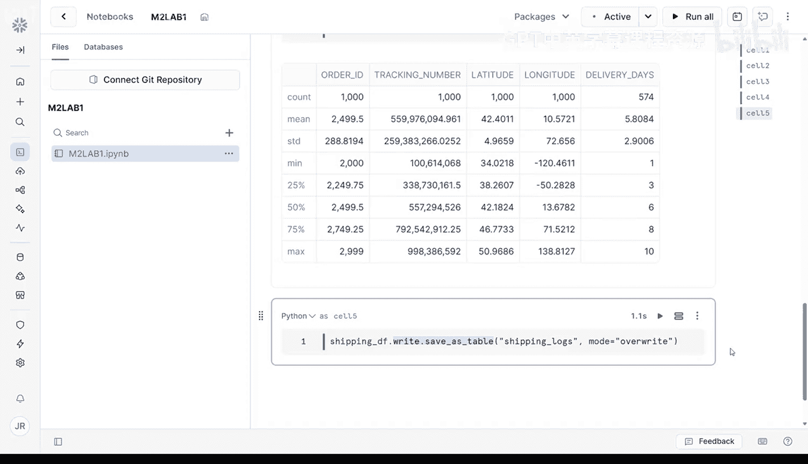

#  026：雪崩运输分析系统 🚚

## 概述
在本节课中，我们将学习如何将雪崩公司的运输日志数据上传至 Snowflake 平台，并进行数据验证、加载和清洗，为后续与客户评论数据结合分析做准备。

欢迎来到雪崩运输实验。在之前的视频中，你已经学习了如何上传单个文件以及在 Snowflake 中暂存批量数据。现在，是时候将这些技能整合到一个真实场景中了。本次实验，你将处理雪崩公司的运输日志。客户评论帮助你了解用户对销售商品的看法，而运输数据则帮助你理解配送如何影响用户情绪。将两者结合，你将获得强大的跨职能洞察力，帮助团队做出更明智的决策。

在本实验中，你将处理一个结构化的 CSV 文件，其中包含雪崩公司的运输操作日志。每一行代表一次货运，其中一些可能存在配送问题，这些问题可能与差评相关联。

让我们开始吧。


## 实验准备与数据上传


上一节我们介绍了实验的目标和数据背景，本节中我们来看看如何准备环境并上传数据。

你已获得一个名为 `shippinglogs.csv` 的 CSV 文件，其中包含雪崩公司的运输操作日志。你的任务是将该文件上传到雪崩公司的 `avalanche_stage` 暂存区，验证内容，将其加载到 Snowflake 表中，并准备清洗数据，以便在下一个实验中与客户评论结合。你可以在课程 GitHub 仓库中找到本实验所需的一切资源。

本实验假设你已经创建了 `avalanche_db` 数据库、`avalanche` 模式和 `avalanche_stage` 暂存区。如果尚未创建，请返回之前的视频，完成这些步骤后再继续。

回到 Snowsight 主页，首先将运输日志 CSV 文件从本地计算机上传到你的 Snowflake 账户，方法与上传客户评论 CSV 文件时相同。这次会更容易，因为你已经创建了数据库、模式和暂存区。

在 Snowsight 主页屏幕，点击左侧导航菜单的加号按钮，选择最后一个选项“添加数据”。在弹出的窗口中，你会看到一个将文件加载到暂存区的选项。在将数据集转换为表之前，你需要先清理数据。

接下来，将 `shippinglogs.csv` 文件拖放或浏览到你计算机上的下载位置。选择 `avalanche` 数据库、模式和暂存区，然后点击上传。

## 验证数据与加载到 Snowpark DataFrame

文件上传完成后，通过运行一个快速 SQL 语句来确认其存在。点击右上角的“项目”，然后点击“笔记本”。点击“+ 笔记本”打开一个新的 Snowflake 笔记本。为笔记本命名，选择 `avalanche` 数据库和模式，其他选项保持默认。为其命名，例如“testing”，然后点击“+SQL”添加一个新的 SQL 单元格。复制并运行以下命令：

```sql
LIST @avalanche_stage;
```

这将列出当前存储在暂存区中的所有文件。如果你看到 `shippinglogs.csv`，说明上传成功。

接下来，在你的 Snowflake 笔记本中，添加一个 Python 单元格并粘贴以下代码：

```python
# 从暂存区读取数据到 Snowpark DataFrame
df = session.read.options({"field_delimiter": ",", "skip_header": 1}).csv('@avalanche_stage/shippinglogs.csv')
df.show()
```

`session` 是激活的会话，它将你的笔记本连接到 Snowflake 计算会话。`field_delimiter` 指定字段分隔符为逗号。`skip_header`: 1 告诉 Snowpark 文件的第一行是列名，不是数据。`df.show()` 为你提供数据预览，类似于 pandas 中的 `df.head()` 函数。

点击运行。干得漂亮！现在，运输数据已经加载到 Snowpark DataFrame 中。你可以使用 Python 和 Snowpark 来清洗和探索 DataFrame 中的数据。

## 数据清洗与探索

在数据预览中，你可以看到列名周围有引号。你可以通过使用别名重命名列来轻松修复这个问题，如下所示：

```python
# 清洗列名：去除引号
df_cleaned = df.selectExpr(
    "`\"shipment_id\"` as shipment_id",
    "`\"carrier\"` as carrier",
    "`\"ship_date\"` as ship_date",
    "`\"delivery_status\"` as delivery_status",
    "`\"delivery_days\"` as delivery_days"
)
df_cleaned.show()
```

Snowpark 会完全按照文件中的样子加载列名，包括引号、大写字母和空格。通过使用 `selectExpr` 和别名，你正在使用 Snowflake 的 SQL 方言直接编辑列名。

列名清洗完毕后，你可以进行一些操作，例如统计每个承运商处理的货运数量，或者切换到 pandas 进行快速原型设计。通常，在本地处理较小数据集时使用 pandas，当你希望进行可扩展的平台分析时使用 Snowpark，这是一个好主意。

利用这段时间清洗数据，检查空值，确保度量单位合理，并执行你通常为准备数据所做的任何其他操作。如果你需要帮助，可以与你喜欢的 AI 助手协作。

## 保存清洗后的数据到表

当你的 DataFrame 看起来没问题后，使用 `df.write.save_as_table` 函数将其保存到一个新表中。

```python
# 将清洗后的 DataFrame 保存为 Snowflake 表
df_cleaned.write.mode("overwrite").save_as_table("cleaned_shipping_logs")
```

这将永久地将你清洗后的运输日志 DataFrame 注册为 `avalanche` 数据库内的一个表。之后，它可以使用 SQL 进行查询、与其他表连接、流入应用程序或发送到 Cortex 进行生成式 AI 分析。

恭喜！你现在已经能够向 Snowflake 读写数据了。本实验将使你为 MVP 构建计划的下一步做好准备：进行最终的数据准备和情感分析。

如果你遇到困难，解决方案在课程 GitHub 仓库的 `M2_lab_1` 中。祝你好运，我们下个视频见。




## 总结
本节课中我们一起学习了如何将 CSV 格式的运输日志数据上传到 Snowflake 暂存区，使用 Snowpark DataFrame 加载和预览数据，清洗数据（如重命名列），以及最终将清洗后的数据保存为 Snowflake 中的永久表。这些步骤为后续结合客户评论数据进行跨职能分析奠定了坚实的基础。