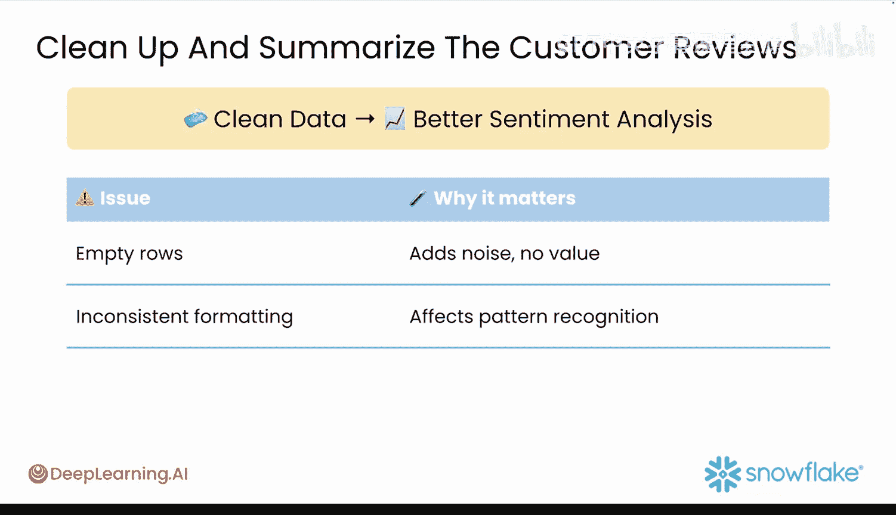
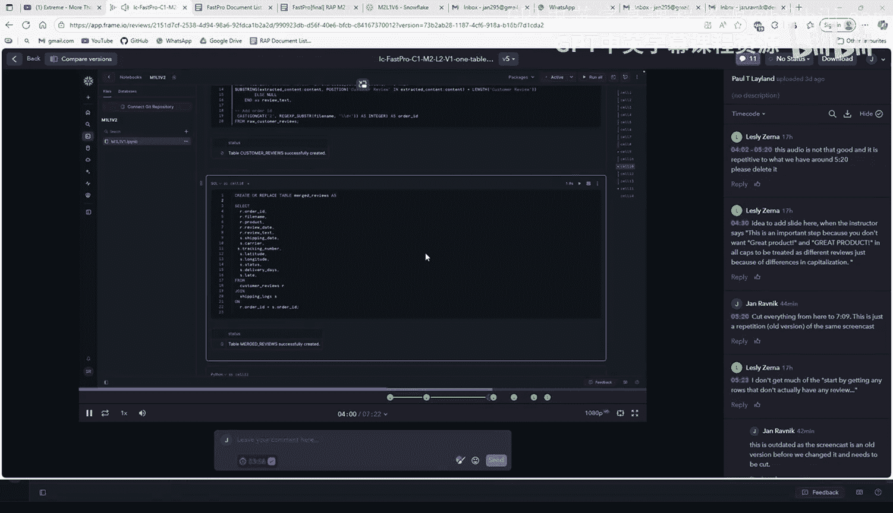
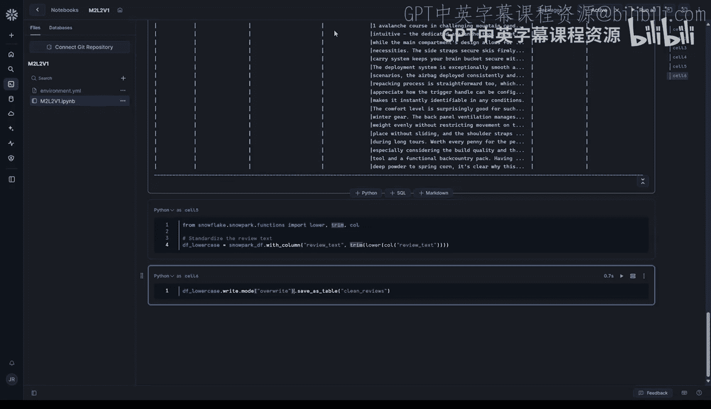

#  027：统一数据表架构 🧩

在本节课中，我们将学习如何将客户评论和物流日志两个数据集合并，并进行清理，为后续的情感分析做好准备。这是构建MVP路线图中的第三步。

上一节我们完成了数据的上传和初步清理。本节中，我们将使用SQL和Snowflake Cortex工具，将两个表格合并成一个统一的数据集，并对文本数据进行标准化处理。

## 准备工作与数据预览

在开始合并数据之前，我们需要先了解现有表格的结构。以下是查看表格预览的步骤。


打开一个Snowflake笔记本，并运行SQL来预览`customer_reviews`和`shipping_logs`表。你可以使用类似以下的提示词向你的生成式AI助手寻求帮助：

```sql
-- 预览客户评论表
SELECT * FROM customer_reviews LIMIT 5;
-- 预览物流日志表
SELECT * FROM shipping_logs LIMIT 5;
```

运行这些代码可以帮你回忆每个表中的列名和其他有用细节，类似于Pandas的`describe`方法。

## 合并客户评论与物流日志

现在，我们将通过`order_id`这个共同字段，把两个表格连接起来。以下是实现这一目标的方法。

向你的AI助手请求帮助，生成合并表格的SQL代码。一个有效的提示词示例如下：

```sql
-- 合并两个表格的SQL示例
SELECT 
    cr.review_text,
    sl.shipping_date,
    sl.carrier,
    sl.status
FROM customer_reviews cr
JOIN shipping_logs sl ON cr.order_id = sl.order_id;
```

如果首次尝试不成功，请将错误信息复制给你的AI助手，它将帮助你进行故障排查。合并后，你可以使用`SELECT * FROM merged_review LIMIT 10;`来检查前10行数据，确保合并操作正确无误。

## 清理与标准化评论文本

虽然生成式AI模型能处理各种数据，但输入数据的质量直接影响分析结果的准确性。因此，在进行分析前，对文本数据进行清理至关重要。以下是清理步骤。

首先，将合并后的表格转换为Snowpark DataFrame。然后，应用`lower`函数将`review_text`列中的所有文本转换为小写，以确保后续文本搜索和匹配的一致性。

```python
# 将文本转换为小写
df_cleaned = merged_df.withColumn(‘review_text_lower’, lower(col(‘review_text’)))
```

接下来，使用`trim`函数去除每条评论开头和结尾可能存在的多余空格。这一步很重要，能避免因格式不一致导致的错误分析。

```python
# 去除首尾空格
df_cleaned = df_cleaned.withColumn(‘review_text_trimmed’, trim(col(‘review_text_lower’)))
```

## 保存清理后的数据集

完成清理后，我们需要将处理好的数据保存下来，供后续分析使用。以下是保存数据的步骤。





以下代码行将在Snowflake中创建一个名为`cleaned_reviews`的新表来存储清理后的数据。`mode=‘overwrite’`参数意味着如果存在同名表，它将被覆盖。请谨慎使用此参数，以免意外覆盖需要保留的数据表。

```python
# 将清理后的DataFrame保存为新表
df_cleaned.write.mode(‘overwrite’).saveAsTable(‘cleaned_reviews’)
```

运行此代码块后，你就拥有了一个干净、规整的数据集，可以随时用于任何分析任务。



## 总结


本节课中，我们一起学习了数据准备流程的关键一步：**统一数据架构**。我们回顾了如何预览表格结构，使用SQL通过`order_id`合并`customer_reviews`和`shipping_logs`表，并对评论文本进行了小写转换和空格修剪的标准化清理。最后，我们将清理后的数据集保存为`cleaned_reviews`表。现在，你的数据已经准备就绪，为下一步引入生成式AI进行情感分析奠定了坚实的基础。