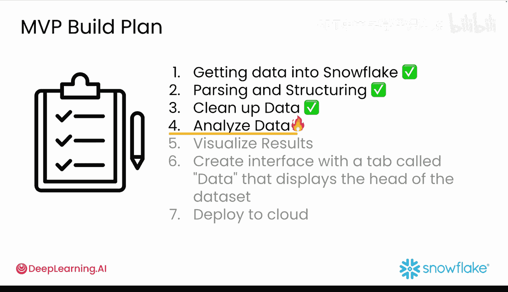
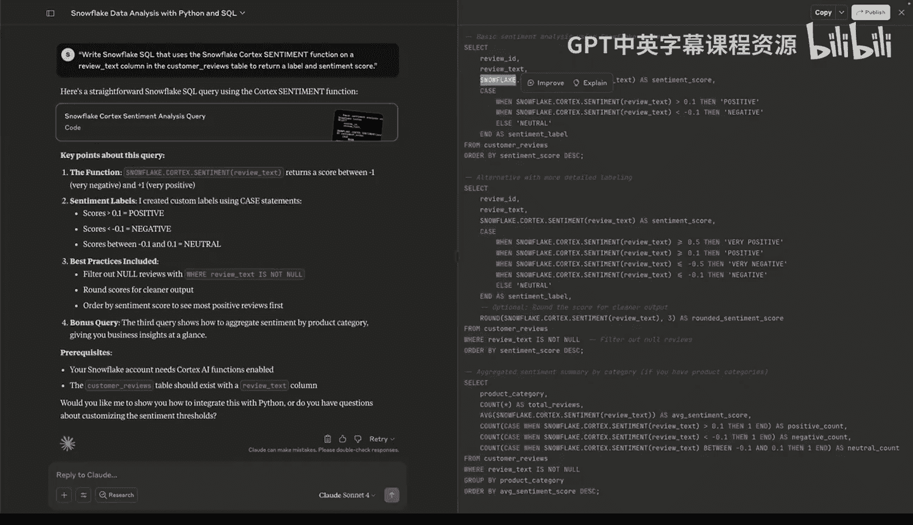
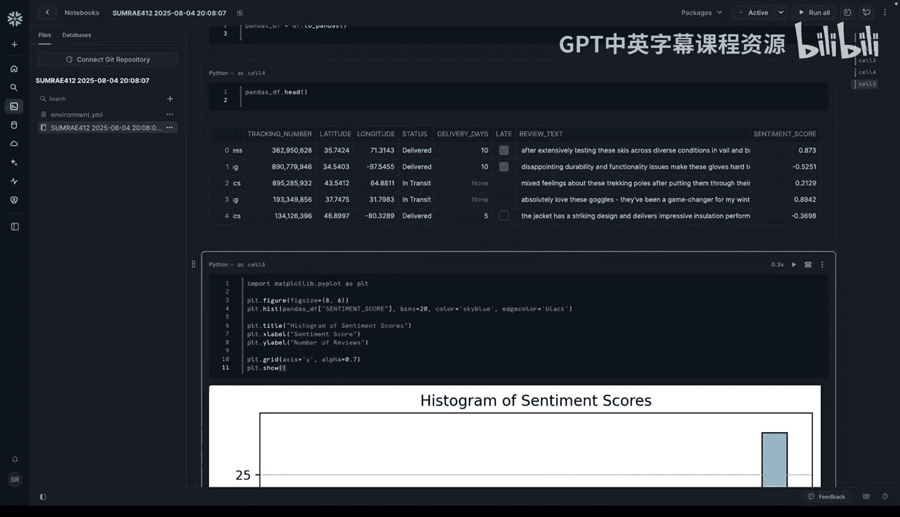
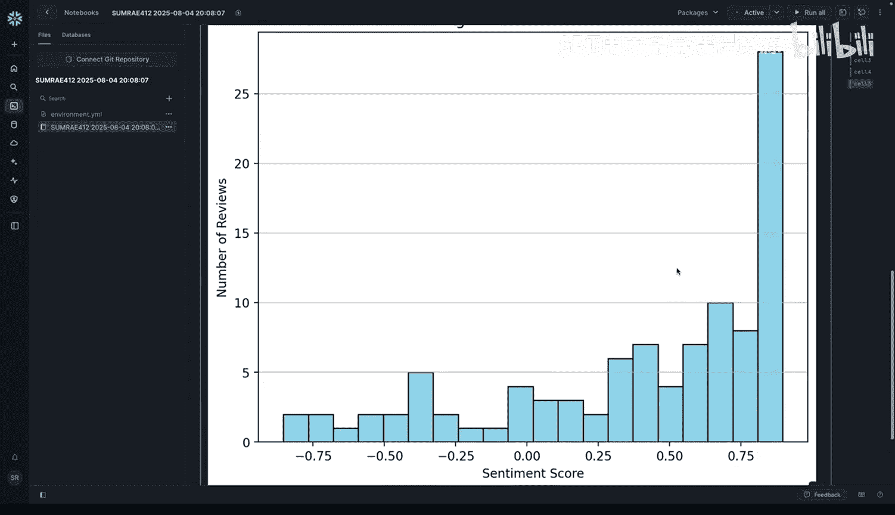

#  028：基于Cortex的舆情分析 📊

在本节课中，我们将学习如何利用 Snowflake Cortex 函数对客户评论进行情感分析，从而避免手动编写复杂的分析代码。我们将借助生成式 AI 工具来加速工作流程，并回顾我们的 MVP 计划进度。

## 概述

本节视频将引导我们完成数据分析的第四步。由于数据已经过清洗和预处理，本项目将进展得很快。我们将使用 Snowflake Notebook 和 Cortex 函数来高效地计算情感得分。

## 开始分析

首先，我们需要在 Snowsight 中打开一个新的 Snowflake Notebook。请确保已选择 `Avalanche DB` 数据库和 `avalanche` 模式，其他设置保持默认即可。

运行第一个代码块以实例化您的 Snowflake 会话。

```python
# 实例化 Snowflake 会话
session = snowflake.snowpark.Session.builder.configs(connection_parameters).create()
```

接着，删除 Notebook 中默认的两个代码块，准备工作就完成了。

## 借助生成式 AI 选择 Cortex 函数


现在，是时候请您的生成式 AI 助手来帮助选择用于情感评分的 Cortex 函数了。




首先，通过如下声明设定 AI 的角色：
“你是一位精通 Python 和 SQL 集成的 Snowflake 数据平台专家。你的职责是通过提供最直接、对初学者友好的解决方案，来教授如何使用 Snowflake 进行数据分析。”

然后，使用如下提示词来获取情感评分：
“请编写 Snowflake SQL，对 `customer_review` 表中的 `review_text` 列使用 `snowflake.cortex.sentiment` 函数，以返回情感标签和得分。”

您将获得一个类似以下的查询：

```sql
SELECT
    REVIEW_TEXT,
    SNOWFLAKE.CORTEX.SENTIMENT(REVIEW_TEXT) as SENTIMENT_SCORE
FROM CUSTOMER_REVIEWS;
```

这是为您的数据框获取情感得分最直接的方法。此处，Cortex 的 `sentiment` 函数处理 `review_text` 列，并为每条评论返回一个情感得分。

## 执行查询并查看结果

您可以在 Notebook 中使用一行代码运行此查询，并将结果加载到 Pandas 数据框中。

```python
# 将 SQL 查询结果加载到 Pandas DataFrame
sentiment_df = session.sql("""
    SELECT
        REVIEW_TEXT,
        SNOWFLAKE.CORTEX.SENTIMENT(REVIEW_TEXT) as SENTIMENT_SCORE
    FROM CUSTOMER_REVIEWS
""").to_pandas()
```

然后，您可以使用 Pandas 的 `head()` 函数查看结果。

```python
# 查看前几行结果
print(sentiment_df.head())
```



生成的数据框包含原始评论文本以及每条评论的情感得分。此操作非常快速，因为 Cortex 在 Snowflake 内部进行了大规模并行处理。

## 可视化得分分布

获得情感得分后，我们可以轻松地使用 Matplotlib 的直方图来可视化得分分布。

```python
import matplotlib.pyplot as plt

# 绘制情感得分直方图
plt.hist(sentiment_df[‘SENTIMENT_SCORE‘], bins=20, edgecolor=‘black‘)
plt.title(‘Distribution of Sentiment Scores‘)
plt.xlabel(‘Sentiment Score‘)
plt.ylabel(‘Frequency‘)
plt.show()
```

如果遇到 “Module not found error”，我们需要安装 Matplotlib 包。

以下是安装步骤：
1.  点击 Notebook 右上角的 “Packages”。
2.  在弹出的下拉菜单中，保持选择为 “Anaconda packages only”。（仅当需要手动安装某些内容，而不是使用 Pip 或 Conda 时，才使用 “Stage packages”）
3.  在搜索栏中搜索您想安装的包，例如 `matplotlib`。
4.  找到包后，它会显示在待安装列表中，点击 “Save” 即可。

安装完成后，返回并重新运行上述代码块。





## 保存工作成果

现在，是时候保存您的工作了。以下代码行将在 Snowflake 中创建一个新表来存储结果。

```python
# 将带有情感得分的结果保存回 Snowflake 表
session.write_pandas(sentiment_df, ‘CUSTOMER_REVIEWS_WITH_SENTIMENT‘, auto_create_table=True)
```

## 生成式 AI 的辅助作用

在整个过程中，生成式 AI 可以在以下方面为您提供帮助：
*   **探索功能**：询问 Cortex 中有哪些可用的函数。
*   **编写与调试**：协助编写和调试 Python 代码。
*   **数据解析**：从复杂字段中解析和提取数据。
*   **结果可视化**：在 Matplotlib 或 Seaborn 中可视化输出。
*   **问题处理**：建议错误处理或模型替代方案。

## 总结


在本节课中，我们使用生成式 AI 来生成代码，利用 Cortex 的 `sentiment` 函数为评论评分，并使用 Matplotlib 将结果可视化。接下来，我们将继续与生成式 AI 协作，为您的 Avalanche 应用添加更多可视化和交互功能。