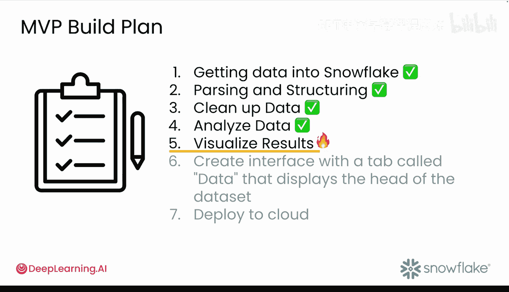
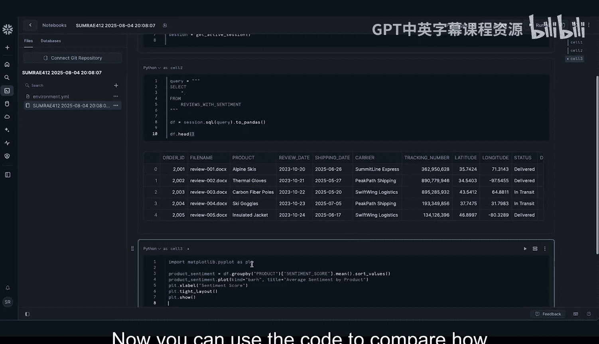
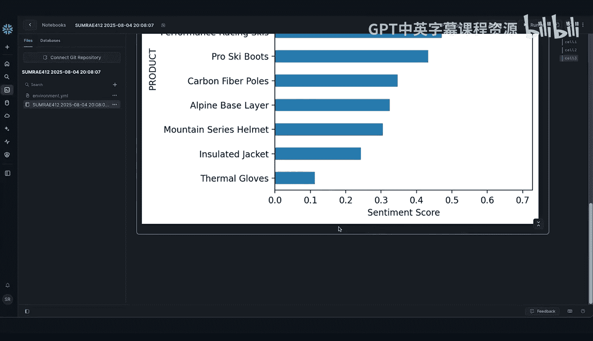
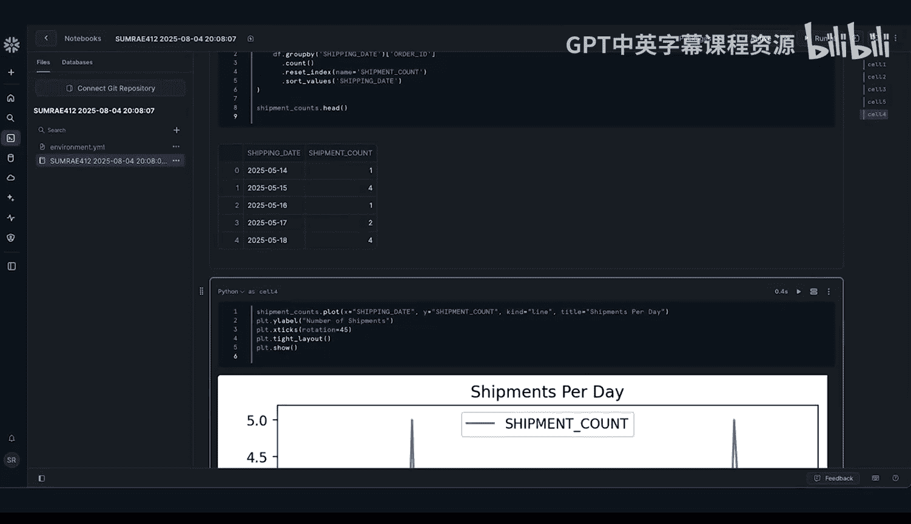
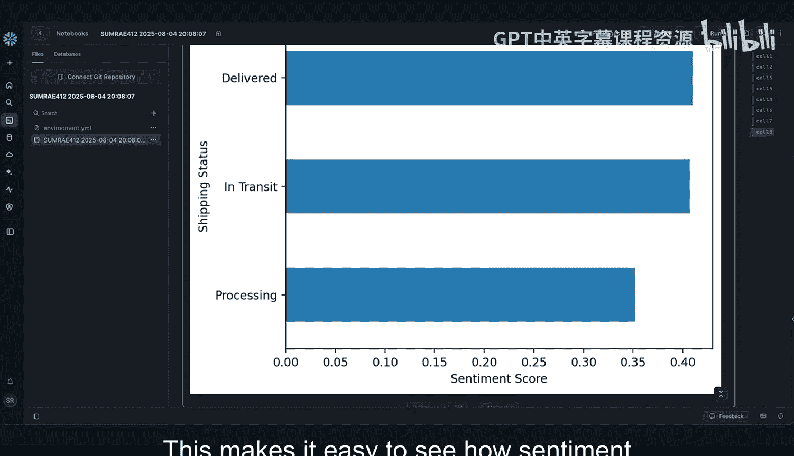

#  029：29_02_03_Snowflake数据可视化 📊

在本节课中，我们将学习如何利用AI大规模分析情感数据，以发现人工难以察觉的趋势。通过将原始情感数据转化为可视化的洞察，为团队提供可操作的决策依据。

## 概述

上一节我们完成了数据分析，现在进入第五步：数据可视化探索。本节的目标是将数字化的洞察转化为易于理解和行动的故事。

## 从构思到实现

首先，我们可以向生成式AI助手提问，以获取可视化图表构思。例如，可以询问：“我可以从Avalanche客户评论和物流日志中创建哪些类型的图表？”

以下是可能得到的建议：
*   创建情感标签数量的条形图。
*   制作随时间变化的平均情感得分折线图。
*   绘制物流时间与情感得分的散点图。
*   按承运商或地区制作分组条形图。

为了保持原型简洁，建议从一两个图表开始。

## 按产品分组情感得分



打开一个新的笔记本，初始化你的Snowflake会话，并使用以下查询来获取带有情感得分的评论数据。

```python
# 示例查询代码
query = “SELECT product_id, sentiment_score FROM merged_reviews_table”
```

由于在之前的视频中我们已经用直方图可视化过情感得分，这次让我们按产品来细分情感得分。为了快速获得代码，可以向AI助手提问：“如何按产品分组情感得分？”

现在，你可以使用生成的代码来比较客户对不同产品的感受。

## 可视化物流模式与异常

接下来，请AI助手帮助你使用时序图来可视化物流模式和异常情况。你应该能得到类似以下的代码。

```python
# 示例：绘制物流量的时序图
import matplotlib.pyplot as plt
plt.figure(figsize=(12, 6))
plt.plot(shipping_data[‘date’], shipping_data[‘volume’], marker=‘o’)
plt.title(‘Shipping Volume Over Time’)
plt.xlabel(‘Date’)
plt.ylabel(‘Volume’)
plt.grid(True)
plt.show()
```

现在，与其用传统方式搜索异常，不如请AI助手帮你更深入地挖掘。可以使用这样的提示：“如何识别物流量低的日期？”



然后，你可以利用这个洞察来添加更多图表。例如，这个按承运商分组的图表。





## 探索物流对客户情感的影响

现在，我们可以利用合并后的评论和物流数据，来查看物流是否影响客户情感。

让我们提示AI助手创建一个条形图，展示不同物流状态下的平均情感得分。AI助手可能会建议使用以下代码，该代码使用`late`列按物流状态对数据集进行分组，然后计算每个组的平均情感得分。

```python
# 示例：按物流状态计算平均情感得分并绘图
import pandas as pd
import matplotlib.pyplot as plt

# 假设 df 是包含 ‘shipping_status’ 和 ‘sentiment_score’ 的 DataFrame
grouped_data = df.groupby(‘shipping_status’)[‘sentiment_score’].mean().sort_values()

plt.figure(figsize=(10, 6))
grouped_data.plot(kind=‘barh’)
plt.title(‘Average Sentiment Score by Shipping Status’)
plt.xlabel(‘Average Sentiment Score’)
plt.show()
```

为了对数据框进行排序，结果使用Matplotlib的水平条形图绘制，显示了按物流状态划分的平均情感得分。这使得我们很容易看出物流延迟如何影响情感得分。

## 总结

本节课中，我们一起学习了如何利用生成式AI助手快速构思并创建数据可视化图表。我们探索了按产品分析情感、识别物流异常，并揭示了物流状态与客户情感之间的关联。




接下来，你将把在本模块中学到的所有知识整合到一个Streamlit应用中，并可以在Snowflake内部运行和部署。