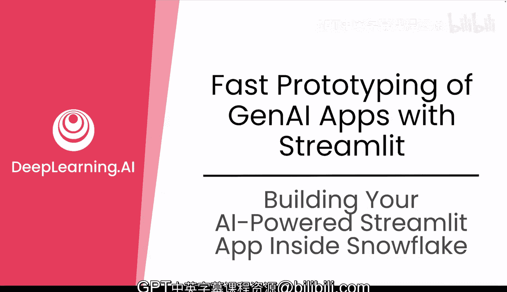
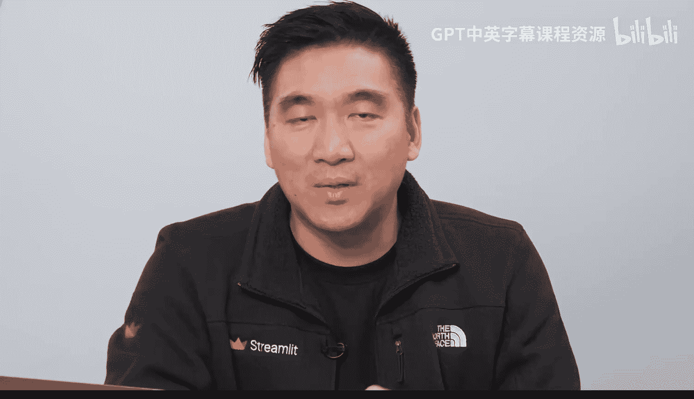
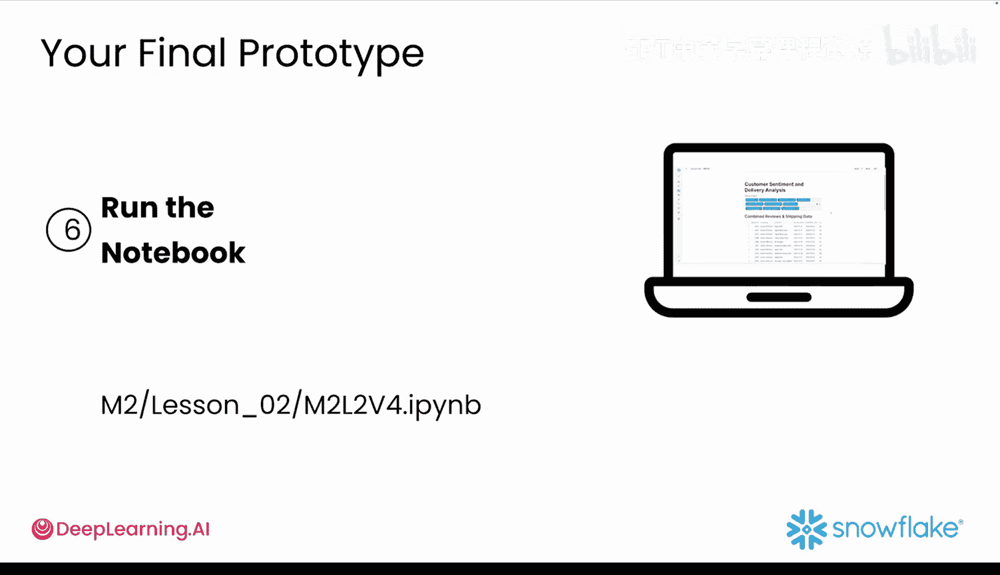
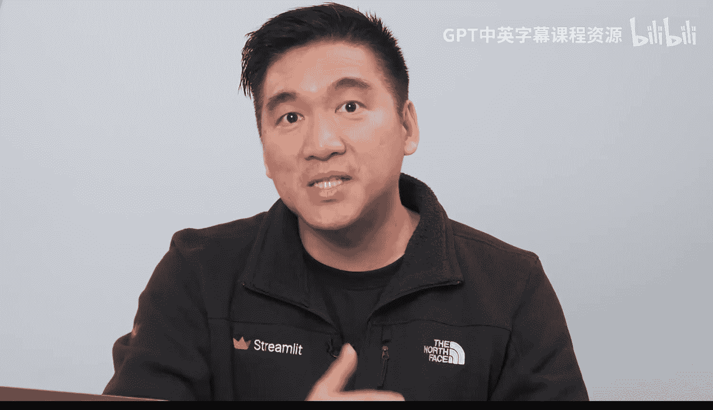

#  030：在 Snowflake 内构建 AI 驱动的 Streamlit 应用 🚀

## 概述
在本节课中，我们将综合运用模块二所学的全部知识，构建一个功能完整的 Streamlit 应用。这个应用将包含交互式筛选、数据可视化、情感分析以及一个基于数据的动态问答助手。

上一节我们通过 GenAI 对数据集进行了深入的可视化分析。本节中，我们将把所有组件整合起来，构建一个可交互的仪表盘。

## 创建应用环境
你已经快速推进了 MVP 构建计划，现在来到了第 6 步：创建仪表盘。这一步将最终整合你的原型，并准备将其发布以获取反馈。最困难的部分——数据摄取、清洗、分析和可视化——已经完成。现在是将原型变为现实的时候了。

你将在 Snowflake Notebook 中直接构建 Avalanche Streamlit 应用，也就是你一直工作的同一个环境。








创建一个新的 Notebook，并将其命名为类似 `Avalanche_app` 的名称。确保将其连接到现有的 Avalanche 数据库和模式，并指向合并了客户评论和运输数据的表。

## 构建基础应用框架
激动人心的部分来了。你将在一个 Notebook 单元格中编写整个 Streamlit 应用代码，运行后，一个完全交互式的 Web 应用将作为单元格输出出现。这就像魔法，但这个魔法技巧将变成一个可供人们使用的真实工具。

为了让事情变得简单，我们先创建一个基础的 Streamlit 外壳。你可以从之前的视频中复制粘贴代码，或者直接让 GenAI 帮助你。以下是你可以使用的提示词示例：

```python
# 提示词示例
write a streamlit app that loads a table on snowflake for sentiment analysis, show some basic stats, and add a title and sidebar.
```

你的 GenAI 应用将生成一个基础 Streamlit 应用的 Python 代码。将代码复制粘贴到你的 Notebook 中并运行单元格。如果出现问题，可以使用 GenAI 来调试或修改代码。你可以询问类似“help me fix this error”或“can you rewrite this function to avoid this error”的问题。持续测试和迭代，直到你的应用运行流畅。

## 集成可视化图表
接下来，你可以集成在之前课程中创建的图表。这些图表应包括每日运输量的折线图、情感分布的条形图，以及一些产品级别的统计数据或顶级产品细分图。

你可以让 GenAI 制作一个 Streamlit 折线图来显示运输量。将代码添加到你的应用中，图表看起来会类似下面的样子。你也可以让 GenAI 帮助处理坐标轴标签、图例，并使图表具有交互性。

## 添加交互式筛选器
现在，你可以使用 Streamlit 小组件来添加筛选器，使你的应用更具交互性和实用性。向 GenAI 提出以下提示：

```python
# 提示词示例
add a date and sentiment filter to my streamlit app.
```

它应该会返回类似下面的代码。现在，是时候通过使用 Cortex 来添加一个可以回答数据相关问题的聊天机器人，让你的应用变得更高级了。

## 集成 AI 问答助手
你可以让 GenAI 在 Streamlit 中编写一个聊天机器人，该机器人使用 Snowflake Cortex 来回答关于清理后的评论表的问题。你的 GenAI 应用很可能会返回类似下面的代码和调用。

为了在 Python 中使用 Cortex，你需要从 Notebook 的下拉菜单中安装一个 Snowflake ML Python 包。所以别忘了这一步。这将为你的用户提供一个友好的界面来提问，例如“product A 的平均情感得分是多少？”或“为什么在这个特定日期运输量减少了？”。

运行 Notebook，现在你的 GenAI 原型中就拥有了一个实时聊天机器人。

如果你在任何地方遇到困难，不用担心，你可以通过此链接在课程模块中找到代码。

## 总结
干得漂亮！你已经将情感分析变成了一个可工作的 Streamlit 原型。在下一个模块中，你将学习如何部署、分享你的应用，并根据用户反馈进行改进。你还将学习如何使用高级的 GenAI 提示技术来提升结果质量。

实验室见。😊







