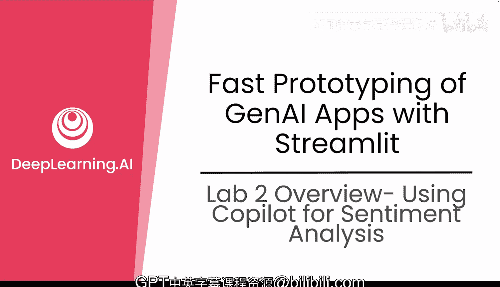
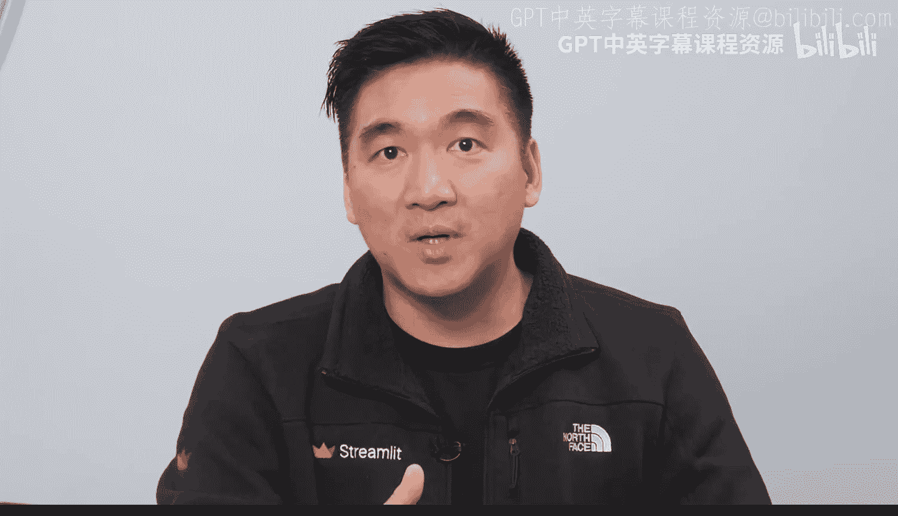

#  031：GenAI舆情分析系统概览 🚀

## 概述
在本节课中，我们将综合运用模块二所学的全部知识，构建一个全新的产品智能仪表盘。我们将为 Avalanche 产品团队开发一个工具，用于探索跨时间和地区的客户舆情、可视化运输延迟趋势，并支持自然语言提问。

## 实验任务概览
欢迎来到模块二的最终实验。这是您将所有学习成果融会贯通的地方。

您已经探索了如何使用 GenAI 分析数据，使用 Cortex 进行了情感分析，构建了可视化图表，甚至添加了聊天机器人。现在，您将以一种全新的方式应用这些技能。

您的任务是：为 Avalanche 的产品团队构建一个产品智能仪表盘。这个工具将帮助他们探索跨时间和地区的客户情感，可视化运输延迟和交付绩效的趋势，并提出自然语言问题。

## 与上节课的区别
与上一课不同，您不仅仅是重复已做过的内容。这次您将：
*   结合情感和运输数据，构建新的可视化图表。
*   构建一个按地理区域显示产品问题的筛选表格。
*   添加一个聊天机器人助手。
*   在整个过程中，您将重度依赖 GenAI。

## 实验步骤详解
以下是构建仪表盘的核心步骤。

### 第一步：连接数据源并加载数据
首先，连接 Snowflake 并加载数据。使用您现有的、结合了客户评论的数据集。

您可以向 GenAI 提问，例如：
> 请编写 Python 代码来连接 Snowflake，并将包含情感分析的评论表加载到 Pandas DataFrame 中。

### 第二步：创建 Streamlit 应用框架
现在，您可以创建一个新的 Streamlit 应用。启动一个新的 Notebook，并请求 GenAI 创建一个基础的 Streamlit 应用，该应用能够加载数据并包含一个带有产品筛选器的侧边栏。

为您的应用添加标题、侧边栏筛选器和数据预览。

### 第三步：添加可视化图表
接着，添加图表以按区域可视化情感。您可以提示 GenAI：
> 使用 Matplotlib 和 Streamlit，绘制按区域划分的平均情感得分图。

您的图表应有助于回答“哪些区域的负面反馈最多？”这个问题。

### 第四步：突出显示交付问题
您还应该突出显示交付问题。创建一个类似下图的表格。

然后，请求 GenAI：
> 筛选出具有负面情感和交付问题的评论。按区域和产品分组显示一个表格。

### 第五步：集成智能聊天助手
别忘了添加一个由自定义语言模型驱动的聊天机器人。您可以提示 GenAI：
> 使用 Cortex Complete，为我的 Streamlit 应用添加一个聊天机器人。

### 第六步：部署与分享应用
最后但同样重要的是，部署或分享您的应用。您可以询问 GenAI：
> 如何在 Snowflake 中部署这个 Streamlit 应用？

按照 GenAI 提供的步骤，在 Snowsight 内部共享应用，或将其导出以供在 Snowflake 外部使用。

## 高效构建 GenAI 原型的建议
为了最大限度地发挥创建 GenAI 原型的价值，请遵循以下建议：
*   **全程使用 GenAI**：从创建应用基础设施到调试可视化，每个步骤都尝试使用 GenAI。
*   **保持简洁专注**：您的应用不需要包含所有功能，只需展示一个强大的最小可行产品。
*   **为代码添加注释**：为您自己或未来的评审者添加注释，以便理解您的逻辑。

所有起始代码、连接设置和提示示例都在 GitHub 仓库的以下路径中。

## 总结
本节课中，我们一起学习了如何综合运用 GenAI、Streamlit 和数据可视化技能，构建一个功能完整的产品智能仪表盘。这个实验不仅仅是一个总结，更是一个发射台。您正在以一种现实的、高影响力的方式测试您的技能。

一旦完成，您将拥有一个可以展示的成果：一个结合了真实数据和交互式洞察的、由 GenAI 驱动的仪表盘。