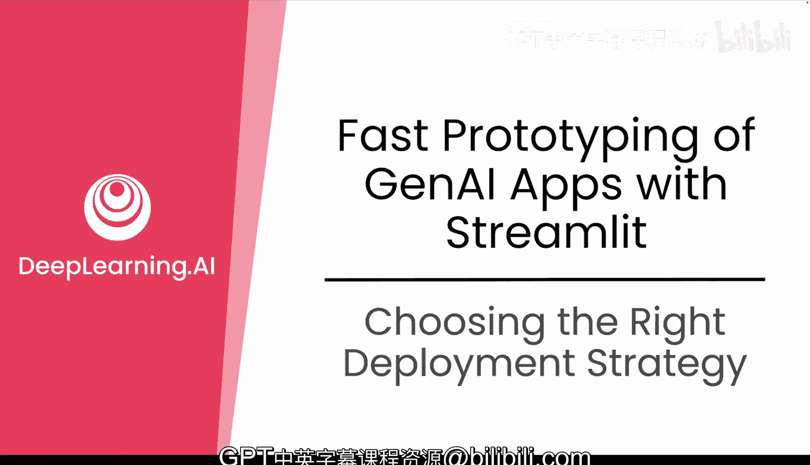
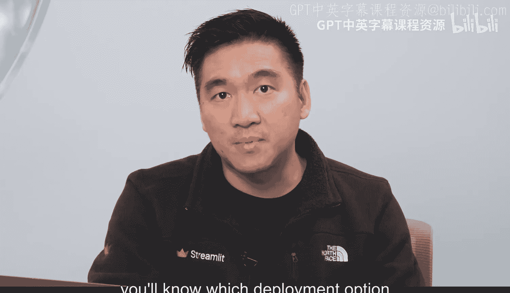
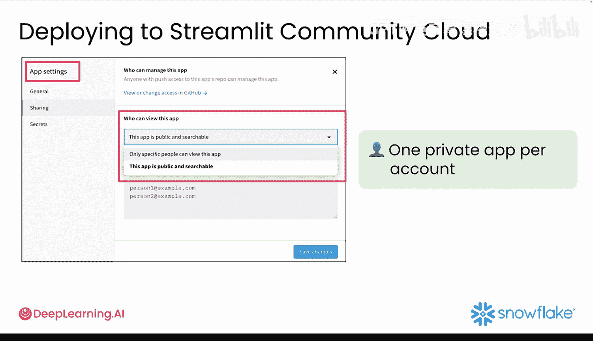

#  032：选择部署策略

在本节课中，我们将学习如何为你的 Streamlit 应用选择合适的部署策略。核心在于理解你的目标用户，并根据他们的需求在可访问性、安全性和性能之间找到最佳平衡点。

## 理解部署策略的关键

上一节我们介绍了 MVP 构建计划的步骤，现在来到了最后一步：部署。部署意味着将你的应用发布出去，让其他人能够实际使用并提供反馈。

选择部署策略的关键是理解你的受众。你需要明确应用是为谁构建的：是内部团队成员、外部合作伙伴，还是普通公众？一旦明确了用户群体，你就能选择在可访问性、安全性和性能之间达到最佳平衡的部署选项。

## 两种主要的部署选择

当你使用 Snowflake 构建 Streamlit 应用时，主要有两种部署选择。以下是这两种选项的详细介绍。

### 选项一：Streamlit Community Cloud

你已经在模块一中使用过此选项。它的优势在于可以直接连接到 Snowflake。当你希望公开分享应用时，可以选择 Streamlit Community Cloud。

*   **适用场景**：构建作品集或演示网站。
*   **核心优势**：可以获得一个任何人都可以访问的公共 URL。

### 选项二：Streamlit in Snowflake

当你的应用需要保持私密性时，应选择 Streamlit in Snowflake。这在你处理敏感数据或需要控制访问权限时非常理想。

*   **适用场景**：处理敏感数据或需要严格控制访问权限的内部应用。
*   **核心优势**：应用在你的 Snowflake 账户内安全运行，让你能完全控制访问权限。

## 其他部署方式与推荐

当然，也存在其他部署 Streamlit 应用的方式，例如 Replit 和 Vercel 是创建免费网络应用的好工具。但出于安全性和易用性的考虑，我们推荐坚持使用 Streamlit Community Cloud 或 Streamlit in Snowflake。

在 Snowflake 中，你可以获得对 Python 应用的原生支持，并且安全选项是专门为 Snowflake 集成而构建的。这意味着你可以通过用户角色来保护敏感数据并控制访问权限。

因此，虽然有很多其他工具可以实现部署，但当你构建一个连接到实时数据的生成式 AI 原型时，Snowflake 和 Streamlit Cloud 的组合是更明智的选择。

## 关于应用隐私设置的说明

当你将应用部署在 Streamlit Community Cloud 上时，你的代码可以保持私有，但应用本身的工作方式略有不同。应用设置菜单中，你可以选择应用是私有还是公开。

你将在后续视频中了解这两种选项，但现在需要知道一个重要信息：**每个账户只能拥有一个私有应用**。因此，如果你选择私有路线，请谨慎决定。

## 总结

本节课中，我们一起学习了在 Snowflake 上部署 Streamlit 应用的不同方式。你了解了何时应保持应用内部化和安全，以及何时适合公开分享。现在你已经了解了整体情况，可以根据应用的目标用户和使用方式来选择正确的选项。现在，你可以继续前进，专注于构建一个既强大又易于分享的应用。