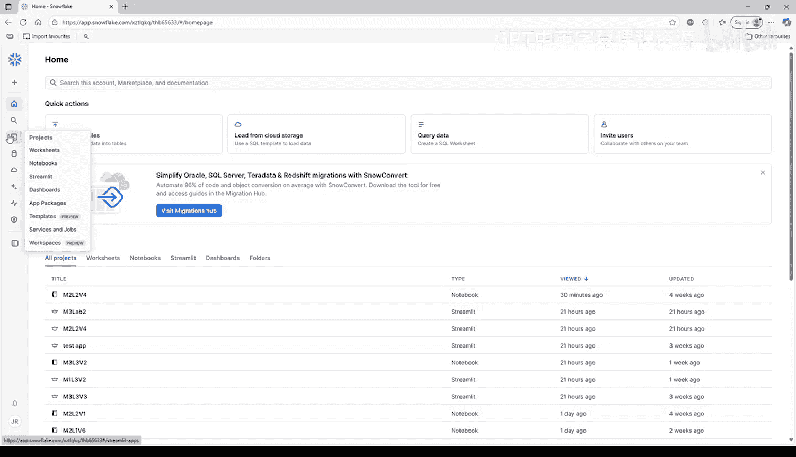
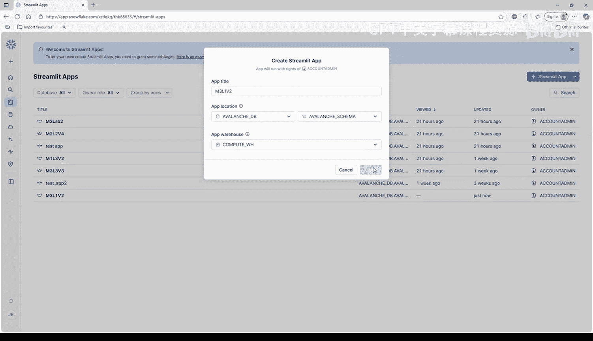
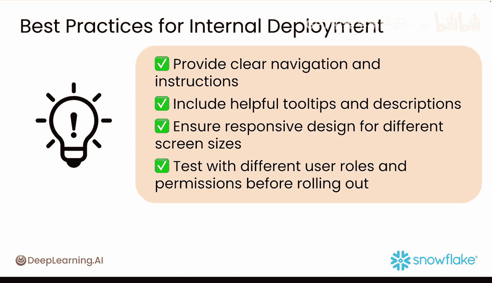

#  033：在 Snowflake 内部部署原型 🚀

在本节课中，我们将学习如何将已完成的雪崩（Avalanche）原型应用部署到 Snowflake 平台内部。通过本次学习，你将能够创建一个可供同事安全访问并提供反馈的内部应用。

## 概述

上一节我们完成了应用的开发，本节我们将专注于部署。我们将把完整的情绪分析仪表板部署到 Snowflake 中，使其成为一个内部应用，同事可以根据他们的数据行权限进行访问。

## 部署已完成的应用程序

以下是部署步骤：

首先，你需要获取应用代码。你已经在 Snowflake Notebook 中创建了一个可直接运行的 Streamlit 应用。该应用的代码可以在以下链接的 GitHub 仓库中找到。请下载包含情绪分析仪表板代码的 `streamlit_app.py` 文件。

接下来，登录你的 Snowflake 账户，使用 Snowsight 在内部部署应用。在左侧导航栏中选择“Projects”，然后选择“Streamlit”。在右上角，点击蓝色的“+ Streamlit App”按钮。

“创建 Streamlit 应用”窗口将会打开。在弹出窗口中，为你的应用命名。在“App location”下拉菜单中，选择你在之前视频中创建的 `avalanche_db` 数据库和 `avalanche` 模式。选择默认的计算仓库。点击“Create”来初始化新的 Streamlit 应用。

## 配置与运行应用

创建后，你将进入 Streamlit 编辑器，其中代码和应用并排显示。在编辑器中，你会看到一些默认的“Hello World”代码。删除编辑器中的所有现有代码。复制你下载的 `streamlit_app.py` 文件中的所有代码，并将其粘贴到编辑器中。

在运行应用之前，你需要添加必要的包。这个脚本使用了 `matplotlib` 和 `snowflake-ml-python`。因此，在左上角选择“Packages”，输入 `matplotlib` 和 `snowflake-ml-python` 并选中它们。点击编辑器中的“Run”按钮来部署你的应用。

应用预览将出现在编辑器的右侧窗格中。应用加载完成后，它将在 Snowflake 内部实时运行。并排的编辑器和预览屏幕允许你在修改代码时实时查看变化。

当在 Snowflake 中运行 Streamlit 应用时，你对代码的更改会立即出现在预览窗格中。你的应用运行起来应该类似这样。

## 理解 Snowflake 的集成优势

你的应用使用了 Snowflake 内置的连接方法。这自动处理了以下事项：通过你当前的 Snowflake 会话进行身份验证、基于行的访问控制（RBAC）以确保数据安全，以及为其 SQL 查询提供自动会话管理和连接池。

如果你不熟悉这些术语，不用担心，我们稍后会进行更详细的解释。但既然你在 Snowflake 中工作，它会为你处理好这些事情。你的应用现在已在内部部署，并准备好与同事分享。

## 分享与安全控制

要分享你的应用，请点击 Streamlit 应用右上角的“Share”按钮。你将获得一个 Web 链接，Snowflake 平台上的同事可以使用它来访问你的应用。

通过基于行的访问控制（RBAC）与其他 Snowflake 账户用户分享你的应用。这意味着访问权限由现有的 Snowflake 权限和角色控制。用户需要访问底层数据库和模式才能查看数据。该应用在你的 Snowflake 环境中保持安全。

对于雪崩应用，这意味着有权访问 `avalanche_db` 和 `avalanche` 模式的用户可以查看该应用。任何具有管理员权限的人都可以修改应用设置和权限，数据访问将遵循现有的 Snowflake 安全策略。

## 监控性能与成本

当你在 Snowflake 中部署 Streamlit 应用时，它会通过虚拟仓库消耗计算资源。你的应用需要一个仓库来对数据执行 SQL 查询。当用户活跃使用你的应用时，仓库保持活动状态，每个用户会话都可能通过数据加载、过滤、聚合等操作触发多个查询。

因此，你的仓库大小直接影响性能和成本。为了监控性能，有几个关键指标需要关注，例如：你的仓库容量使用了多少、单个查询完成需要多长时间、运行仓库随时间产生的成本、同时使用你的应用的人数。

Snowflake 提供了多种工具来从 Snowsight 内部跟踪你的应用性能。要检查查询历史记录，请转到“Activity”，然后选择“Query History”。这将显示你的 Streamlit 应用执行的每个 SQL 查询，并可以帮助你监控查询持续时间、执行时间、使用的仓库和计算量、消耗的积分以及执行计划。

要从 Snowsight 检查仓库使用情况，请转到“Admin”，然后选择“Warehouses”。“Warehouses”工具显示实时和历史仓库性能，帮助你更好地了解空闲时间、队列深度、平均执行时间和随时间变化的积分使用情况。

“Admin”面板还有一个名为“Resource Monitors”的工具，它将显示成本控制和使用情况警报。这可以帮助你为仓库设置支出限制、在达到阈值时收到警报，并自动暂停仓库以控制成本。

## 建立定期审查流程

如果你的原型最终成为我们都希望的那种绝妙想法，那么建立一个每周审查流程来监控你的应用使用情况是个好主意。

以下是建议的每周检查事项：

*   **检查查询历史记录**：识别缓慢或昂贵的查询。
*   **分析模式**：寻找可以缓存以提高效率的重复操作。
*   **审查仓库使用情况**：确保仓库大小与实际负载相匹配。
*   **测试优化**：通过实施小的更改并测量其影响。
*   **监控结果**：跟踪性能指标的改进。

这种监控方法有助于你维护一个经济高效、高性能的 Streamlit 应用，同时确保访问内部仪表板的同事获得良好的用户体验。

## 提升用户体验的技巧

以下是部署原型时提升用户体验的一些技巧：

*   **提供清晰的导航和说明**。
*   **包含有用的工具提示和描述**。
*   **确保响应式设计以适应不同的屏幕尺寸**。
*   **在推出前使用不同的用户角色和权限进行测试**。

## 总结

至此，你的应用已在 Snowflake 上成功运行。恭喜你！你已成功使用 Streamlit 在 Snowflake 上部署了情绪分析仪表板。你在 Snowflake 的内部部署为完善仪表板提供了完美的测试环境，并确保其已准备好进行更广泛的公开访问。