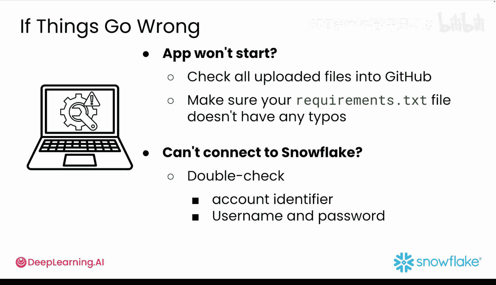

#  034：部署至 Streamlit 社区云 🚀

在本节课中，我们将学习如何将你在 Snowflake 上构建的雪崩数据仪表板原型，部署到 Streamlit 社区云。这将使你能够通过分享一个链接，轻松地与其他人共享你的项目。

## 概述

上一节我们完成了应用的本地开发。本节中，我们将把应用部署到云端，使其成为一个可公开访问的网页应用。整个过程主要涉及将代码上传至 GitHub，并在 Streamlit 社区云上进行配置。

## 准备工作

在开始部署之前，你需要完成几项准备工作。

以下是部署前的必要步骤：

1.  **创建 Streamlit 社区云账户**：如果你还没有账户，请前往 Streamlit 社区云网站注册，并使用你的 GitHub 账户登录。
2.  **创建新的 GitHub 仓库**：与模块 1 的做法类似，为你要部署的应用创建一个全新的 GitHub 仓库。请为仓库选择一个独特的名称。
3.  **上传项目文件**：在你的新 GitHub 仓库中，点击“上传现有文件”，然后将整个课程文件夹（包含 `streamlit_app.py` 和 `requirements.txt`）上传至此。上传完成后，点击“提交更改”。

你的文件现已准备就绪，可以开始部署。

## 部署应用到 Streamlit 社区云


接下来，我们将把 GitHub 仓库中的应用部署到 Streamlit 社区云。

以下是部署的具体操作步骤：

1.  登录 [Streamlit 社区云](https://streamlit.io/cloud)。
2.  点击右上角的“创建应用”或“新建应用”按钮。
3.  选择“从 GitHub 部署一个公共应用”。
4.  在表单中，选择你的 GitHub 用户名以及对应的仓库名称。
5.  分支保持为 `main`，并确保主文件路径指向你的 Streamlit 应用文件（通常是 `streamlit_app.py`）。
6.  为你的应用选择一个唯一的子域名，或使用自动生成的网址。
7.  点击“部署”按钮。

Streamlit 将开始构建你的应用，这个过程可能需要几分钟。

## 配置 Snowflake 数据库连接

由于你的应用需要从 Snowflake 数据库拉取实时数据，因此必须在云端配置访问权限。

以下是配置数据库连接的步骤：

1.  在部署的应用页面，点击右下角的“管理应用”。
2.  点击右上角的“三个点”图标，然后选择“设置”。
3.  在左侧边栏中，点击“Secrets”。
4.  在出现的“Secrets”文本框中，添加你的 Snowflake 凭据，格式如下：

```python
[snowflake]
user = "你的用户名"
password = "你的密码"
account = "你的账户标识符"
warehouse = "你的仓库名"
database = "你的数据库名"
schema = "你的模式名"
```

**注意**：请务必将所有信息替换为你自己的凭据。你的账户标识符是你登录 Snowflake 时在浏览器地址栏看到的部分。如果找不到，请查阅 Snowflake 官方文档。

保存更改后，应用将自动刷新，并开始使用来自 Snowflake 数据库的实时数据。

## 常见问题排查

如果你的应用没有按预期工作，可以尝试以下常见的修复方法。

以下是问题排查清单：

*   **应用无法启动**：检查所有文件是否已正确上传到 GitHub，并确保 `requirements.txt` 文件中没有拼写错误。
*   **无法连接 Snowflake**：在“Secrets”部分仔细核对你的账户标识符、用户名和密码。同时，确认仓库名和数据库名的拼写完全正确。

## 总结



本节课中，我们一起学习了如何将 Streamlit 应用从本地原型部署到 Streamlit 社区云。我们完成了从准备 GitHub 仓库、执行部署到配置云端数据库连接的全过程。现在，你的数据仪表板已经成为一个可以通过链接分享的在线应用了。接下来，请亲自尝试部署你的应用吧。