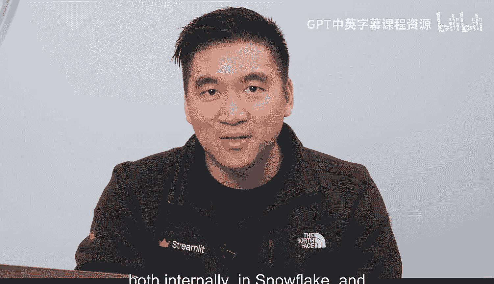
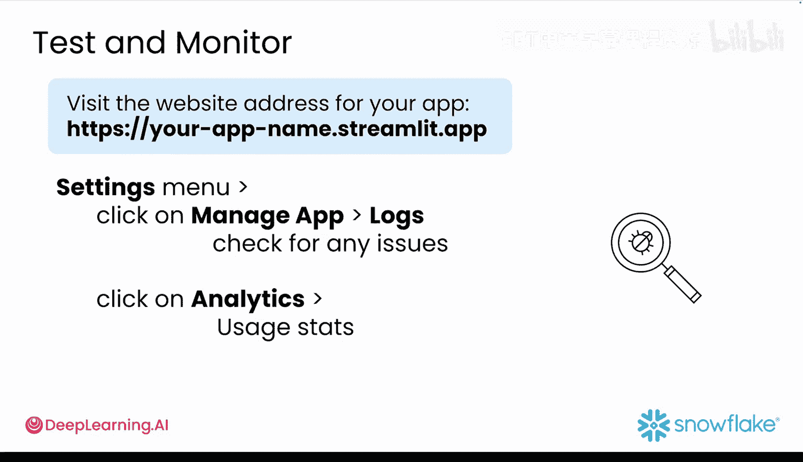

#  035：原型部署实践 🚀

在本节课程中，我们将学习如何将之前学到的提示工程、数据连接、UI设计和生成式AI知识结合起来，完成应用的部署。你将学会如何在Snowflake内部安全地部署应用，以及如何在Streamlit社区云上公开部署。我们还将涉及如何监控应用状态、控制访问权限，以及利用生成式AI工具来促进团队协作。

---

## 在 Snowflake 内部安全部署

上一节我们介绍了应用开发的核心概念，本节中我们来看看如何将完整的“雪崩”原型部署到Snowflake环境中。

首先，打开Snowflake并导航到“项目”下的“Streamlit应用”部分。

点击右上角的蓝色“+ Streamlit应用”按钮。

为你的应用命名，例如“Avalanche prototype”。选择你的“avalanche”数据库和“avalanche”模式。

点击“创建”进入编辑器。删除默认的“Hello World”示例代码。

然后，从你的本地`streamlit_app.py`文件中复制所有代码，并粘贴到编辑器中。请确保你的代码使用`st.connection()`或`st.get_active_session()`来建立连接。记住，当你在Snowflake内部部署时，这些函数会自动处理身份验证和访问权限。

点击“运行”来启动你的原型。




你的应用现已上线，并可在Snowflake内部查看。

接下来，点击“分享”获取一个链接，你可以将此链接分享给团队成员。

---

## 监控与优化应用性能

部署完成后，确保应用运行顺畅至关重要。以下是监控和优化应用性能的几个关键步骤：

首先，检查查询历史记录，查看查询耗时以及正在运行的操作。

其次，监控仓库使用情况，以跟踪成本、负载和空闲时间。

然后，设置资源监视器以获取警报并管理支出。

**专业建议**：每周进行一次审查，查找运行缓慢的查询、可以缓存的冗余操作以及高成本的计算峰值。

如果你想进一步提升，可以使用生成式AI应用来帮助你起草文档、建议代码改进、生成入门指南并修复性能问题。

---

## 在 Streamlit 社区云公开部署

现在，让我们将你的应用公开给全世界。

首先，创建一个新的公开GitHub仓库，并上传以下文件：
*   `streamlit_app.py`
*   `requirements.txt`
*   `streamlit_config.toml`
*   以及任何相关的数据文件夹或文件。

通过终端，首先登录到 `streamlit.io/cloud`，并选择使用GitHub登录的选项。

然后，点击“创建应用”。选择你想要部署的仓库，并指向`streamlit_app.py`文件。

现在，你可以点击“部署”。应用启动并运行后，你可以通过点击应用右上角的三个点来访问应用管理菜单。

从应用管理菜单的下拉列表中，选择“管理应用”。在出现的侧边栏上，点击“设置”。这将打开你的应用设置面板。

现在，点击“Secrets”来添加你的Snowflake登录凭据，以便Streamlit可以始终访问你的数据。粘贴以下代码块，但请务必将其更新为你自己的登录信息。

```toml
# .streamlit/secrets.toml
snowflake_account = "your_account"
snowflake_user = "your_username"
snowflake_password = "your_password"
snowflake_warehouse = "your_warehouse"
snowflake_database = "avalanche"
snowflake_schema = "avalanche"
```

完成后，点击“保存”。你的应用将自动重新加载并使用新的凭据。

---

## 测试与最终检查

为了在Streamlit社区云上测试和监控你的应用，请访问你部署的应用URL。这通常类似于 `https://your-app-name.streamlit.app`。

在将原型发送给其他人之前，自己测试应用总是一个好主意。快速检查以确保每个标签页和小部件都能正常工作。

然后，进入你的设置菜单，点击“管理应用”->“日志”以检查是否存在任何问题。在同一个菜单下的“分析”部分，你稍后可以查看使用情况统计信息。

现在你的应用已经部署完成，你将能够快速迭代并使其变得更好。

---

## 总结




本节课中我们一起学习了如何将你的“雪崩”原型安全地部署在Snowflake内部，并公开部署到Streamlit社区云上。你现在可以将链接分享给你的团队，将其添加到你的作品集，发布到LinkedIn或X上。最重要的是，开始收集反馈以便在下一个实验中进行迭代。在下一课中，你将学习如何收集和优先处理反馈，以使你的应用变得更好。但现在，请享受这个胜利的时刻。你已经将你的想法变成了现实。