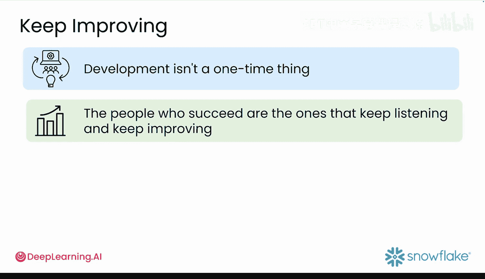

#  036：快速迭代方法论 🚀

在本节课中，我们将学习一种适用于生成式AI应用开发的快速迭代方法论。这种方法强调快速构建、快速测试和快速改进，而非追求初始的完美。

## 概述

在迭代改进原型时，开发者投入大量精力来构建和部署初始版本。拥抱快速实验的精神对此大有裨益。人工智能技术使得构建应用的速度变得极快。开发者可以在几天甚至几小时内编写一个提示词并完成部署。这意味着可以尝试大量想法，摒弃不佳的，保留优秀的。

## 核心原则：速度至上

以下是关于AI开发的惊人事实：开发者可以比以往任何时候都更快地构建应用。

如果开发者只有一个小时，那么就将范围缩小到能在一小时内完成的事情上。即使在短时间内，所能实现的可能性也会令人惊讶。让某个功能运行起来，即使它很粗糙，也总比什么都没有要好。不要花费数周时间进行规划，直接构建一个能工作的东西，然后观察它在哪里出现问题。

## 与传统方法的区别

这种方法可能与传统的编程最佳实践相悖，但对于生成式AI而言，它能帮助开发者更快地进入市场。因为开发者是通过实践而非空想来发现问题。

例如，在构建客户服务聊天机器人时，客户不会花费数月时间来设计完美的对话流程。只需构建一个能回答公司收到的五个常见问题的基本版本，然后观察用户在何处感到困惑或沮丧。

## 构建最小可行产品

可以将其类比为烹饪：边做边尝。不要等到整餐饭都做完才判断是否需要加盐。开发者此刻构建的并非最终产品，而是一个用于测试想法的简单版本。这就是最小可行产品——能让开发者了解所需知识的最简版本。

这引出了一个关键问题：原型何时才算足够好？

## “完成优于完美”的理念

原型只需要足够好地运行，以测试核心想法并获得反馈。专注于高效地交付80%的核心功能，然后让反馈来指导剩余的部分。

## 与用户闭环

与用户形成闭环至关重要，但这一点常被忽视。告诉用户你根据他们的反馈做出了哪些更改。向他们发送更新、撰写发布说明或在应用中展示。这能建立信任，并让他们愿意继续提供帮助。

## 团队协作与知识共享

确保整个团队都知道你发现了什么。将信息放在每个人都能访问的地方，以避免重复犯错。可以将其发布在社交媒体平台、代码托管网站等任何能获得关注和额外见解的地方。

## 持续改进

开发不是一蹴而就的事情。成功者正是那些持续倾听并持续改进的人。竞争对手也在不断进步，因此开发者需要保持领先。当今时代，成功的关键在于速度：快速构建、快速获得反馈、快速改进，而不是追求完美。

## 总结

本节课中，我们一起学习了生成式AI应用的快速迭代开发方法论。其核心在于**快速构建 → 获取反馈 → 快速改进**的循环，而非追求初始的完美。每一次反馈和改进的循环都让开发者更接近用户真正想要的产品。掌握这个循环的开发者将会取得成功。因此，请从小处着手，快速行动，并始终将用户置于所做一切的中心。