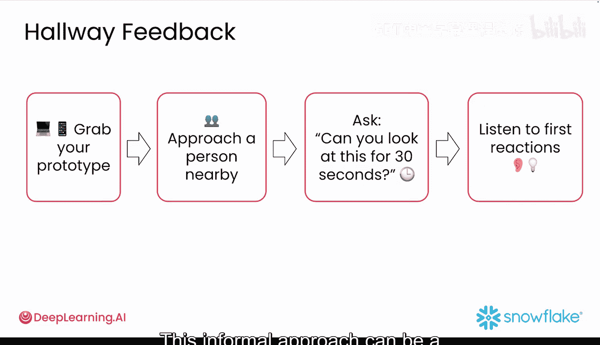

#  037：即时反馈机制 🚀

在本节课中，我们将要学习如何为你的应用快速获取用户反馈。完成比完美更重要，而实现这一点的最佳方式之一就是快速获得反馈。当你能够快速构建出产品时，等待数天才能获得反馈会显得极其缓慢。你获取反馈并据此行动的速度越快，你就能越快构建出人们真正想要使用的东西。

## 概述

现在，是时候快速行动并学习了。最重要的部分是获取真实的用户反馈。早期获取反馈的策略通常更侧重于定性反馈，这对于激发新想法和理解用户痛点非常有价值。然而，并非所有反馈都同等重要。因此，让我们来看看一些简单而高效、有策略地收集反馈的方法。

## 高效收集反馈的策略

上一节我们介绍了快速获取反馈的重要性，本节中我们来看看具体如何操作。以下是几种有效的反馈收集方法：

### 1. 从目标用户群开始
首先，找一小群人，最好是你的目标用户群体。你可以通过社交媒体、专业网络，甚至从现有客户群中寻找测试者。

### 2. 进行“5秒测试”
在你解释应用功能之前，先向他们展示界面5秒钟。然后问他们：“你记住了什么？你认为这个应用是用来做什么的？”这可以检验你最重要的功能是否突出且令人难忘。

### 3. 在关键时刻收集反馈
在用户刚刚使用完你的功能时抓住他们，例如他们刚刚完成购买、结束教程或尝试了新功能。此时他们的体验记忆犹新，因此反馈会更具体、更有用。

### 4. 聚焦核心用户旅程
识别出你应用中**最重要**的用户旅程，并只测试那条路径。例如，在你的雪崩分析原型中，应用需要做的**最重要**的事情就是对输入数据进行情感分析。因此，请你的测试者选择一个日期范围并设置产品，然后查看结果。就这么简单。在核心工作流程完善之前，忽略其他一切。

### 5. 提出具体问题
不要问宽泛的问题，如“你觉得怎么样？”，试着问能给你提供具体功能信息的问题，例如：“这个按钮容易找到吗？”或“这个功能如何帮助你解决问题？”开放式问题鼓励测试者提供详细的见解，但也可以加入一些评分量表以便于分析。

### 6. 观察用户自然行为
观察用户在其自然状态下如何使用你的应用。注意他们做事的顺序、在哪里卡住、是否需要为了使用应用而在应用外做很多事情。这是一个重要的发现点。例如，如果用户在上传文件到你的应用之前需要进行大量编辑，这就是一个需要改进的信号。

### 7. 进行“出声思考”测试
当人们试用你的应用时，试着请他们大声说出自己的想法。这是发现诸如“我在找提交按钮，但它不在我以为的地方”这类问题的好方法。如果你能记住所有反馈当然好，但也可以询问他们你是否可以做笔记。

### 8. 尝试“咖啡店测试”捷径
如果传统方法耗时太长，可以使用这个捷径。方法很简单：带上你的笔记本电脑，找到同事、朋友，甚至咖啡店里的陌生人，然后问：“嘿，你能花30秒看看这个，然后告诉我你的想法吗？”如果做得好，这种非正式的方法可以成为有价值的、可操作的反馈来源。

## 总结

本节课中，我们一起学习了多种快速获取用户反馈的策略。记住，持续构建、持续迭代、持续获取宝贵的反馈是产品成功的关键。请跟随我到下一个视频，学习如何根据反馈采取行动。