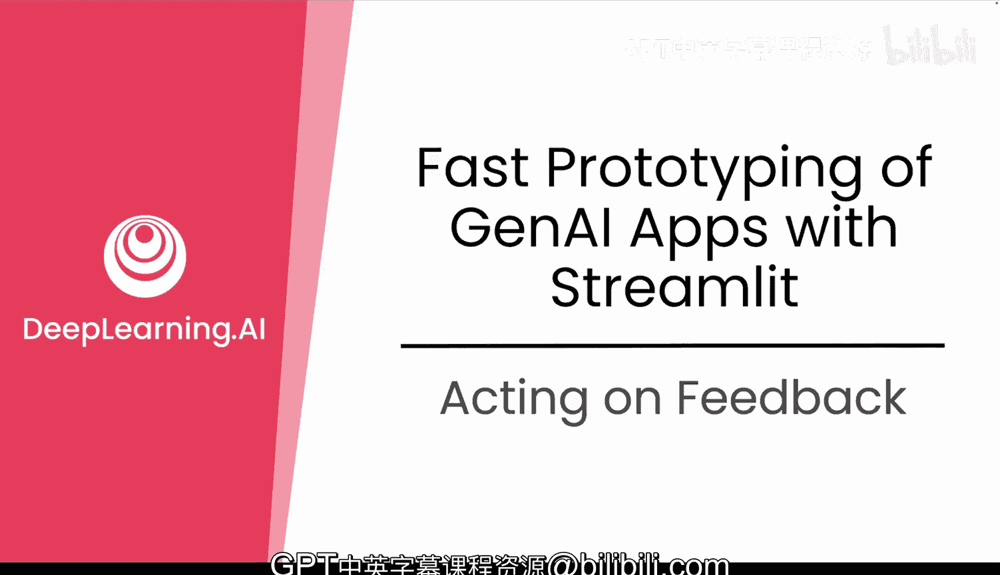
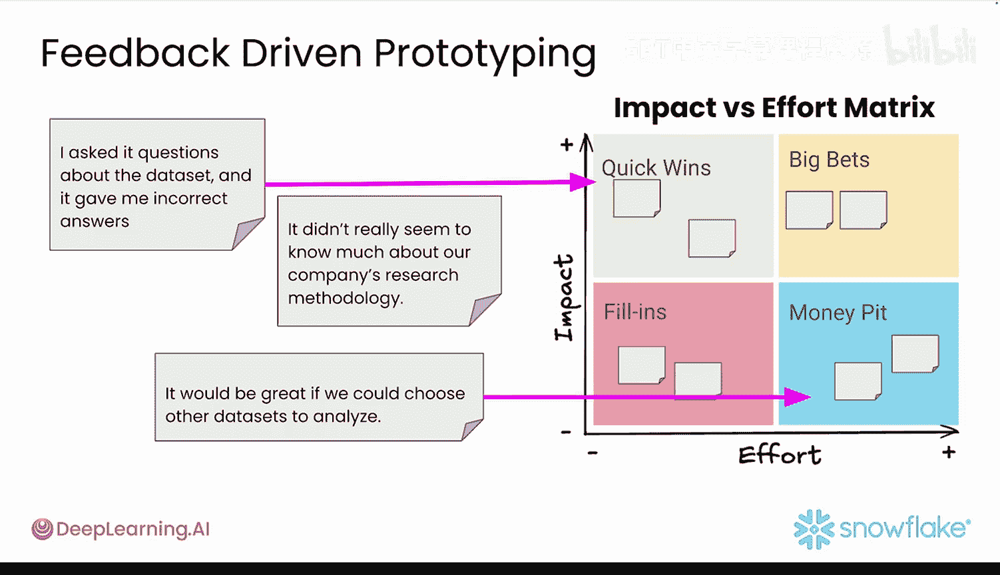

#  038：反馈响应策略 📝

在本节课中，我们将学习如何有效地收集、分析和响应原型开发过程中获得的用户反馈。我们将探讨如何区分反馈的优先级，并采取快速行动来改进你的应用。

---

有许多快速且简单的方法可以为原型有效收集反馈。但并非所有反馈都有用，例如有人不喜欢你的配色方案，或者希望添加对更广泛受众无用的功能。本视频将介绍如何对反馈进行优先级排序并采取行动的策略。

首先，将反馈分类到不同的类别中，例如**错误报告**、**功能请求**或**可用性问题**。这不仅能帮助你了解用户的要求，还能理解他们提出这些要求的原因。

当用户说你的应用“很慢”或“某个功能不工作”时，不要只是猜测问题所在。要像侦探一样思考，系统地调查以找到真正的问题。不要惊慌失措地试图一次性修复所有问题，而要变得有条理。将问题分解成更小的部分。问问自己：是只对新用户慢，还是对回访用户也慢？是移动端用户比桌面端用户更受影响吗？通过这种方式分解问题，你可以精确定位导致问题的根源。

对于快速原型开发，你的测量方法应该和你的构建速度一样快。尝试以下快速验证方法：
*   观察少量用户测试你更新后的原型。即使是五个用户也能发现主要问题。
*   向近期用户发送一个简短的调查，询问一个关于你所做更改的具体问题。
*   检查你的基本分析数据，看看用户行为是否朝着你期望的方向转变。
*   设置简单的A/B测试，让一半用户看到旧版本，另一半看到新版本，然后比较他们的行为。

目标不是统计上的完美，而是获得一个清晰的信号，判断你是否在朝着正确的方向前进。

现在，我们已经到了反馈不一定只来自人类用户的阶段。让AI帮助你编码。像 **Github Copilot** 和 **Cursor** 这样的工具可以为你编写代码，帮助你调试问题，并自动化枯燥的任务。要擅长“提示”。你越能清楚地告诉AI你想要什么，你得到的帮助就越好。这是一项值得培养的技能，因为它可以极大地加快你的工作速度。在下一个视频中，你将了解更多相关内容。

对于复杂问题，尝试**智能体工作流**。将问题分解为步骤，并让AI处理每个部分。这种方法比试图一次性解决所有问题能带来更好的结果。

系统地跟踪反馈。使用能帮助你自动收集和组织用户反馈的工具。这为你提供了快速做出明智决策所需的数据。

现在，让我们看看你从“雪崩”公司的同事那里得到的一些反馈：
*   “我询问了关于数据的问题，但它给了我错误的答案。”
*   “它似乎不太了解我们公司的产品线。”
*   “如果我们可以选择其他数据集来分析就好了，我甚至没看到上传按钮。”

你如何决定在推出原型之前，需要对这些评论中的哪些（如果有的话）采取行动？关键在于找到**易于实现**、可以快速添加的功能。记住你在构建MVP时使用的“**必须有**”与“**最好有**”决策框架。你可以使用类似的过程来优先处理反馈，使用一个**影响度 vs. 实施难度矩阵**。

这个框架帮助你首先关注**高影响、低难度**的更改，这些是你的“速赢”机会。你可以使用影响度-难度矩阵来优先处理“雪崩”的反馈。例如：
*   **提供关于数据的正确答案**：对于你的原型来说，这是高影响、低难度的“速赢”。
*   **添加选择其他数据集的能力**：对于一个原型来说，可能是低影响，并且需要更多努力，因此目前可以跳过。

你刚刚经历的**反馈 -> 优先级排序 -> 构建 -> 验证**的循环，是驱动成功产品的引擎。你转动这个轮子的速度越快，你就能越快创造出真正能引起受众共鸣的东西。

请记住，每一条反馈都是一份礼物，但并非每份礼物都需要立即拆开。保持专注，保持快速，并持续构建。

---

本节课中，我们一起学习了如何系统化地处理原型反馈。我们介绍了将反馈分类、像侦探一样调查问题根源、采用快速验证方法，以及利用AI工具和影响度-难度矩阵来优先处理高价值任务。掌握这个快速迭代的循环，将帮助你高效地改进产品，使其更符合用户需求。