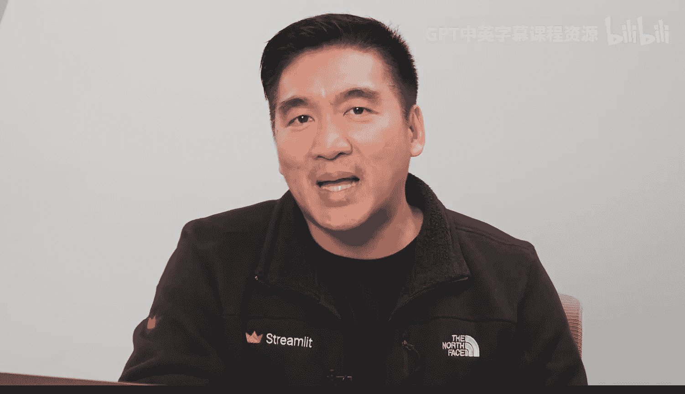
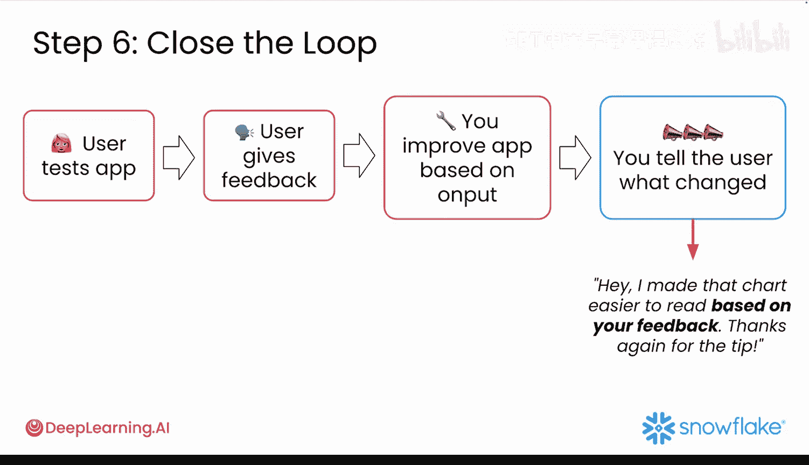
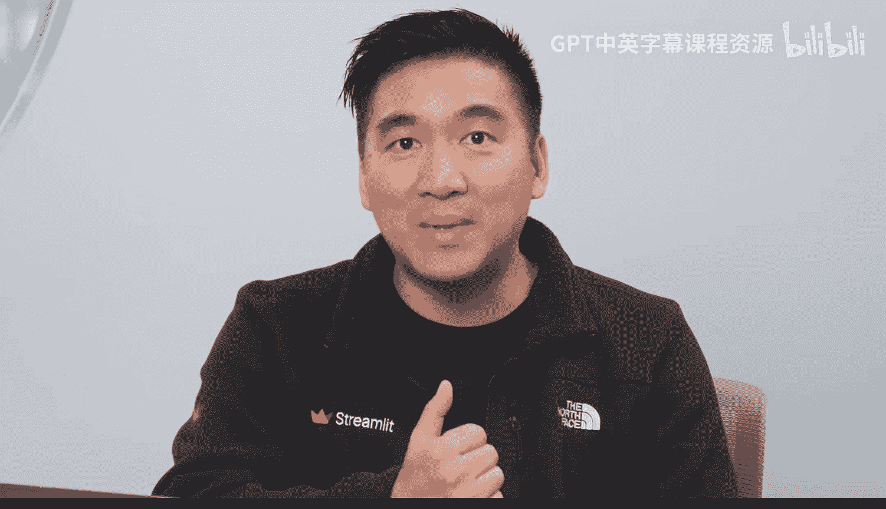

#  039：雪崩应用的迭代优化循环 🔄

在本节课中，我们将学习如何将用户反馈转化为有意义的改进，从而避免原型被废弃。我们将掌握一套系统的方法，从用户视角测试应用、快速收集可操作的反馈、根据影响力和工作量确定改进优先级，并利用AI工具加速迭代过程。

你的原型已经上线。用户正在试用，反馈也随之而来。

现在该怎么办？大多数原型失败，并非因为它们本身有问题，而是因为开发者不知道如何将用户反馈转化为有意义的改进。他们要么完全忽略反馈，要么试图一次性修复所有问题，结果什么都没改好。

## 从用户视角测试应用 👀

上一节我们讨论了原型上线后的反馈现状，本节中我们来看看如何从用户视角进行测试。

首先，打开你已部署的雪崩应用。你可以通过 Snowflake 的 Streamlit 界面或 Streamlit Cloud 访问它。假设你是雪崩公司的品牌经理，你的业务目标是回答这个问题：客户对我们的冬季产品线有何看法？

以全新的眼光浏览你的应用并进行评估：
*   你能否快速找到情感分析功能？
*   结果是否以易于理解的格式呈现？
*   不熟悉你数据的人是否知道下一步该点击什么？

这种视角转换有助于你在真实用户遇到问题之前，就发现可用性问题。

## 评估第一印象与核心用户旅程 🧭

在明确了用户视角的重要性后，接下来我们具体评估应用的第一印象和核心使用流程。

向某人展示你的应用五秒钟，然后立即询问他们：
*   你认为这个应用是做什么的？
*   什么最吸引你的注意？
*   你能弄清楚下一步该做什么吗？

这个测试评估的是第一印象。你的核心功能应该一目了然，而不是隐藏或令人困惑。如果你独自工作，可以截取应用截图，通过短信或 Slack 发送给朋友，请他们只看五秒钟并回答同样的问题。

确定你应用中最重要的单一用户旅程。对于雪崩应用，这可能是：加载仪表板 -> 运行情感分析 -> 解读结果。计时走一遍这个流程，注意你在哪里会放慢速度或犹豫。问自己：这个流程中有什么令人困惑或别扭的地方吗？说明文字是否清晰且可操作？布局是否有效地支持了这个主要任务？

请记住，你不是在测试所有功能，而是专注于这一个关键工作流程，以保持测试的快速和集中。

## 收集与分类反馈 📋

测试完成后，我们会得到大量信息。以下是整理这些反馈的有效方法。

打开一个笔记应用或拿一张纸，创建以下三个分类：
1.  **Bug（错误）**：任何损坏或无法工作的部分。
2.  **可用性问题**：功能可以工作，但感觉笨拙或令人困惑。
3.  **功能创意**：未来开发中值得添加的“锦上添花”的功能。

对于你识别的每个项目，问自己：**什么是高影响力但低工作量就能修复的？我现在能在30分钟内改进什么？** 这些就是你的“快速胜利点”。专注于立即解决其中的一两个。

## 利用AI工具加速迭代 ⚡

识别出需要改进的问题后，我们可以借助强大的AI工具来加速修复过程。

如果你识别出需要修复的问题，可以利用AI工具来提供帮助：
*   **针对内容问题**：使用 GitHub Copilot、ChatGPT 或 Claude 来重新措辞令人困惑的标签或工具提示。可以请求AI重写提示模板以提高清晰度，或请求帮助清理代码块。
*   **针对用户体验**：使用 Snowflake 中的 Jupyter 助手选项卡来测试回答用户问题的新方法。可以请求AI建议替代的图表类型或数据可视化方式。

你并不是在构建一个新应用，而是在打磨和完善你已经创建的东西。

## 闭环反馈与持续改进 🔄

完成初步优化后，迭代循环的最后一步是关闭反馈环，这能培养用户忠诚度。

如果在测试过程中有人提供了反馈，请告诉他们你做了哪些更改。一条简单的信息，例如：“嘿，根据你的反馈，我让那个图表更容易阅读了。再次感谢你的建议！”这种方法可以将临时的测试者转变为你的应用的长期用户和倡导者。

一个被持续使用的原型和一个被遗忘的原型之间的区别，往往取决于上线后发生的事情。让我们确保你的原型属于前者。

在下一节视频中，我们将探讨如何通过更好的提示设计技术，更快地改进你的生成式AI结果。

---

本节课中我们一起学习了如何系统化地处理用户反馈以优化应用原型。我们掌握了从用户视角测试、评估第一印象、梳理核心流程、分类反馈优先级，并利用AI工具高效实施改进的方法。关键在于快速识别并实施“高影响力、低工作量”的改进，形成持续的迭代优化循环，从而确保你的原型能够持续吸引用户并创造价值。