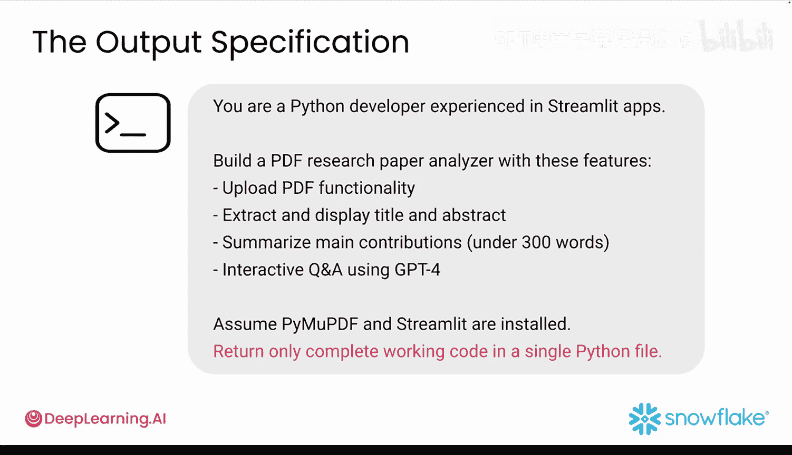
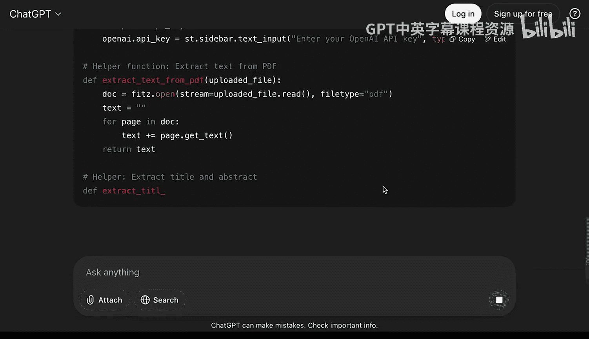
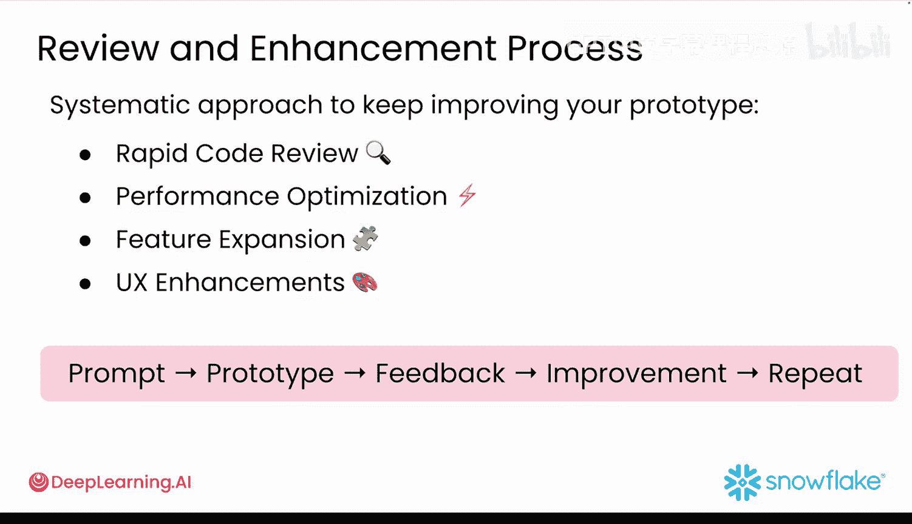

#  040：提示词优化技巧 🚀

在本节课中，我们将要学习如何通过优化提示词来加速生成式AI应用的开发流程。我们将深入探讨提示词工程的核心技巧，这些技巧能将数小时的编码工作转化为几分钟的智能提示，从而帮助你快速构建、测试并迭代你的应用原型。

在现代开发周期中，速度至关重要。你需要尽快从想法过渡到可测试的原型，然后收集用户反馈，并根据所学进行迭代。本节视频将深入探讨AI驱动的开发，并展示如何设计提示词，以加速你的原型开发速度。


## 为什么提示词工程对快速原型开发至关重要


在快速原型开发中，你是在与时间赛跑。你需要快速构建一个可工作的原型，用真实用户进行测试，收集反馈，快速实施更改，并重复这个循环。糟糕的提示词会在每一步造成瓶颈。

一个模糊的提示词可能给你80%正确的代码，但修复最后20%可能需要数小时。一个精心设计的提示词能让你完成95%的工作，让你专注于用户反馈，而不是调试。

当用户给你诸如“图表令人困惑”或“我找不到导出按钮”的反馈时，你需要迅速将这些反馈转化为代码更改。有效的提示词让你能够直接将用户反馈转化为给AI助手的具体技术指令。

例如，与其纠结于“让它更直观”这样的用户反馈，你可以设计一个提示词：“你是一位专注于用户体验的Python开发者。用户说图表令人困惑。请重写这段图表代码，使其包含：清晰的坐标轴标签、解释每条线代表什么的图例、显示精确数值的悬停提示，以及解释图表内容的标题。”这能在几分钟内将模糊的反馈转化为可执行的代码更改。

## 构建高效提示词的四大核心组件

每个强大的提示词最多包含四个构建模块。理解这些组件对于快速原型开发至关重要，每个组件在帮助你从想法快速过渡到工作代码方面都有特定作用。

1.  **具体指令**
    模糊的指令会浪费时间。你会得到无法解决具体问题的通用代码，迫使你花费数小时修改它。例如，与其说“制作一个应用”，不如尝试“构建一个Streamlit应用，用于分析PDF研究论文并回答相关问题”。当需要整合用户反馈时，同样要具体，例如“为分析结果添加一个下载按钮”，而不是“让它更有用”。

2.  **上下文**
    上下文能防止AI做出减慢你速度的假设。没有适当的上下文，你可能得到React代码，而你需要的却是Streamlit；或者得到Python 2语法，而你使用的是Python 3。上下文包括两个关键要素：
    *   **角色设定**：赋予AI一个专业的身份和专长水平。例如，“你是一位有丰富Streamlit应用开发经验的Python开发者”。这消除了基础解释，并为你提供生产就绪的代码。
    *   **约束与要求**：帮助定义项目的规则。指定Python版本、部署平台或技术限制，并包含公司指南或合规要求，例如“你的应用必须在移动设备上运行”或“仅使用Python 3.9”。这样，当用户在特定平台上报告问题时，你可以快速将这些约束添加到提示词中。

3.  **具体输入数据**
    提供具体的输入数据能让你立即获得可工作的代码。与其得到通用示例，不如获得适用于你实际数据的代码。你可以通过以下方式实现：
    *   **提供AI将处理的具体内容**，如你想要修改或扩展的特定代码片段。
    *   **提供示例的数据格式**，添加样本文件或数据集。如果用户报告你的应用在处理某些文件类型时崩溃，你可以在提示词中包含有问题的文件格式，以获得正确处理它的解决方案。
    可以将其理解为给别人烹饪指令与同时给他们指令和具体食材之间的区别。

4.  **输出指示器**
    输出指示器对速度至关重要。没有它们，你会在需要代码时浪费时间解析解释，或者在需要即时解决方案时得到教程。明确说明你希望响应如何结构化。例如，“仅返回可工作的Python代码”、“格式化为JSON”或“提供一个单独的Python文件”。当你需要快速整合用户反馈时，你可以精确指定所需内容，例如“仅返回修改后的函数，而不是整个文件”或“仅显示所需的CSS更改”。

## 加速原型开发的策略

以下是专门设计用于加速原型开发和反馈整合过程的策略。

上一节我们介绍了高效提示词的组件，本节中我们来看看如何运用策略来组织它们。

**从简单开始，然后迭代**
这反映了快速原型开发的理念：先快速做出能工作的东西，然后根据用户反馈进行改进。不要试图一次性构建所有功能。首先创建一个基本版本，然后逐步完善。这种方法让你能更好地控制开发过程，获得更可靠、可迭代的结果，以及更快的反馈循环。

**将复杂任务分解为更小的提示**
当用户给出反馈时，你通常需要更改应用的多个部分。更小、更聚焦的提示让你能够快速且安全地进行这些更改。因此，与其使用一个庞大的提示词，不如创建一系列聚焦的请求：
*   你的第一个提示词应描述基本的应用结构。
*   第二个提示词可用于添加特定功能。
*   第三个提示词是实现错误处理的好地方。
*   第四个提示词可用于优化性能。

例如，如果用户报告应用运行缓慢且图表令人困惑，你可以用单独的提示词来处理这些问题：
*   **提示词1**：优化此数据加载代码以提高性能。
*   **提示词2**：改进这些图表可视化以提高清晰度。
你不必完全遵循此布局，但按照你通常编码的逻辑顺序进行提示，有助于获得你想要的结果。

**设置防护栏以保持代码一致性**
在基于反馈进行迭代时，防护栏能保持你的代码一致且可维护。使用这些防护栏让AI的回答保持在正轨上：
*   **告诉AI要避免什么**：这可以防止AI引入可能破坏你现有原型的不必要的复杂性或依赖项。
*   **在需要时要求推理**：帮助你理解为何进行更改，这在快速迭代且需要保持控制时至关重要。
*   **使用一致的术语**：确保在你根据不同的反馈进行多次更改时，你的代码库保持连贯。
*   **维护你的编码标准**：即使在进行快速更改时，也有助于保持代码的可读性和可维护性。
这些防护栏在快速原型开发中尤为重要，因为你正在快速进行更改，需要确保每次迭代都建立在前一次的基础上，而不会引入不一致或技术债务。

## 一个高效提示词的实例分析

让我们分析一个结构良好的提示词，看看它为何如此有效。

**提示词示例**：
```
你是一位经验丰富的Python开发者，专注于构建Streamlit应用。请创建一个Streamlit应用，实现以下功能：
1.  从用户上传的PDF文件中提取文本。
2.  使用OpenAI API总结提取的文本。
3.  在Streamlit界面中显示原始文本和摘要。
4.  允许用户下载摘要为文本文件。
约束条件：
- 摘要长度限制在300字以内。
- 假设所需的包（streamlit, PyPDF2, openai）已安装。
- 仅使用Python 3.9+兼容的语法。
请将输出作为单个可运行的Python文件返回。
```

**分析**：
*   **角色设定**（“经验丰富的Python开发者”）设定了技术专长水平，有助于将响应集中在Streamlit特定解决方案上，并消除了更基础的编程说明。
*   **具体指令**以详细的逐步说明形式列出，每个要点都成为一个特定的功能。
*   **约束条件**明确指定了300字的限制，并告知AI应假设所需包已安装，这防止了它包含安装说明，使响应专注于实现而非设置。它还通过指定使用Python 3.9+语法来确保AI使用正确的库。
*   **输出指示器**（“作为单个可运行的Python文件返回”）让你获得可运行的代码，而不是教程或解释。

这个结构化的提示词生成了一个完整的、可工作的Streamlit应用，所有四个功能都已实现并准备运行。相比之下，一个模糊的提示词如“帮我构建一个PDF应用”，你只会得到通用建议，而不是功能代码。

## 将用户反馈转化为快速代码更新

提示词工程在快速原型开发中变得极其强大的地方在于，它不仅帮助你构建初始应用，还改变了你整合用户反馈的速度。

通过有效的提示词，你可以在几分钟内将用户反馈转化为可工作的代码更新。当你得到诸如“仪表板太杂乱”和“我找不到导出按钮”的模糊反馈时，你可以使用类似以下的提示词来获得直接解决用户反馈的特定代码更新，这些更新可以在几分钟内部署。

**反馈转化提示词示例**：
```
用户反馈指出当前仪表板过于杂乱，且难以找到导出按钮。你是一位UI/UX专家。请修改以下Streamlit仪表板代码：
1.  将主要指标卡片重新组织为两列网格布局，以节省垂直空间。
2.  将“导出数据”按钮从侧边栏移至主区域顶部的醒目工具栏中。
3.  为所有交互元素添加工具提示说明。
4.  确保所有更改保持响应式设计。
这是当前的代码：[在此处粘贴当前代码]
请仅返回修改后的代码部分。
```





一旦掌握了将反馈快速转化为提示词的技巧，你可以使用系统化的方法来持续改进你的原型：

以下是系统化改进原型的四个方向：

*   **快速代码审查**：要求你的生成式AI审查你的原型代码，并根据用户反馈建议增强功能。
*   **性能优化**：快速识别并修复用户报告的性能问题。
*   **功能扩展**：为用户请求的新功能生成多种解决方案。
*   **用户体验改进**：将主观反馈转化为具体的UI和UX增强，将“感觉笨拙”等评论转化为具体的界面修改。

这种系统化的方法创建了一个强大的加速开发循环：原型 -> 反馈 -> 改进 -> 重复。

## 总结




本节课中，我们一起学习了如何通过优化提示词来加速生成式AI应用的原型开发。我们了解到，精心设计的提示词能为你节省数小时的开发时间，让你可以将这些时间用于用户研究、测试和迭代。即使有了完美结构的提示词，有时你仍需要为AI提供额外的上下文，以帮助应对复杂的原型开发挑战。在下一课中，我们将探索提示词增强技术，以进一步扩展你的AI能力。