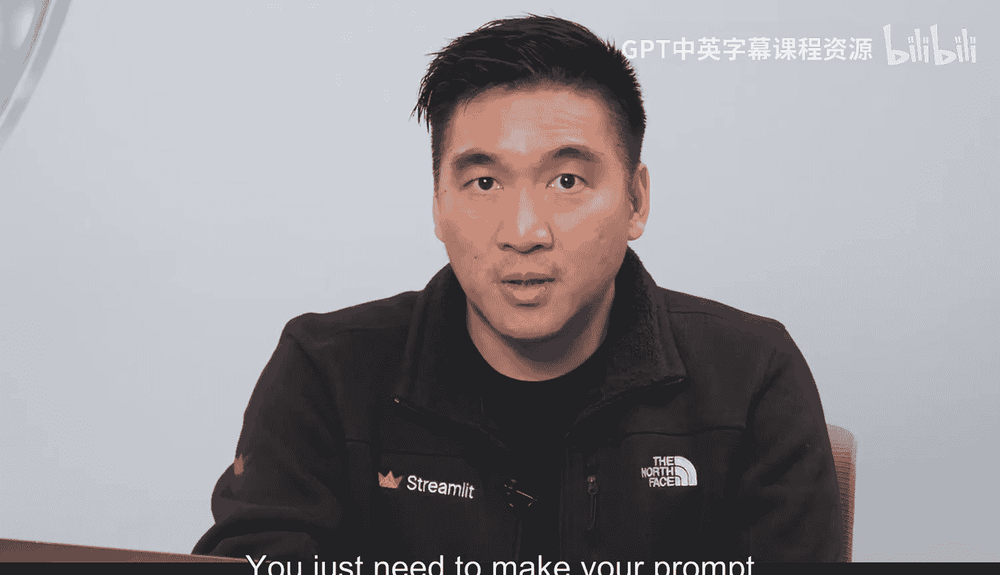
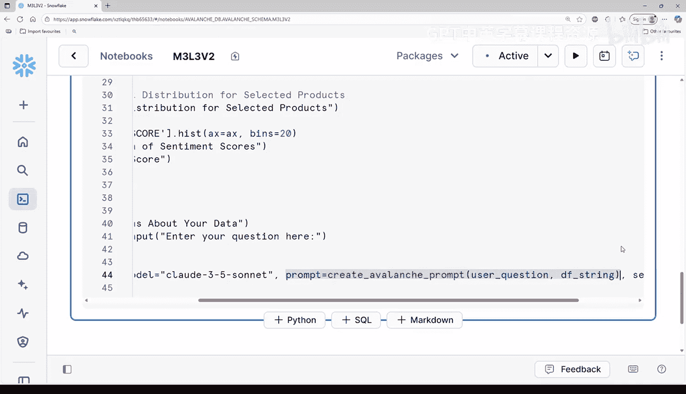

#  041：通过数据增强升级原型 🚀

在本节课中，我们将学习如何通过“提示增强”技术，让您的AI应用原型能够基于特定数据集回答问题，而无需更换或重新训练模型。

---

## 概述

上一节我们构建了一个基础的聊天机器人原型。本节中，我们将解决用户反馈中提到的问题：“我询问了关于数据集的问题，它给出了错误的答案，而且似乎对我们的产品线知之甚少。” 核心解决方案并非更换更强大的模型，而是通过**提示增强**，将您的数据直接“喂”给AI，使其能够基于这些信息进行回答。

## 从通用到具体：提示增强的核心思想

想象一下，要求某人猜测您冰箱里有什么，与直接打开冰箱门让他查看的区别。您当前的AI聊天机器人原型就像那个猜测者，它对“雪崩数据”一无所知。当被问及数据中的产品时，它只能给出通用回答，例如“我无法访问特定的产品信息”。这就像要求某人评论一部他们从未看过的电影。

提示增强就是为您的原型提供一张“小抄”。您不再要求AI仅凭通用知识回答问题，而是将关于您数据的特定信息直接嵌入到每次提问的提示中。

## 升级您的聊天机器人代码

以下是升级步骤，我们将从上一模块已部署的应用代码开始。




**注意**：您可以在课程资源库的指定文件路径中找到本视频的起始代码笔记本。代码被分为两个单元格以便于理解。

### 第一步：导入与数据加载

第一个单元格导入必要的库并加载数据集，这与之前的操作一致。

```python
import streamlit as st
import pandas as pd
# ... 其他必要的导入

# 加载数据集
df = pd.read_csv('avalanche_data.csv')
```

### 第二步：改造数据为AI可读格式

因为大型语言模型无法直接读取电子表格或数据库，您需要将数据框转换为AI能理解的格式。您可以使用 `df.to_string()` 方法，将pandas数据框转换为一个类似格式化表格的字符串。

```python
data_string = df.to_string()
```

现在，您可以使用这个字符串，将其直接传递到聊天机器人的提示上下文中，帮助AI理解您的数据。

### 第三步：创建增强提示函数

在这里，您将升级基础聊天机器人。目标是每次用户输入问题时，都包含“雪崩数据”。

此前，您的聊天机器人提示仅仅是用户的文本输入。现在，您将创建一个函数，将该文本输入与一个提示模板以及您刚创建的数据文本版本结合起来。

将 `create_avalanche_prompt` 函数想象成AI的“简报室”。每次有人提问，您都在给您的生成式AI聊天机器人提供：其工作描述、所需的所有相关信息以及需要回答的具体问题。

1.  **工作描述**：设定AI作为雪崩数据专家的角色。这使聊天机器人专注于提供与数据相关的答案。
2.  **数据上下文**：在这里，模板中的占位符（如“雪崩数据”）被替换为您实际的文本格式数据 (`data_string`)。
3.  **问题部分**：被替换为用户刚刚输入的问题。

以下是该函数的一个示例：

```python
def create_avalanche_prompt(user_question, data_context):
    prompt_template = f"""
    你是一个雪崩数据集专家。请根据以下数据回答问题。
    数据：
    {data_context}
    问题：{user_question}
    答案：
    """
    return prompt_template
```

### 第四步：整合到Streamlit应用

在第二个单元格中，您拥有Streamlit应用的骨架（标题、文本、表格、图表），最后是聊天机器人。现在，您需要修改聊天机器人的部分，使用新的增强提示函数。

您需要将此完整提示传递给模型。这样，每次调用时，提示中都包含完整的数据框内容，因此AI将知道您拥有什么数据，并能够回答相关问题。

```python
# 在Streamlit聊天界面中
if user_input:
    augmented_prompt = create_avalanche_prompt(user_input, data_string)
    # 将 augmented_prompt 发送给您的AI模型（例如通过OpenAI API）
    response = get_ai_response(augmented_prompt)
    st.write(response)
```

## 测试与效果

现在您可以运行单元格并测试其工作原理。您刚刚将您的原型从一个为没有答案而道歉的东西，转变为一个能够自信回答关于您雪崩数据问题的工具。

---

## 总结



本节课中，我们一起学习了**提示增强**技术。通过将数据集转换为文本并动态嵌入到每个用户提问的提示中，我们成功升级了AI应用原型，使其能够基于特定数据提供准确答案，而无需改动底层模型。这种方法简单高效，是快速提升原型能力的关键步骤。

在下一视频中，我们将探讨当数据量过大而无法全部放入提示时该怎么办，并学习如何使用**RAG（检索增强生成）** 技术来解决这一问题。