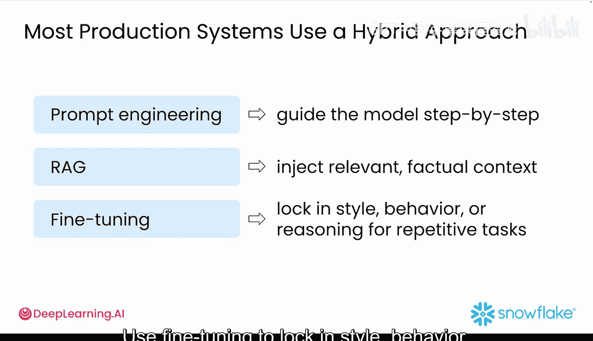
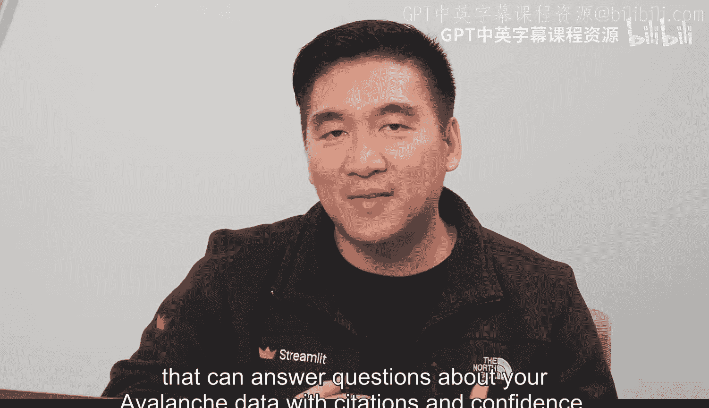

#  042：使用RAG提升模型性能 🚀

在本节课中，我们将要学习检索增强生成（RAG）技术。这是一种让大型语言模型（LLM）在回答问题时，能够从外部知识库中查找最新、最相关事实的方法。通过RAG，你的模型将从一个仅依赖训练数据的“知识库”转变为一个懂得实时查阅资料的“研究助手”。

---

## 什么是RAG？🔍

上一节我们介绍了LLM应用可能面临的挑战，本节中我们来看看RAG如何解决这些问题。

RAG是一种帮助LLM提供更佳答案的技术。它在生成回复前，先从外部来源检索相关信息。这就像给你的模型配备了一个能为你查找有用事实的助手。

RAG包含两个主要步骤：

1.  **检索**：它在你的知识库（如一组文档或数据库）中搜索，以找到最相关的信息。这可以包括基于关键词的词汇搜索，或使用向量嵌入的语义搜索。
2.  **生成**：它将找到的信息注入到大型语言模型中，以生成更准确的回复。

这种组合使你的模型回答更具事实性、相关性，并减少了“幻觉”（即编造信息）的可能性。

---

## 为什么需要RAG？🤔

LLM虽然强大，但它们并非无所不知。它们尤其不了解你的最新产品数据、内部政策或医学、法律等专业领域的信息。

使用RAG，你无需重新训练模型来让它变“聪明”。相反，你让它在运行时查找事实。这在准确性、透明度和可信度至关重要的场景中非常理想，例如医学研究或合同法。此外，通过减少提示词长度和避免不必要的模型重训练，它还能让你的应用更便宜、更快。

以下是需要使用RAG的几种情况：

*   你的知识库太大，无法全部放入提示词中。
*   你的内容频繁变化，并且你需要实时答案。
*   你需要为合规性或可信度提供来源引用。
*   你在医疗保健等准确性至关重要的专业领域工作。
*   你想使用用户特定数据来提供个性化答案。
*   你想优化令牌使用以节省成本。

---

## RAG实战：雪崩数据集示例 📊

回到雪崩数据集的例子，假设用户提问：“本月我们的客户对我们的退货政策有何评价？”

如果仅使用提示词，模型将根据其通用训练进行猜测。而使用RAG，它会搜索你最近的雪崩评论，找到最相关的几条，并基于真实的客户反馈给出答案。

以下是其幕后的工作原理：

1.  模型收到用户问题。
2.  你的系统将评论分解成小块，以便它们能放入提示词中。
3.  检索引擎找到最相关的小块。
4.  LLM将该上下文与问题结合，生成一个有根据的答案。

在Snowflake中，这整个过程可以使用Cortex Search来处理，它会为你完成向量搜索、重新排序和检索。你可以在Snowflake文档中阅读更多相关信息。

---

## RAG vs. 微调 ⚖️

RAG在查询时获取新的上下文，而微调则将特定行为内化到模型本身。

微调最适合以下情况：

*   你需要特定的写作风格或语调。
*   反复执行相同的任务，例如合同摘要。
*   需要一致的逻辑或推理。
*   不想管理外部文档或存储。

然而，微调设置速度较慢，需要带标签的训练数据，并且如果你的数据发生变化，则更难适应。

以下是许多顶级团队使用的成功公式：

1.  使用**提示工程**来逐步指导模型。
2.  使用**RAG**来注入相关的事实性上下文。
3.  使用**微调**来锁定重复性任务的风格、行为或推理。

---

## 总结 🎯

本节课中我们一起学习了RAG技术。你现在理解了为什么RAG已成为生产级LLM应用的支柱。它是一个聪明的演示与团队真正信任的应用之间的关键区别。

核心洞见是：不要让你的LLM记住所有东西，而是教会它如何研究。

接下来，我们将使用Snowflake和Streamlit实现一个RAG系统，该系统能够回答关于你的雪崩数据集的问题，并提供引用和置信度。是时候看看RAG的实际应用了。