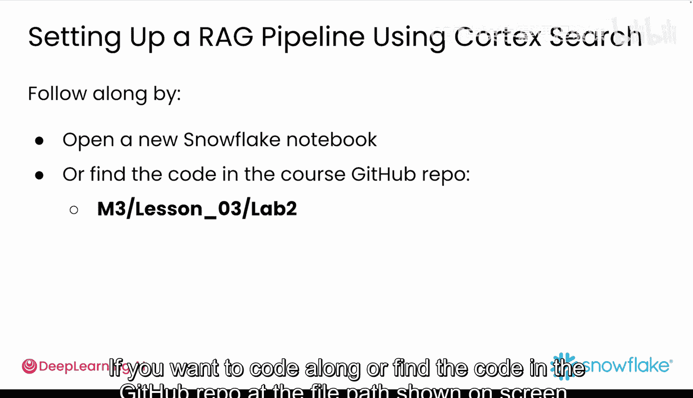
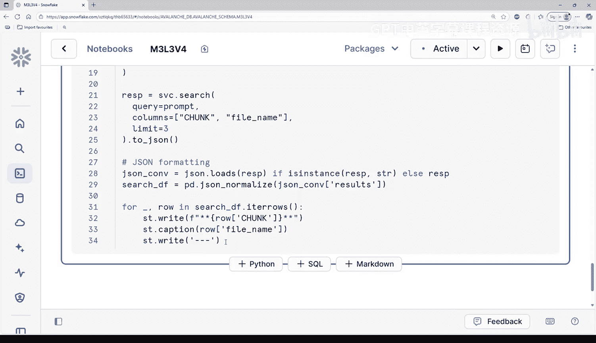

#  043：基于Cortex Search构建RAG管道 🚀

在本节课中，我们将学习如何利用 Snowflake 的 Cortex Search 服务来构建一个检索增强生成（RAG）管道。我们将从数据分块开始，到创建搜索服务，最后进行查询测试，完成应用原型的最后一块拼图。

上一节我们介绍了RAG如何提升信息检索的效果。本节中，我们来看看如何将这些理论付诸实践。

## 理解 Cortex Search

Cortex Search 是 Snowflake 为 AI 应用提供的托管搜索服务。它能自动从你的数据中创建索引和嵌入向量，并提供简单的 API，让你无需自行管理复杂的基础设施，即可构建 RAG 应用。

## 准备数据

首先，在 Snowflake 中打开一个新的 Notebook，或者按照屏幕上显示的文件路径在 GitHub 仓库中找到代码。在开始新操作之前，先预览 `parsed_reviews` 表的内容，以检查现有的数据结构和内容。

## 创建分块数据表

接下来，你将创建一个名为 `chunked_content` 的新表。以下是创建表的 SQL 语句：

```sql
CREATE OR REPLACE TABLE chunked_content (...);
```

创建表之后，使用 `INSERT` 语句配合 `snowflake.cortex.split_text_recursive` 函数。这是一个强大的文本分析函数，能将客户评论文本分割成多个块，以便于后续处理。

```sql
INSERT INTO chunked_content
SELECT 
    ...,
    snowflake.cortex.split_text_recursive(review_text, ...) AS chunk
FROM parsed_reviews;
```




至此，你的数据已完成分块并加载到 `chunked_content` 表中。通过选择前几行数据快速查看新表，确保分块过程正确执行，数据已为后续分析做好准备。

## 设置 Cortex Search 服务

现在，是时候使用 `CREATE OR REPLACE CORTEX SEARCH SERVICE` 来设置搜索服务了。添加以下代码块：

```sql
CREATE OR REPLACE CORTEX SEARCH SERVICE my_search_service
ON chunked_content
COLUMNS chunk;
```

这段代码创建了一个基于你分块数据的搜索引擎，使你可以快速查询文本中存储的特定信息，例如产品评论。

## 测试搜索功能

最有趣的部分来了：测试你的搜索。在 `chunked_content` 表上运行一个 SQL 查询，以查找特定内容，例如“所有关于护目镜的评论”。你可以通过将搜索词传递给 `SEARCH_PREVIEW` 函数来获取匹配结果，如下所示：

```sql
SELECT *
FROM TABLE(SEARCH_PREVIEW('my_search_service', 'goggles'));
```

更好的是，你也可以使用 Python 进行搜索。以下是你需要使用新建的搜索引擎来搜索“护目镜”评论的代码：

首先，一如既往，你需要设置一个 Snowflake 会话连接。

```python
import snowflake.connector

ctx = snowflake.connector.connect(
    user='<user>',
    password='<password>',
    account='<account>'
)
```

然后，你可以编写一个简单的提示词，创建查询服务，并使用你的提示词并指定要搜索的列来进行搜索。

```python
prompt = "Find reviews about goggles"
query_service = ctx.cortex.search_service('my_search_service')
results = query_service.search(prompt, columns=['chunk'])
```

你可以将结果格式化为 JSON 并从中提取信息。

```python
import json
formatted_results = json.dumps(results, indent=2)
```

最后，只需在你的 Streamlit 应用中展示它。

```python
import streamlit as st
st.json(formatted_results)
```



本节课中，我们一起学习了如何利用 Snowflake Cortex Search 服务构建 RAG 管道。我们从数据分块开始，创建了搜索服务，并最终通过 SQL 和 Python 两种方式测试了检索功能，为生成式 AI 应用原型完成了关键的数据检索部分。