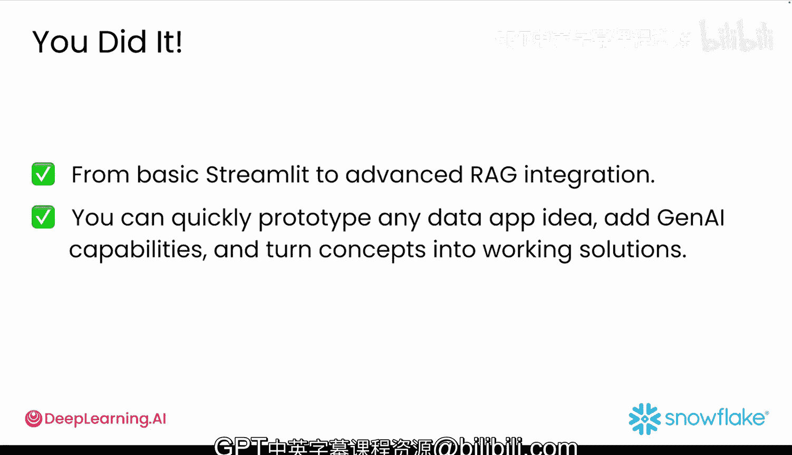

#  044：集成RAG的聊天机器人 🚀

在本节课中，我们将学习如何将之前分别掌握的 Snowflake 数据分析和 RAG 搜索功能整合到一个强大的应用程序中。这个应用将能够分析客户数据，并即时搜索客户评论。我们将构建一个功能全面的分析工具，并为其聊天机器人注入 RAG 的强大能力。

## 概述

你已经分别掌握了 Snowflake 数据分析和 RAG 搜索。现在，你将把它们结合到一个强大的应用程序中，该程序能够分析客户数据并即时搜索评论。让我们构建一个出色的应用。你的应用已经可以完成很多工作：一键加载数据、筛选客户信息、显示有意义的图表以及与你的数据对话。你已经创建了一个真正的分析工具。你学习了 RAG 并构建了完整的流程。现在，进入激动人心的部分。

## 为聊天机器人添加 RAG 功能

上一节我们介绍了数据分析工具的基础功能，本节中我们来看看如何增强其智能对话能力。

想象一下，你的用户可以询问特定产品，并立即从真实的客户评论中获得准确答案。现在是最后的关键一步：将你上节课笔记本中的 RAG 代码添加到你的 Streamlit 应用程序中。你的聊天机器人即将变得非常智能。

实际上，你上节课笔记本中的最后一个单元格已经是一个使用 RAG 服务的可运行 Streamlit 应用。

它唯一缺少的是一个输入窗口，以便你可以输入任何想要的提示，而不是使用应用中硬编码的提示。你已经知道如何使其具有交互性。

## 整合代码与界面优化

以下是整合和优化应用的步骤。

首先，你可以将此代码添加到现有应用的底部，添加一些标题和标签，或按照你偏好方式进行调整。

随着应用规模扩大，你可能需要进一步组织代码。还记得你如何使用列来并排放置按钮吗？创建选项卡几乎完全相同。你首先创建选项卡，然后使用 `with` 语句指定每个选项卡中要放置的内容。

一如既往，你可以完全自由地按照自己的方式实现它。

如果你需要任何帮助，可以在 `M3/lesson3/lab_two` 文件夹中找到一些辅助文件和完整的应用解决方案代码。你可以将这些部分组合起来构建最终的应用。

## 进阶挑战：添加对话记忆

目前，你的聊天机器人只有金鱼般的记忆，它在每个问题之后会忘记一切。尝试使用会话状态变量添加聊天历史记录，以便用户可以进行真实的对话。

一种方法是修改提示，使其不仅接收数据和问题，还接收聊天历史记录。你需要通过将其存储为会话状态变量来跟踪此聊天历史记录，就像你保存数据集的位置一样。如果你遇到困难，解决方案在同一个文件夹中。

## 总结

本节课中我们一起学习了如何从基础的 Streamlit 应用进阶到集成 RAG 的高级应用。你已经掌握了全栈技能。现在，你可以快速原型化任何数据应用想法，添加 AI 功能，并将概念转化为可行的解决方案。

在我们的最后一个视频中，我们将讨论你构建了什么、学到了什么，以及最重要的是，接下来可以着手哪些令人兴奋的项目。