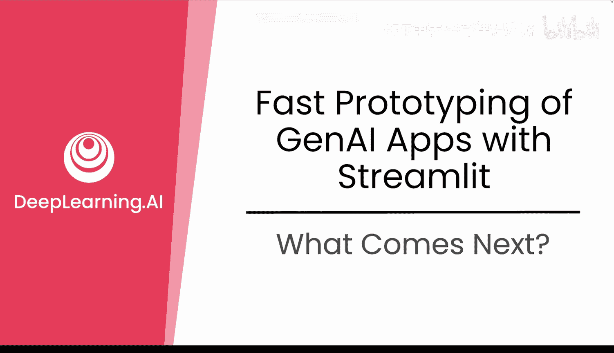
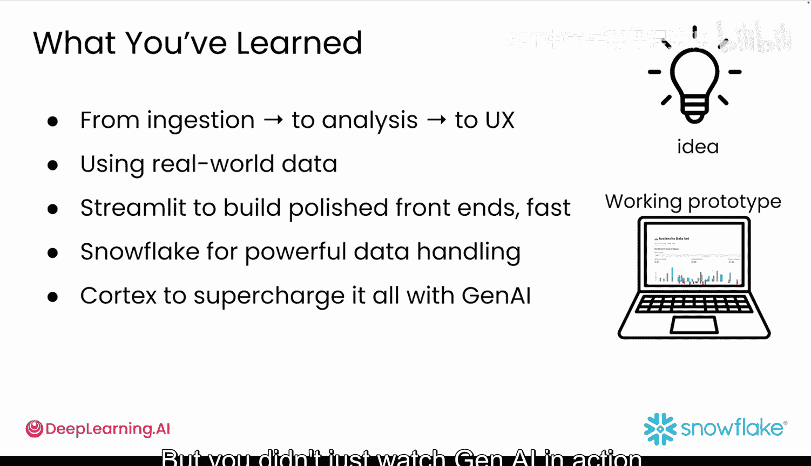
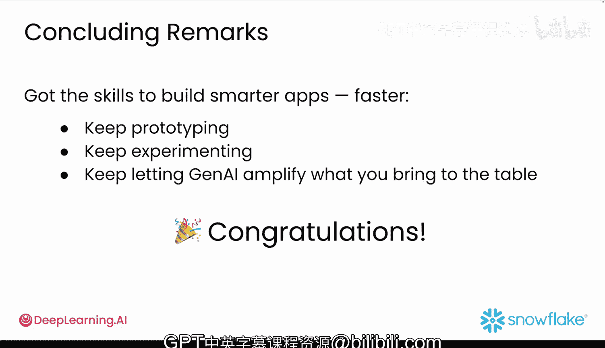

#  045：后续发展路径 🚀

在本节课中，我们将回顾整个课程的学习成果，并探讨在掌握了快速原型开发技能之后，如何规划下一步的发展路径。我们将从已完成的成就出发，展望几个可以深入探索的创意方向。

## 课程回顾与成就

恭喜你成功抵达终点线。这不仅是本课程的终点，更是你决定接下来要开发任何原型的起点。

让我们花点时间回顾一下你所完成的成就。你从一个想法开始，将其转变为一个完整的原型，涵盖了从数据摄取、分析到用户体验的每一步，并且全程使用了真实世界的数据。你使用 **Streamlit** 快速构建了精美的前端界面，使用 **Snowflake** 进行强大的数据处理，并利用 **Cortex** 通过生成式 AI 为整个应用赋能。

你实践了敏捷开发，将 AI 作为你的编程伙伴，以前所未有的速度编写、调试和改进你的应用。你不仅仅是观察生成式 AI 的运行，更将其融入了你的工作流程。

## 后续发展路径

现在，你已经成为一名生成式 AI 原型开发能手。接下来该做什么呢？以下是一些启发你思考的想法。

### 创意一：构建多模态应用

目前，大型语言模型可以接受文本、图像，甚至音频作为输入，有些还支持视频。想象一下这个场景：你录制一段应用使用过程的屏幕录像，然后将其输入给一个模型，并自动请求获取用户体验反馈、文档或下一步功能建议。

### 创意二：探索 AI 智能体

我们现已进入智能体生成式 AI 的时代。你可以创建行为类似初级开发者的自定义智能体。赋予它们一个角色、一些目标和一种开发风格，然后让它们去开发功能、测试代码或评估应用性能。凭借你在这里建立的 **MVP（最小可行产品）优先** 的思维方式，你已具备了在这一领域开始工作的绝佳条件。

### 创意三：将原型转化为产品

无论你构建的是工作项目、副业项目，还是仅仅为了乐趣，你已经学会了如何将一个想法变成一个可运行的生成式 AI 应用。若想从原型走向产品，可以按以下步骤进行：
*   **添加身份验证和权限**，以支持真实用户。
*   **集成外部 API**，以获取实时数据或触发现实世界的操作。
*   **将洞察转化为功能**，基于你的分析开发仪表板、警报或自定义工具。
*   **部署并实现应用盈利**，收集用户反馈，并开始对访问权限或洞察分析收费。

凭借你在此构建的基础，你已经成功了一半。下一步就是：让它变得有用，让它变得真实，让它成为你的作品。

## 总结与展望

AI 将持续快速发展，工具会变，界面会变，模型也会变。但你的思维方式——你所建立的 **“构建、评估、迭代、改进、重复”** 的原型开发循环——才是让你保持领先的关键。这正是现代软件，尤其是生成式 AI 应用的开发方式，现在也成为了你的开发方式。

那么，接下来做什么？这取决于你。你已经掌握了更快构建更智能应用的技能。所以，请继续开发原型，继续实验，继续让生成式 AI 放大你所能带来的价值。

这仅仅是第一个版本。现在，去让它变得更好吧。

再次恭喜你，你正式成为了一名生成式 AI 原型开发者！🎉