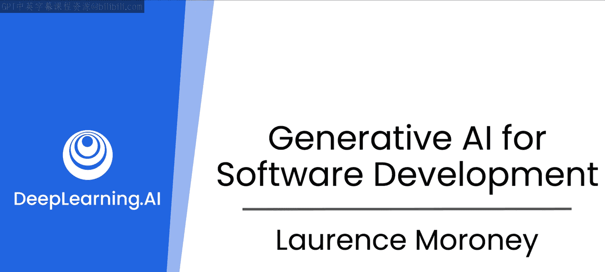

# 1：课程介绍与展望

## 概述

在本节课中，我们将一起了解吴恩达与劳伦斯·莫罗尼关于生成式AI如何变革软件开发领域的对话。我们将探讨生成式AI如何成为开发者的得力助手，提升编码效率与乐趣，并展望未来的发展趋势。

欢迎来到《软件开发中的生成式AI》课程。生成式AI正在帮助许多软件开发者编写更快、更好的代码。

需要明确的是，本专项课程并非教授如何构建生成式AI应用，而是专注于生成式AI如何助力软件开发本身。

无论你是数据科学家、前端、后端、全栈还是移动端开发者，生成式AI都能提供帮助。我很高兴能与劳伦斯·莫罗尼一同授课，他将是本系列课程的主讲人。你可能通过TensorFlow课程认识劳伦斯，他曾在DeepLearning.AI任教。劳伦斯也是超过30本书籍的作者，题材涵盖科幻、编程和机器学习。我很期待他能教授如何利用生成式AI更好地编写软件的最佳实践。

## 生成式AI对开发者的影响

上一节我们介绍了课程的基本情况，本节中我们来看看生成式AI将如何影响软件开发者的日常工作。

劳伦斯分享了他的亲身感受：使用生成式AI进行编码比以往更有趣。三周前，他需要将某个应用部署到云服务，但忘记了具体步骤。他本可以去阅读文档，但发现通过提示大语言模型来引导他完成整个过程更快，结果也基本正确。这帮助他打包了Docker容器并推送到云服务，从而完成了任务。

因此，他发现自己现在更期待编码，因为他知道有像生成式AI这样的编程伙伴在身边协助。正是那些繁琐的任务有时会消解解决特定问题本身的乐趣。当你有一个结对编程伙伴帮你处理这些任务时，整个开发过程会变得更愉快。

生产力提升是显而易见的。麦肯锡和思科的研究估计，在代码生成等任务上，生产力可能提升35%甚至更多。生产力的大幅提升固然很棒，但乐趣的增加同样是一个巨大的收获。

劳伦斯发现自己坐下来享受编码的时间比以前更多了，因为他可以将更多时间花在思考要解决的问题上，而不是纠结于如何实现用户界面、如何构建Docker容器并推送到云端这类事情。这真的很有趣。

## 关于“AI取代程序员”的讨论

在社交媒体上，一直存在一种尖锐的声音，认为“没人需要再写代码了”或“程序员将因生成式AI而淘汰”。对此，我们持有不同看法。

劳伦斯认为这种观点是错误的。他强调，在生成式AI时代，作为软件开发者的专业知识比以往任何时候都更重要。因为AI能赋予你超能力，让你更高效、更能解决领域问题，并在过程中享受乐趣，从而获得更充实的体验，在工作中过得更好。

事实上，吴恩达推测，如果35%的生产力提升估算准确，那么会发生的情况是：**使用AI的人将取代不使用AI的人，但AI不会取代软件开发者**。

考虑到研究显示当前已有显著的生产力提升，并且随着技术的快速发展，这些收益未来只会不断扩大。今天，AI帮助我们解释代码、调试、管理依赖等。展望未来，随着更先进的智能体技术出现，开发者将拥有更多工具，变得更高产、工作更有趣。

## 未来趋势：本地化与专业化

劳伦斯还提到了“小型化”趋势，即大语言模型正在变得更小但依然有效。他预见这一趋势将持续，并让开发者的工作更加轻松。未来，开发者可以在本地机器上运行一个经过自己代码库训练、精通自身领域的大语言模型，将其作为专属的结对编程伙伴。

此外，许多公司不允许将源代码分享到外部，不能上传到ChatGPT或Claude等平台。但当你在自己的开发机上运行一个内部模型时，他认为对于许多开发者而言，限制将被打破。

当我们遇到难题时，无论是新手还是有经验的开发者在学习新东西时，通常需要找到人类专家来帮助解决。劳伦斯非常喜欢“结对编程”这个类比——你现在随时都有一个伙伴可以提问。相比于等待一天或更长时间去寻找领域专家（尽管专家也未必知道所有答案），你的伙伴能立即给出答案或提供一些选项。他认为这将帮助开发者更频繁、更快速地摆脱困境。

有时，即使AI没有直接解决眼前的问题，它提供的答案也能激发灵感，帮助开发者找到不同的解决路径，甚至开辟一个全新的方向。这种灵感的激发是让任务变得更愉快的事情之一。

## 生成式AI在开发全流程中的应用

吴恩达非常欣赏劳伦斯带来的见解。他认为很多人都在以临时但有效的方式使用生成式AI辅助编码，而劳伦斯所做的是系统性地梳理开发者必须完成的各种任务，并思考如何利用生成式AI的最佳实践来协助这些任务。

例如，在听到劳伦斯的分享之前，吴恩达从未想过使用生成式AI来辅助测试驱动开发以编写测试用例。这种对开发任务进行系统性分析、探索最佳实践的方式，他非常赞赏。

劳伦斯补充道，另一个他喜欢的领域是依赖管理。通常，错误并非源于你的代码，而是依赖项集合中存在不匹配。能够使用友好的结对编程伙伴（大语言模型）来帮助你理解依赖关系、破坏性变更等，并引导你解决问题，这非常有用。

成为一个开发者所涉及的内容远不止编写代码。在所有任务中都有一个LLM陪伴你，这非常强大且有趣。

吴恩达分享了一个亲身经历：几年前，他遇到一些使用Python 3.12特定功能的开源代码，这些功能他从未用过。幸好，AI告诉他如何修改代码以兼容他正在使用的Python 3.10。他认为这类事情确实节省了大量时间，因为AI对Python 3.10和3.12的了解远胜于他，能帮助他快速解决问题。

## 展望未来：五年后的软件开发

如果我们展望未来五年，生成式AI将把软件开发塑造成什么样子？

劳伦斯认为这令人兴奋。语法已经变得不那么重要了，我们需要记忆的东西少了一件。随着AI越来越能够自主编写代码、测试和调试（通过智能体工作流），他感觉软件开发者可以在更高层次上操作。他认为人类很可能在很长一段时间内需要指导和监督AI。

但了解技术发展并跟上技术步伐，即使对经验丰富的开发者来说，也是我们做好工作的关键。有时，当我们开始构建一个系统时，会从白板开始，绘制各种方框和箭头，思考约束条件。考虑到今天我们通过提示生成代码、文档或测试用例，在不久的将来，我们在白板上绘制的那些系统设计图——那些方框图——可能成为下一个提示词。

借助多模态模型识别图像的能力，能够基于这些设计图生成系统代码，这将非常有趣。回到领域专业知识的话题：当你拥有解决特定问题的领域专业知识，并且可以绘制出其架构时，该架构可以隐式地转化为可执行的代码。你可能不需要过多地接触原始代码，除非你想进行微调和调试。五年后，这可能是软件开发者变得更高效的一种方式，他对此充满期待。

## 本专项课程内容介绍

那么，我们今天有什么呢？在这个专项课程中，我们有三门课程。首先要强调的是，这不是一系列关于如何构建生成式AI的课程，而是一系列关于如何使用生成式AI成为更好的软件开发者的课程。我们在这里要培养的技能与所有领域都高度相关。

正如我们已经谈到的，它不仅仅是编码，还包括文档编写、依赖管理、测试，甚至一些架构设计。在这些课程中，我们将采用最佳实践，利用生成式AI作为你的朋友来协助完成所有这些工作。

以下是三门课程的具体内容：

**第一门课程** 主要面向作为个体的软件开发者。它将向你介绍大语言模型，以及如何将它们用作结对编程伙伴。然后，你将深入学习提示工程和系统提示，让大语言模型扮演软件测试员等角色，就像与你并肩工作以构建更好代码的各类人员一样。

**第二门课程** 则着眼于与其他人的协作。作为一名软件工程师，你将与测试人员、文档编写人员以及提供依赖项的人员（可能是公司内部的，也可能是像Python包这样的第三方）合作。我们将培养你使用大语言模型更好地完成所有这些工作的技能。

**第三门也是最后一门课程**，我们将把技能提升到专业软件开发者的水平。你将了解从设计阶段（使用著名的“四人帮”设计模式）到数据序列化、数据库管理等构建和启动应用程序的完整工作流程。

整个课程的理念是：帮助你从个体开发者起步，过渡到团队协作，最终能够部署专业的解决方案。

## 课程前提与准备

关于课程前提，唯一的先决条件是最好了解一点Python。如果你是一名Python开发者，那会很好。我们也会涉及一些其他语言，如Java和JavaScript，但主要使用Python进行教学。

本课程有很多内容需要学习。接下来，让我们立即开始学习如何使用大语言模型来辅助你的编码工作。让我们进入下一个视频，正式开始学习之旅。

## 总结

本节课中，我们一起学习了生成式AI对软件开发领域的深远影响。我们探讨了AI如何成为开发者的高效伙伴，提升生产力与工作乐趣，并反驳了“AI将取代程序员”的观点。我们展望了未来AI模型更小型化、本地化及专业化的发展趋势，以及其在软件开发全流程（如测试、依赖管理、系统设计）中的应用潜力。最后，我们概述了本专项课程的三门核心内容：从个体开发到团队协作，再到专业部署，旨在系统性地培养你利用生成式AI提升开发技能的能力。现在，让我们准备好开始实践之旅。