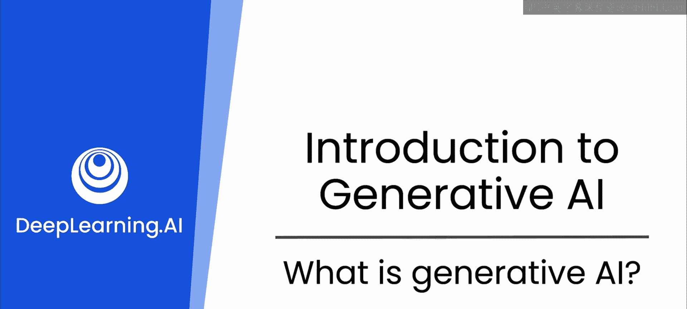
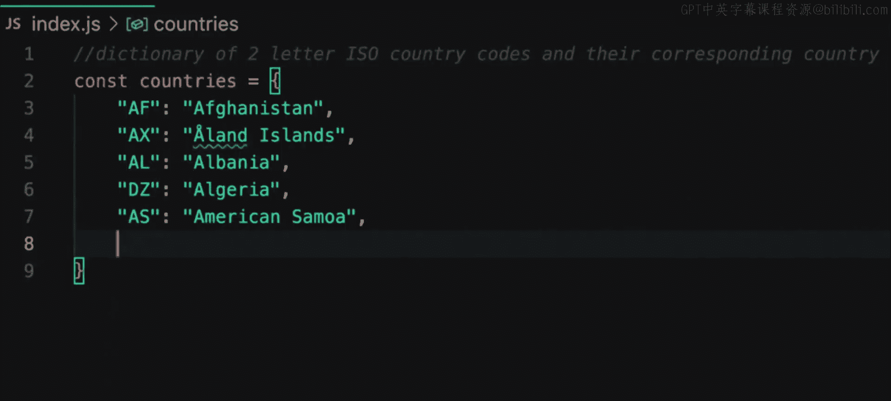
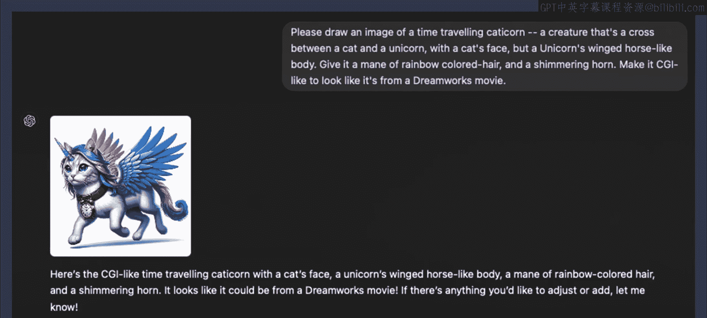

# 2：什么是生成式人工智能 🤖

在本节课中，我们将要学习生成式人工智能的基本概念，了解它如何改变软件开发领域，并探讨其核心工作原理。

欢迎来到“生成式AI软件开发技能”认证课程。这是一门创新课程，旨在赋予您在软件开发领域整合和利用生成式人工智能所需的前沿技能。随着商业和技术的演进，对先进AI能力的需求正在急剧增长。本课程为您提供了一条全面的路径，不仅帮助您理解生成式AI技术，还教您如何在创建、增强和扩展软件应用程序时应用它们。

在本专项课程结束时，您将知道如何使用生成式AI工具来协助您完成构成软件开发人员角色的所有主要任务，从而使您能更好、更高效地完成工作。您可能听说过生成式AI可以生成代码，但要构建一个可运行的系统，需要的远不止代码。因此，通过本课程，您将看到如何通过让大型语言模型（LLMs）在您身边协助您完成整个过程，来增强您的编码技能，成为一名更优秀的工程师。

那么，让我们首先退一步，探索一下大型语言模型。您可能听说过这些术语，但它们对您作为开发人员究竟意味着什么？让我们来解析一下，并探讨它对您的项目和工作流程的影响。

## 生成式AI的定义与范畴

生成式AI指的是能够生成新内容的人工智能系统。这包括从代码片段到完全渲染的图像，甚至视频和音乐等合成媒体的一切内容。

例如，您可能遇到过像GitHub Copilot这样的工具。它是生成式AI如何通过在你输入时建议整行或整块代码来协助编码的一个典型例子。

## AI在日常工具中的深度集成

看到AI如何深度集成到您日常使用的工具中，这非常有趣。想想搜索引擎、推荐系统、集成开发环境（IDEs），甚至一些调试工具，它们都由AI驱动，以提高您的效率。

## 生成式AI的创造性应用

聚焦于生成方面，AI现在可以帮助进行超越传统数据处理的内容创作。它是关于从零开始生产新的、可用的资产。以DALL-E为例，它可以根据文本描述创建图像。在这里，我提示模型生成一张“时间旅行猫角兽”的图像——一半是独角兽，一半是猫，并且是时间旅行者。我还加入了一些我希望图像具备的特征，而模型很好地仅根据这些特征创建了一张图像。这不仅仅是一个很酷的玩具，它让您得以一窥未来如何可能直接从描述中为游戏或应用程序生成资产。

## 生成式AI的重要性

那么，为什么这很重要？生成式AI不仅仅是更快创建内容的工具，它是您在软件开发中处理问题和解决方案方式的一次范式转变。它提供了一种自动化和增强创造力的方法，缩短了从概念到产品的时间。无论您是在构建企业应用程序还是独立游戏，理解生成式AI都将为您带来显著优势。

因此，让我们从探索这一切是如何运作的开始。我们不会深入探讨技术细节，但我认为为了让您能最大限度地利用它，了解其底层工作原理是有益的。

## 核心概念：大型语言模型

大型语言模型是生成式AI的核心驱动力之一。它们是基于海量文本数据训练的深度学习模型，能够理解、生成和操作人类语言。

**核心公式/概念**：
一个简化的LLM工作原理可以表示为：
`输出 = 模型(输入提示)`
其中，模型是一个经过训练的神经网络，它根据输入的文本（提示）预测最可能的下一个词或序列。

## 生成式AI如何协助软件开发

以下是生成式AI在软件开发中的几个关键应用场景：

*   **代码生成与补全**：如GitHub Copilot，根据上下文自动生成代码行或函数。
*   **代码解释与文档**：解释复杂代码段的功能或自动生成注释和文档。
*   **调试与错误修复**：分析错误信息或代码，提供可能的修复建议。
*   **设计辅助**：根据自然语言描述生成UI草图、数据库架构图或系统设计。
*   **测试用例生成**：自动创建单元测试或集成测试的代码。

## 总结

本节课中，我们一起学习了生成式人工智能的基本定义，了解了它如何通过像大型语言模型这样的技术，在代码生成、内容创作等方面为软件开发带来革命性的助力。我们看到了它不仅是效率工具，更是改变问题解决思路的新范式。理解这些基础，将帮助我们在后续课程中更好地学习和应用具体的生成式AI技能。