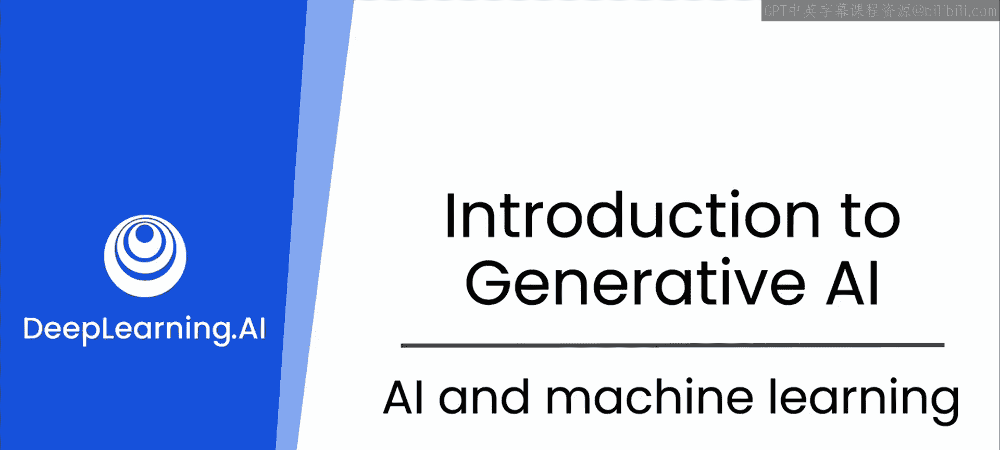
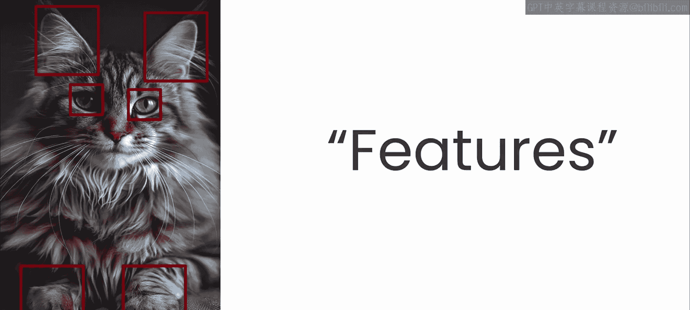
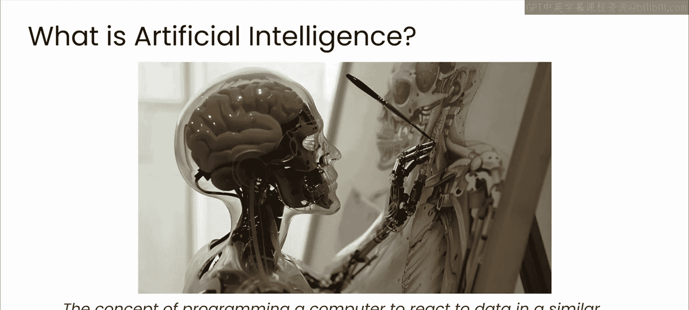
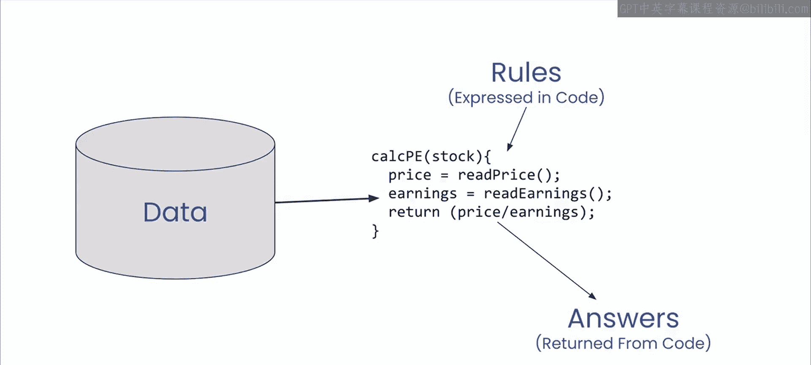
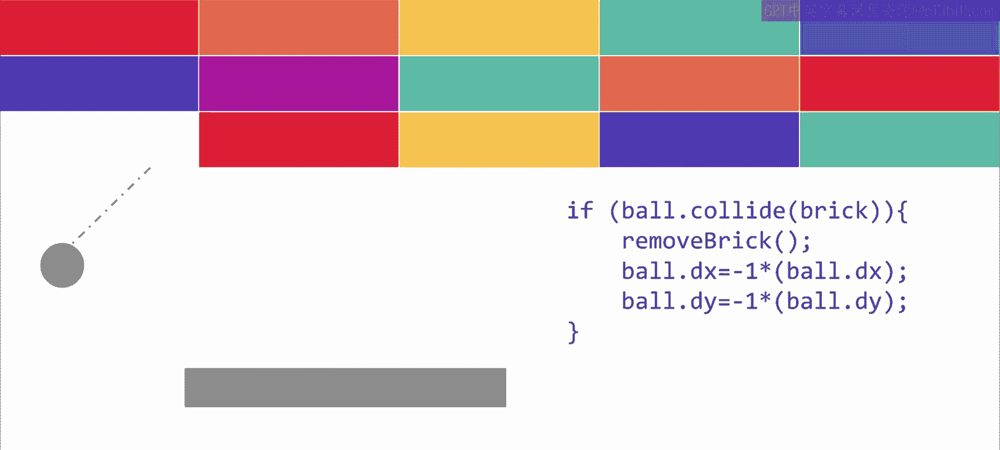
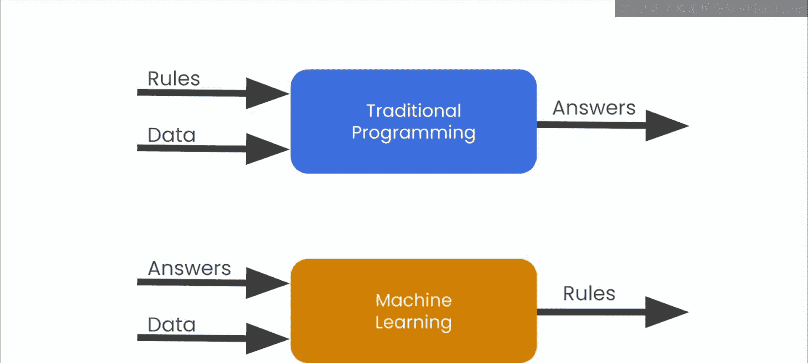

# 3：人工智能与机器学习基础

在本节课中，我们将要学习人工智能和机器学习的基本概念。我们将从定义开始，探讨计算机如何像智能生物一样“理解”数据，并介绍机器学习与传统编程的根本区别。

## 人工智能的定义

上一节我们提到了课程目标，本节中我们来看看人工智能的核心定义。

人工智能可以被定义为：**编程使计算机能够像智能生物一样对数据做出反应**。

为了理解这个定义，让我们看一个例子。下图是一只猫的图片。人类和许多动物都能认出这是一只猫。

但计算机是如何“看”这张图片的呢？计算机并不真正地“看见”。它将图片视为一堆没有关联意义的彩色像素。而人类或动物会识别出眼睛、耳朵、爪子等特征，并根据经验判断这是一只猫。

因此，人工智能的目标就是让计算机程序能够以类似的方式识别特征，并将这些特征组合起来，得出“这是一只猫”的结论。

## 从人工智能到机器学习

那么，如何实现让计算机识别特征并做出判断呢？这就是机器学习发挥作用的地方。

机器学习并不是指机器人在教室里学习。它只是一种编程计算机的新方法。为了理解它，我们需要先审视传统计算机编程是什么。

以下是传统软件开发的核心组成部分：

*   你可能会看到读取数据、对数据进行操作并返回结果的代码。这是整个软件行业的基础。
*   或者是指定游戏行为规则的代码，例如球的移动方式以及球与砖块碰撞时会发生什么。

传统编程可以总结为下图所示的流程：**你用代码表达规则，这些规则作用于数据，然后你得到答案**。

## 机器学习的革命性转变

机器学习的革命性在于，它提供了一种看待上述流程的新方法，这是一种全新且不同的编程方法论。

与传统编程不同，机器学习不要求你自行找出规则并用代码表达。相反，它的核心思想是：**你提供数据和对应的答案，然后让计算机自己找出背后的规则**。

这就是整个机器学习革命的核心。如果你之前没有接触过机器学习，这个概念可能暂时不太容易理解。在接下来的视频中，我们将通过更详细的例子来深入探讨。

本节课中我们一起学习了人工智能的基本定义，即让计算机模仿智能生物处理数据。我们还探讨了机器学习与传统编程的根本区别：传统编程是“规则 + 数据 → 答案”，而机器学习是“数据 + 答案 → 规则”。理解这一范式转换是掌握生成式AI工具背后关键概念的第一步。