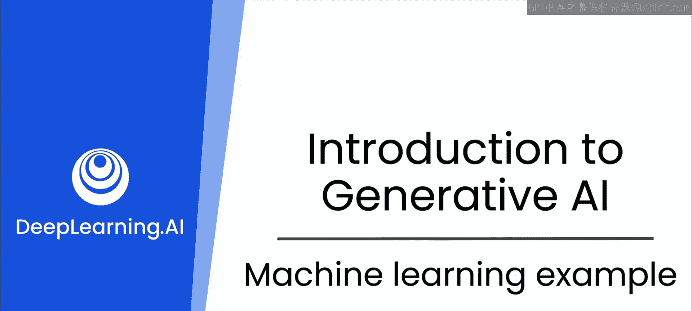
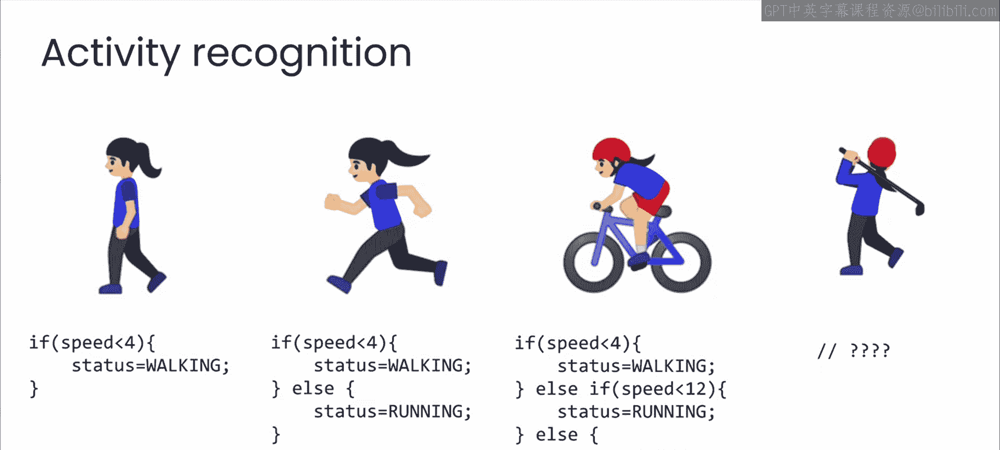
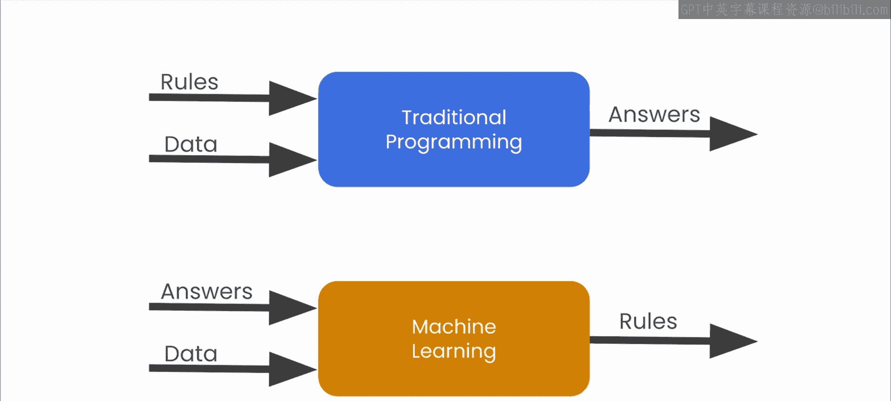
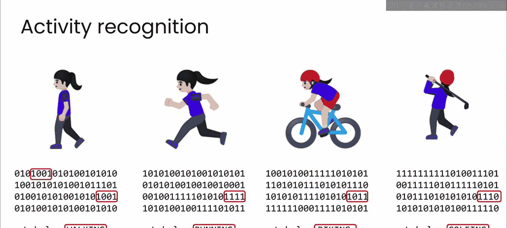
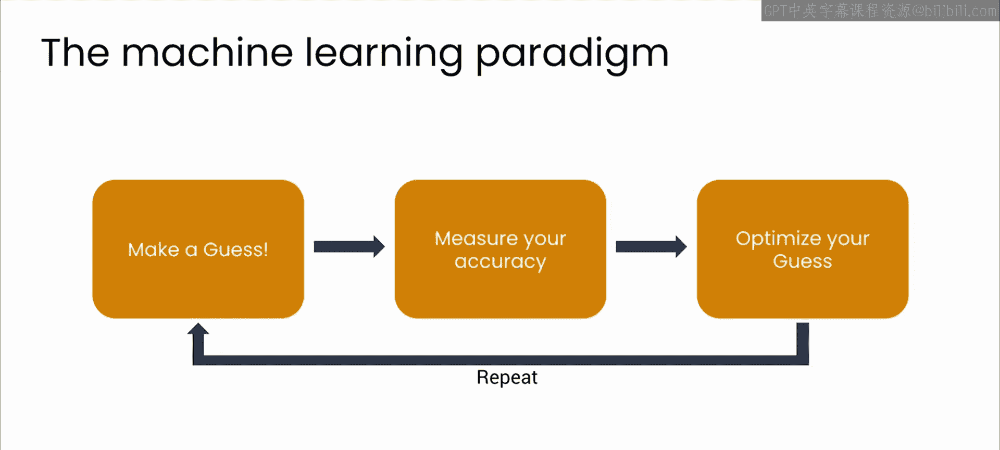
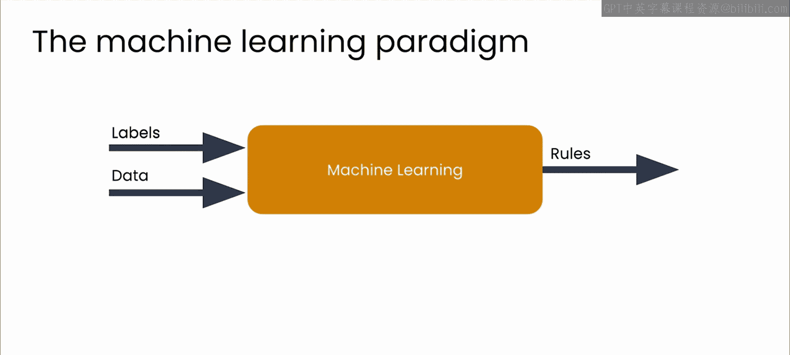
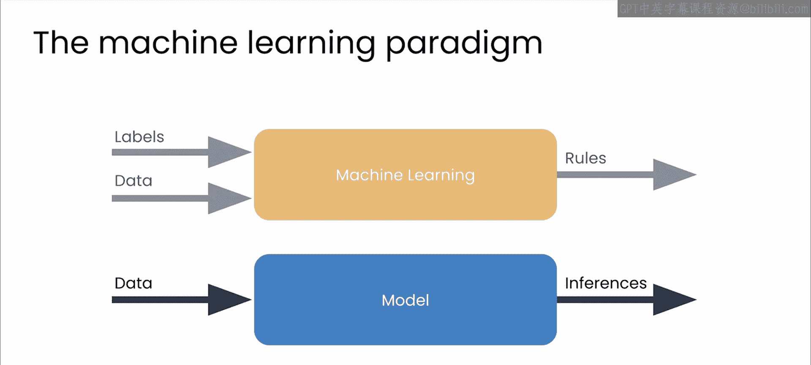

# 4：机器学习示例 🧠

在本节课中，我们将通过一个具体的例子，深入探讨机器学习如何工作。我们将了解机器学习如何通过数据和标签，让计算机自己找出完成任务所需的规则，而不是由程序员手动编写这些规则。

## 从传统编程到机器学习的范式转变

上一节我们介绍了机器学习是一种范式转变。现在，我们通过一个“活动识别”的问题来具体看看这是如何运作的。

你的目标是编写一个应用程序，利用手机、手表或其他设备上的传感器来确定一个人的活动状态：他们是在走路、跑步、骑自行车，还是在做其他事情？

## 传统规则方法的局限性

以下是传统编程方法的思路：

你可以使用设备传感器的速度数据，并编写一条规则：如果速度低于某个值（例如每小时4英里），那么设备佩戴者可能正在走路。你有数据，你有规则，你就能得到答案。

然后，你可以扩展这条规则来判断跑步：如果速度低于4英里/小时，是走路；否则是跑步。这个方法似乎还行。

你甚至可以进一步扩展来判断骑自行车：如果速度低于4英里/小时，是走路；否则如果低于12英里/小时，是跑步；否则，用户就是在骑自行车。

但是，其他活动呢？例如，你如何判断用户正在打高尔夫球？你能写出什么规则来区分打高尔夫球和走路？

此外，你可能已经意识到，之前的规则也有些过于简单了。你不能仅仅依靠速度。例如，你下坡跑步的速度可能比你上坡骑车的速度还要快。

## 机器学习如何解决问题

让我们回到核心图表，思考机器学习如何帮助你解决这个问题。如果你给计算机提供答案（标签）和数据，并让它为你找出匹配这些标签和数据的规则，会怎么样？

具体操作可以如下所示：

1.  你可以让某人佩戴设备，并进行一系列活动。
2.  在每个活动期间，捕获设备传感器的数据。
3.  然后用“走路”、“跑步”、“骑车”、“打高尔夫”等标签来标记这些数据。

现在，问题变成了：你能否将这些数据与活动标签匹配起来？例如，也许当人走路时，数据的这些部分总是以某种特定形式出现。而当人跑步、骑车或打高尔夫时，这些数值总是不同。

你可以让机器发现这些模式。当它发现这些模式后，就可以利用它找出的规则来确定哪些模式对应哪些标签，并用这些规则来分析未来的数据，从而判断设备佩戴者实际在进行什么活动。

这很可能比我们自己编写规则更可靠。

## 机器学习的基本流程

那么，我们如何编写一个程序来进行这种模式匹配呢？这个过程实际上相当简单。

以下是机器学习训练的基本步骤：

1.  **做出猜测**：首先，对数据和标签之间的关系做出一个初始猜测。
2.  **比较与评估**：查看所有数据，将你的猜测与正确答案进行比较（我们在标记数据时已经有了答案）。
3.  **优化猜测**：根据猜测的参数以及通过对比真实答案得到的准确度，你现在拥有了一些可以用来优化猜测的数据。
4.  **重复迭代**：然后重复这个过程。

从逻辑上讲，如果我们持续这样做，我们的猜测会变得越来越好。在使用像TensorFlow这样的机器学习工具时，实现这些步骤的API实际上是现成可用的。

## 机器学习模型

现在，如果我们回到这个图表，机器学习的核心思想是：输入答案（也称为标签）和数据，让机器找出将这些标签与数据匹配起来的规则。

当你这样做之后，你会得到一个**模型**。这个模型可以接收新数据，并应用它学到的模式将数据与答案匹配，从而给出对该数据的**预测**或**推断**。

在我们的活动检测案例中，现在其他人可以佩戴设备。基于机器学到并放入模型中的模式匹配规则，该模型就能检测出这个人是在走路、骑车、跑步还是打高尔夫。

## 总结与展望

本节课中，我们一起学习了机器学习的一个具体示例。我们看到了传统基于规则的方法在解决复杂问题（如活动识别）时的局限性，并深入了解了机器学习如何通过“数据+标签”的模式，让计算机自动学习规则，最终生成一个可以对新数据进行预测的模型。

这是一种形式的机器学习，被称为**监督学习**。在下一节视频中，我们将更详细地探讨监督学习。