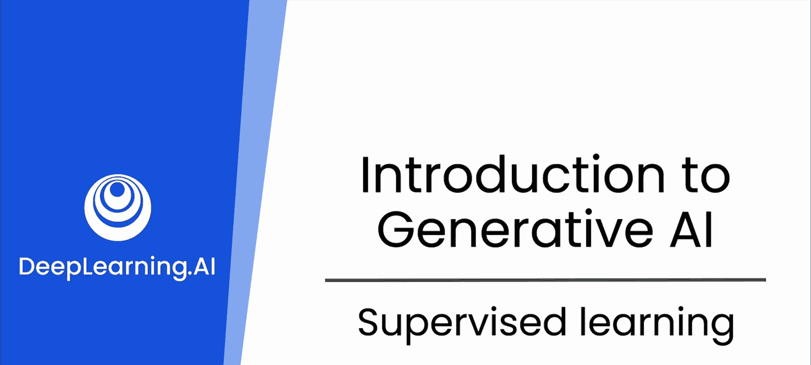
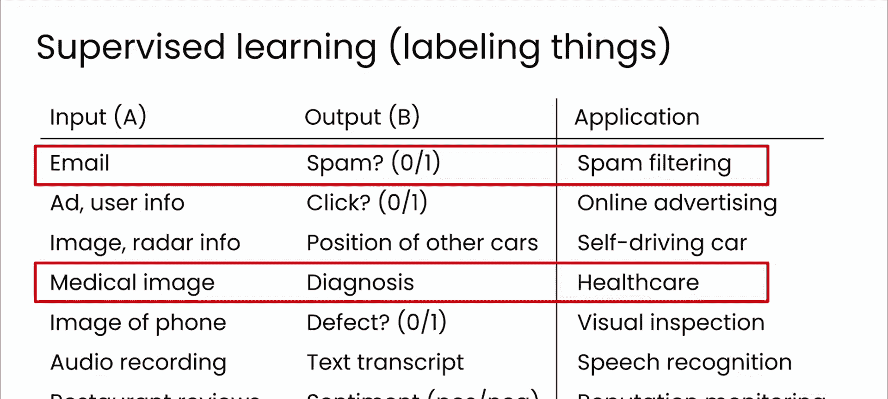
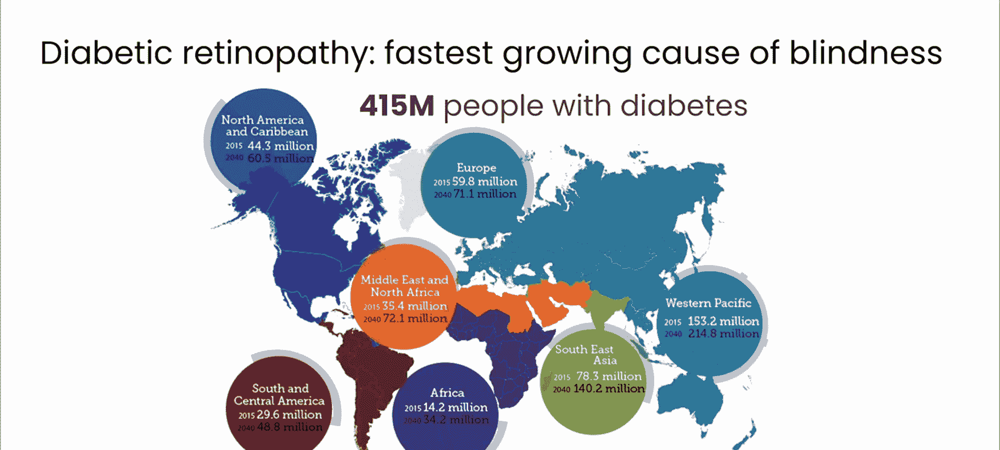
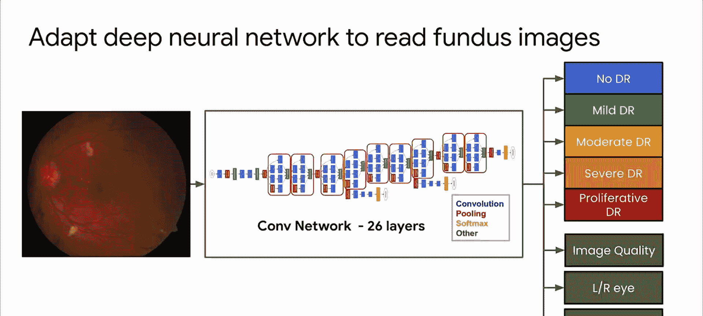
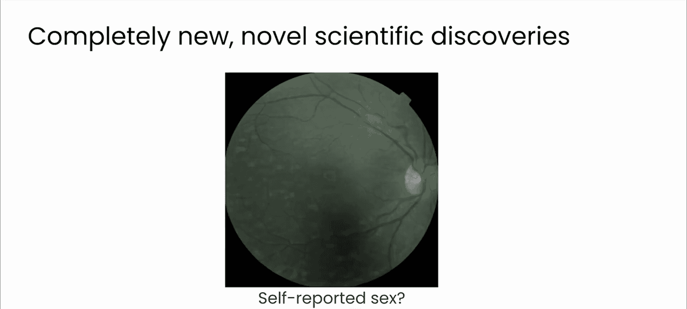
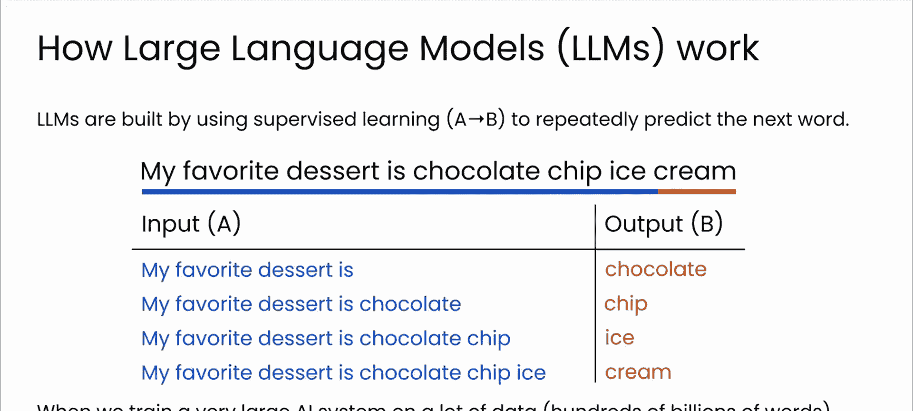

# 5：4_监督学习

在本节课中，我们将要学习监督学习。监督学习是工业界应用最广泛的人工智能领域，它构成了许多日常技术的基础。我们将了解其核心概念、工作原理，并通过一个医学领域的实例来加深理解。

## 什么是监督学习？🤔

上一节我们介绍了机器学习的基本概念，本节中我们来看看其中最重要的一种范式——监督学习。

在工业界，监督学习是一个巨大的领域。它比无监督学习或强化学习等其他人工智能领域更为普遍，因为它在我们日常技术中有着直接的应用。从电子邮件过滤到个人助理，监督学习构成了那些需要基于历史数据进行可靠且准确预测的系统的支柱。

那么，监督学习究竟是什么？它涉及在一个包含输入与正确输出配对的数据集上训练模型。正如我们之前在活动检测示例中看到的那样。

这种方法类似于用抽认卡教孩子。每个问题都附有答案，任务是学习这些配对以便进行预测。

## 监督学习的核心原理与实例 🏥

理解了基本定义后，我们来看看它的核心原理和一些实际例子。

监督学习的核心底层原理是，机器学习模型能够学会将数据与标签进行匹配。以下是一些日常例子：基于优质邮件和垃圾邮件的特征训练以识别垃圾邮件的电子邮件系统；或者从数千张带有诊断标签的视网膜图像中学习的医学成像系统。这些系统都依赖于高质量的标签数据来学习如何准确响应新信息。

一个非常有趣的现实世界例子来自医学领域，即糖尿病视网膜病变的例子。糖尿病视网膜病变是全球增长最快的可预防性失明原因。通过定期筛查可以相对容易地缓解，每位糖尿病患者每年都应使用特殊相机拍摄眼底（视网膜）进行筛查。

但在世界许多地方，根本没有足够的专家来做这件事。例如，在印度，缺少数千名眼科医生来进行这种扫描。结果，几乎一半的患者在得到任何诊断之前就会遭受视力丧失。这是一个悲剧，因为这种疾病是完全可预防的。

## 机器学习如何提供解决方案？💡

面对专家短缺的挑战，研究人员是如何利用监督学习来解决问题的呢？

为了解决医生短缺的问题，研究人员转向了机器学习。他们创建了一个包含数万张视网膜扫描的数据集，这些扫描由医生按照从无问题到晚期疾病的五分制进行分级。医生会识别出像这里看到的出血等模式。

研究人员随后使用得到的数据和人工分配的标签来训练一个机器学习算法，使其能够将图像与标签匹配起来，并执行与医生相同的特征识别。

因此，这个模型使计算机能够学会如何诊断图像，其水平有时甚至优于人类。

## 监督学习的意外发现 🔍

机器学习有时还能在数据集中发现其他有趣的关系。在这个案例中，视网膜图像不仅被标记了疾病特征，还包括其他数据，如患者年龄、出生时指定的性别、血压读数等。

因为监督学习是将数据与标签进行匹配，这里的算法学会了通过所有标签来匹配图像，并在此过程中揭示了一些新东西。该模型能够从视网膜图像中以97%的准确率预测一个人的出生时指定性别。不知何故，它能以人类无法做到的方式从图像中“看到”这个标签。人类在这方面的正确率大约只有50%，和抛硬币的概率一样。

## 监督学习的广泛应用与未来展望 🚀

所以，监督学习是一种非常强大的技术，可以应用于不同类型的标签数据，从图像到声音和文本。事实上，正是使用文本数据的监督学习，推动了强大大型语言模型的发展。

强大的聊天机器人和其他应用，如ChatGPT或Gemini等LLMs，都是在海量文本数据上训练的。在这些数据中，模型学习单词序列之间的关系以及自然跟随的内容，使其能够反复预测下一个单词，从而自主生成连贯且与上下文相关的文本。

我们将在下一节中探讨这些内容，从Transformer架构开始，它使得文本生成和人工模拟推理成为可能。

---

**本节课总结**

本节课中，我们一起学习了监督学习。我们了解到监督学习是通过输入与正确输出配对的数据集来训练模型，其核心是学习数据与标签之间的映射关系。我们通过糖尿病视网膜病变诊断的实例，看到了监督学习如何解决现实世界中的专家短缺问题，并可能发现人类难以察觉的数据关联。最后，我们认识到监督学习是构建当今强大语言模型的基础技术。