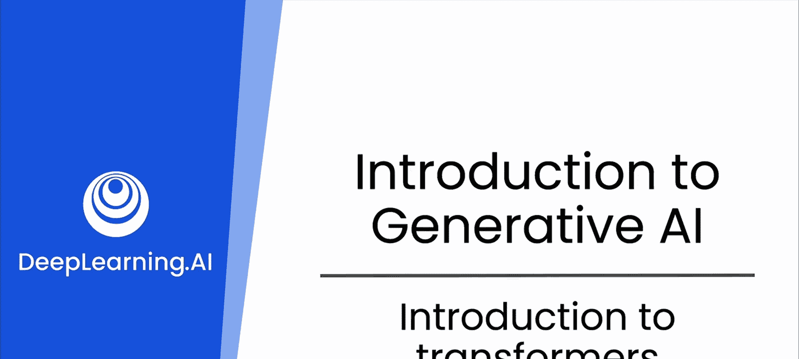
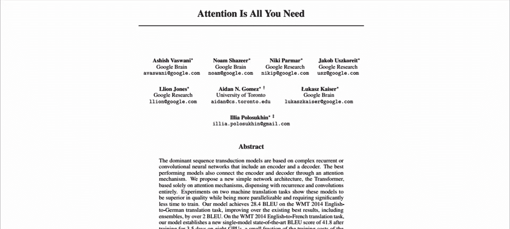
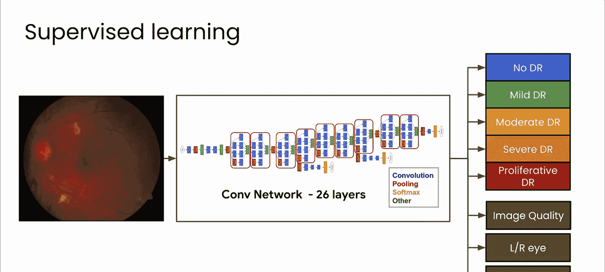

# 6：Transformer简介 🧠

在本节课中，我们将要学习现代AI的核心引擎——Transformer架构。这种革命性的设计已成为自然语言处理领域的游戏规则改变者。我们将拆解Transformer的基本工作原理，并了解它如何为GPT、Gemini等先进的大型语言模型铺平道路，这些模型迅速吸引了公众的注意，并开始彻底改变软件开发者的工作方式。

---

## 背景与革命性突破

上一节我们介绍了监督学习的基本概念。现在，我们来看看处理序列信息（如文本）的模型是如何演进的。

早期的监督学习是让计算机学习预测已标注的数据，模型学习将数据与标签进行匹配。例如，将视网膜图像与医生对其病变状态的诊断意见进行匹配。

更复杂的算法，如循环神经网络，开始学习数据的序列关系。这对于预测系统下一步会发生什么（而非预测当前所见）的模型非常有用。对于文本，这些模型表现尚可，但在理解文本深层含义方面存在局限。

Transformer背后的核心思想在于，它能**同时处理数据的所有部分**。这种并行处理能力不仅**加速了训练过程**，还**提升了处理文本中长期依赖关系的能力**。

---

## 注意力机制：Transformer的核心

为了更好地理解这一点，让我们来看一个例子。

考虑这个句子：“在爱尔兰，我上了中学，所以我必须学习____。” 你会如何补全这个句子？

我们来分析一下：
*   首先，“中学”在其他地方类似于“高中”，是为年龄较大的学生学习更高级知识的阶段。
*   其次，爱尔兰是一个国家，因此当地学生可能学习一些其他国家学生不学的科目。

正是基于对句子中“爱尔兰”和“中学”这些**关键词语**以及**完整上下文**的关注，你可能会预测空白处的下一个词是“爱尔兰语”或“盖尔语”（一种语言）。你的判断很可能是正确的。

这种让模型学会关注输入序列中不同部分之间关系的能力，就是“注意力机制”。这也正是提出Transformer的那篇著名论文标题——《Attention Is All You Need》的由来。

---

## Transformer的关键概念

Transformer的技术细节非常复杂，本身足以构成一门完整的课程，因此我们不会在此深入所有具体内容。但有两个关键概念我认为对你非常重要，我们将在下一节视频中深入探讨它们。

---

本节课中，我们一起学习了Transformer架构的起源及其革命性意义。我们了解到，它通过**注意力机制**和**并行处理**能力，克服了早期序列模型的局限，为当今强大语言模型的诞生奠定了基础。下一节，我们将具体探讨Transformer的两个核心组件。