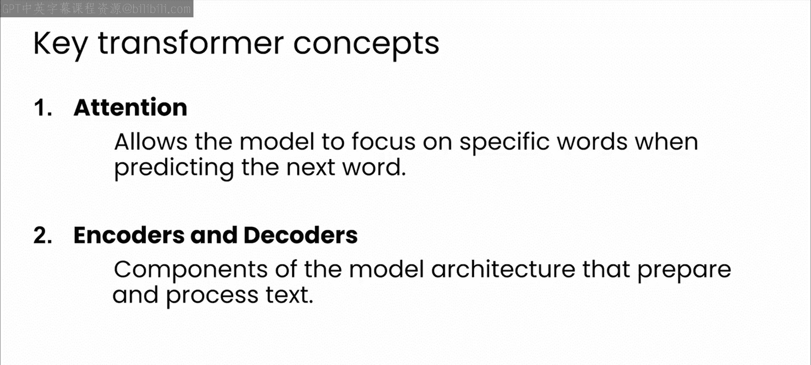
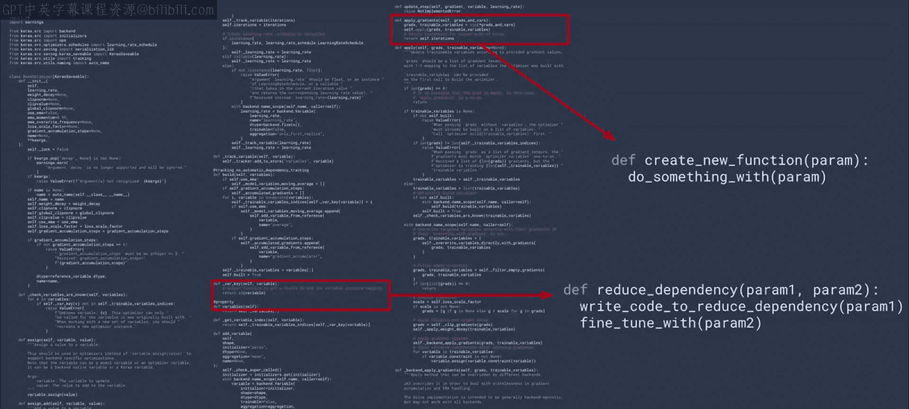

# 7：Transformer关键概念 🧠

在本节课中，我们将学习Transformer模型的两个核心概念：注意力机制以及编码器与解码器。理解这些概念是掌握大型语言模型工作原理的基础。

## 注意力机制：让模型学会“聚焦” 👁️

上一节我们介绍了Transformer模型的基础。本节中，我们来看看第一个核心概念：注意力机制。

本质上，注意力机制允许模型在预测下一个词时，聚焦于输入文本的特定部分。它通过考虑句子中词语之间的关系来理解上下文，从而预测即将出现的词语。

例如，对于句子“我的小白毛茸茸的狗跑向我的客人”，注意力机制会让模型在预测名词“狗”的含义时，聚焦于形容词“小”、“白”和“毛茸茸”。这有助于模型理解这只狗很可能是在欢迎客人，而不是攻击他们。因此，模型可能会预测“并热情地迎接了他们”作为完成句子的文本。

那么，这个注意力机制具体是如何工作的呢？让我们更仔细地看看文本是如何被模型表示的。

以下是文本处理的基本步骤：
1.  **分词**：文本被分解成称为“词元”的片段，通常是单个单词，偶尔是词的一部分。
2.  **词嵌入**：每个词被分配一个高维向量，这是该词含义的数学表示。这个向量被称为“嵌入”。
3.  **上下文调整**：注意力机制帮助调整这些嵌入，以考虑周围词语的上下文。例如，“小”、“白”和“毛茸茸”会影响“狗”这个向量的值，使其更接近这些形容词所描述的特征。
4.  **多层处理**：模型会经过多个注意力块，在这些块中，嵌入被反复更新。

最终，词语和句子的细节被用来学习潜在的概念。通过适当的调优，模型可以非常准确地确定潜在的语义，从而生成语义准确的文本来接续一个短语。

总的来说，注意力机制是一个强大的工具，它使Transformer能够捕捉句子中词语之间复杂的关系。这对于机器翻译、文本摘要和问答等任务至关重要。

## 编码器与解码器：理解与生成的双重奏 ⚙️

理解了注意力机制如何工作后，我们来看看Transformer的第二个核心概念：编码器和解码器。

想象一下，你正在处理一个复杂代码库中的一段代码。在你添加或修改任何内容之前，你需要理解整个上下文、代码每一部分的作用以及它与其他部分的交互方式。这基本上就是Transformer模型中的编码器对文本所做的事情。

当我们训练一个基于Transformer的模型时，编码器会一次性接收整个输入序列。与传统监督模型逐步处理数据不同，编码器可以同时查看数据的所有部分。这要归功于我们前面描述的注意力机制。它允许编码器聚焦于输入序列的不同部分，确定哪些特征最重要。你可以把这个过程看作有点像代码审查，你可能会更关注那些可能影响整个应用程序功能的关键部分。

处理完成后，编码器将输入数据转换为一组上下文向量。这些向量是输入文本的浓缩表示，它封装了通过注意力机制学习到的数据不同元素之间的见解和关系。

解码器则以某种方式逆转这个过程。你可以从代码审查的角度来思考：基于你刚刚形成的理解，你不再仅仅是审查代码，而是在计划接下来要编写什么代码。

我喜欢称之为“通过注意力机制收集的众多智能片段而形成的人工理解”。模型通过注意力机制理解了大量关于你当前工作内容的上下文，因此可以智能地为你建议新的内容。

## 核心概念回顾与总结 📝

在本课程中，你将广泛使用基于Transformer的模型，因此对它们的工作原理有一个基本的理解非常重要。这里没有魔法或秘方，只是一个优秀的算法，它能理解你提供的上下文（例如你输入并让它分析的代码），然后可以对该上下文应用推理，给出非常相关的输出（例如在代码中查找错误）。作为一名开发者，至少了解你所使用工具的一些技术细节总是有益的，对于大型语言模型也是如此。

让我们快速回顾一下本模块中看到的主要概念。

首先，你看到了监督式机器学习的简要总结。其核心思想是，模型可以在带标签的数据集上进行训练，以发现潜在的规则和模式。然后，这些规则可以应用于新数据以进行预测或生成有用的输出。一般来说，训练中使用的数据越多或质量越高，模型给出的输出质量就越高。

大型语言模型建立在一种称为Transformer的架构之上。Transformer特别擅长处理大量文本（无论是软件库还是书籍），它使用一个名为“注意力”的概念，可以跟踪词语或概念之间的关系，即使它们在文本中并不相邻。

你将接触到的大型语言模型已经在几乎难以想象的海量文本数据集（包括大量代码）上进行了训练。这种训练使它们既能理解冗长或微妙的提示，也能生成新的文本，例如，生成最符合你要求的代码。

本节课中，我们一起学习了Transformer模型的两个基石：注意力机制以及编码器与解码器结构。注意力机制让模型能够根据上下文动态聚焦，理解词语间的复杂关系；而编码器-解码器结构则分别负责对输入信息的深度理解与基于此理解的新内容生成。掌握这些概念，是有效利用大型语言模型进行软件开发的关键第一步。