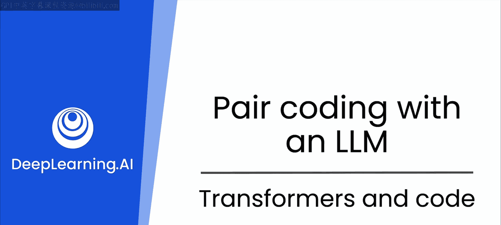
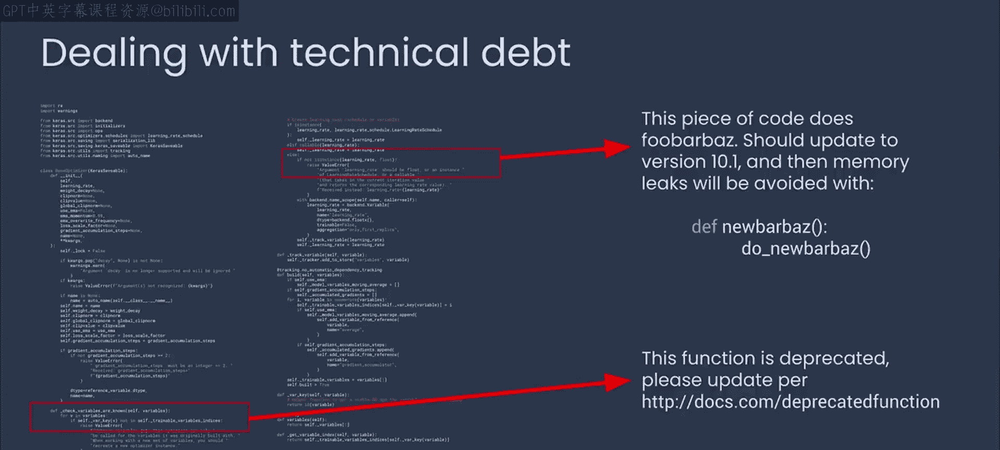

# 8：Transformer与代码

在本节课中，我们将要学习Transformer架构如何赋能大型语言模型，使其成为编码和开发过程中的得力助手。我们将探讨这些AI模型如何改变你应对常见编程挑战的方式，并在日常工作中提供帮助。

上一节我们介绍了Transformer架构在并行处理数据和精准理解上下文方面的卓越能力。这项革命性技术是大型语言模型的基础，使它们能够快速阅读和分析海量文本。

本节中，我们来看看如何将这项技术应用到编码世界中。

想象一下，你拥有一位不仅能检查语法错误，还能扫描整个代码库以发现漏洞和潜在低效之处的助手。大型语言模型可以分析你的代码，建议更好的算法，或者重构代码以提升性能。它们还能帮助追踪执行过程，精确定位问题所在，从而显著缩短调试周期。

依赖管理常常让开发者头疼。大型语言模型可以通过分析项目文件和代码导入来协助完成这项任务，然后建议更新或识别不兼容的版本。这种能力确保你的项目保持最新状态，并最大限度地减少冲突或使用已弃用库的风险。

编写文档是开发者一项至关重要却常被忽视的任务。大型语言模型可以通过理解代码的结构和用途，自动生成注释和文档。这不仅节省时间，还提高了代码的可读性和可维护性，便于未来的修订或团队协作。

技术债务积累迅速，且往往难以追踪和管理。当你接手一段极其复杂、可能只有早已不在的原开发者才能理解的代码时，大型语言模型可以审查代码，帮助你理解它，并提出重构或重新设计的策略。它们甚至可以优先安排债务削减任务，这样未来从你手中接手代码的人总会轻松许多。保持健康的代码库总是有益的。

有了大型语言模型，其应用范围超越了日常编码任务。你可以针对复杂问题集思广益，提出创新解决方案，构思创新功能，甚至模拟新模块如何与现有系统集成。

将大型语言模型作为思维伙伴可以激发创新，推动项目突破常规界限，使你能够快速实验，并探索那些你以前可能没有时间或机会用代码尝试的事情。

将大型语言模型集成到你的开发流程中，不仅仅是改变了你处理任务的方式，更是彻底革新了它们。这些AI伙伴扩展了每位软件开发者的能力，让你能更专注于开发的创造性和战略性方面。我希望你能像我一样使用这些模型，不仅仅是作为工具，而是作为你开发团队中不可或缺的成员。

现在，你已经到了可以超越理论并开始动手实践的阶段。

在下一节中，你将使用像ChatGPT或Gemini这样的简单聊天界面，开始与AI助手进行结对编程的旅程。

本节课中我们一起学习了Transformer架构如何支撑大型语言模型，以及这些模型如何在代码分析、调试、依赖管理、文档编写、技术债务管理和创新构思等方面成为开发者的强大伙伴。它们不仅仅是工具，更是能够革新软件开发流程的协作成员。