# 9：使用聊天机器人生成代码 🧑‍💻

在本节课中，你将学习如何通过ChatGPT界面使用大语言模型（例如GPT-4）来编写代码，从而开始自动化和加速你的开发流程。

## 概述

我们将从编写简单的函数开始，逐步深入到如何通过详细的提示词生成更复杂、更健壮的代码，并探讨如何利用LLM进行代码调试。通过具体的示例，你将掌握使用AI辅助编程的核心技巧。

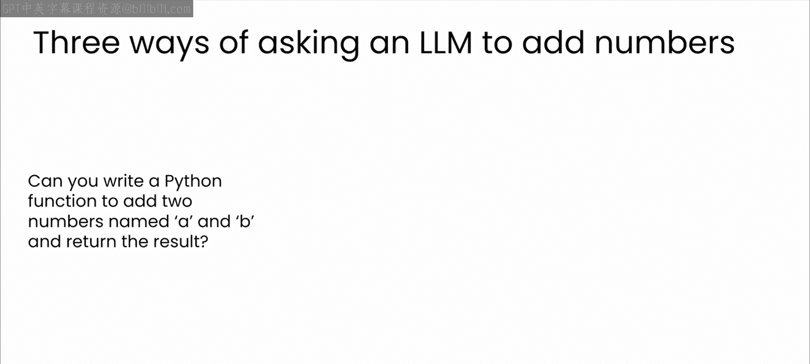

---

## 编写基础函数

上一节我们介绍了课程目标，本节中我们来看看如何让AI生成一个最简单的函数。

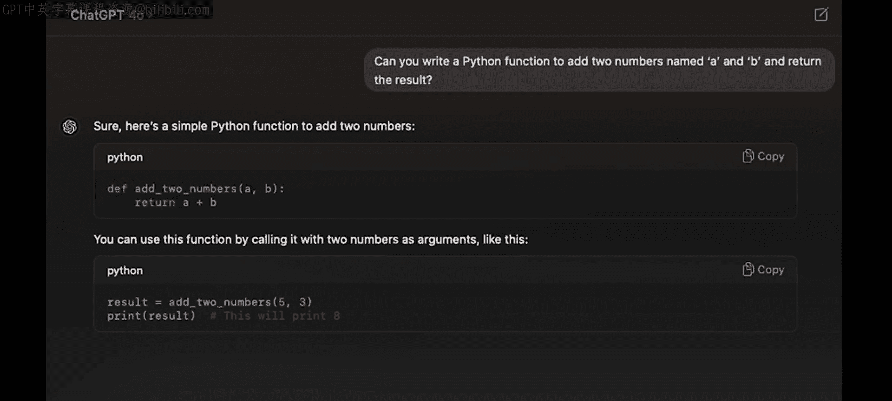

首先，我们让ChatGPT编写一个简单的Python函数，用于将两个数字相加。为了确保清晰和具体，我是这样组织提示词的：

> 你能写一个名为`add_two_numbers`的Python函数吗？它接收两个参数`a`和`b`，并返回它们的和。

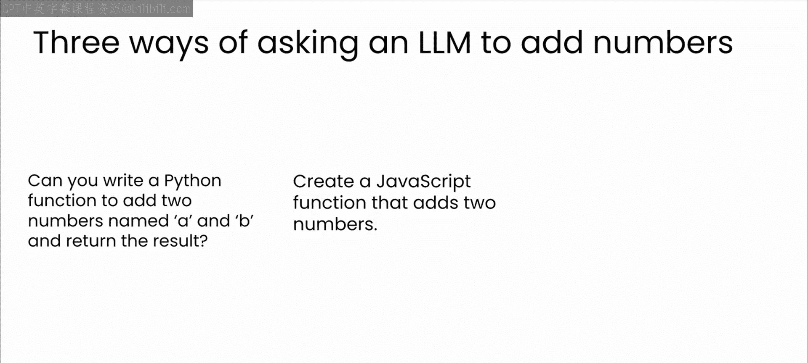

ChatGPT返回了以下代码。它编写了一个名为`add_two_numbers`的函数，完全符合要求，并且还包含了一个如何使用该函数的示例。

```python
def add_two_numbers(a, b):
    return a + b

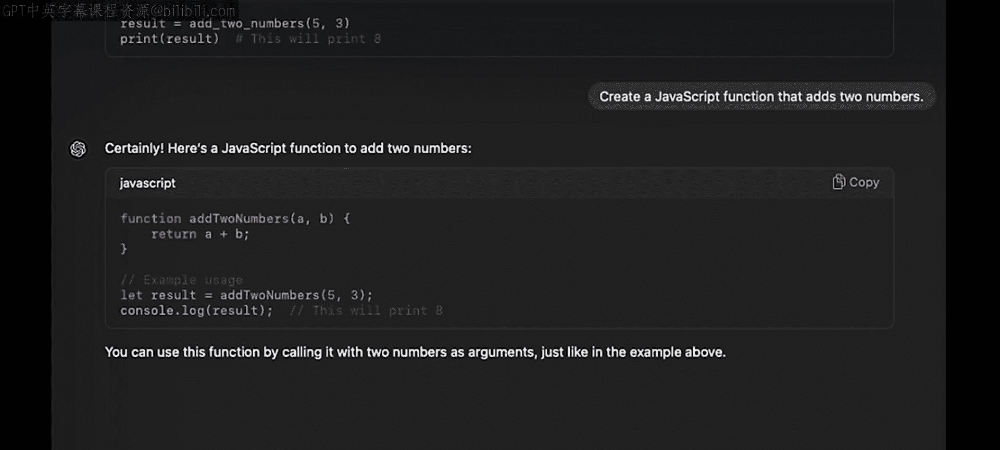

# 示例用法
result = add_two_numbers(5, 3)
print(result)  # 输出：8
```


这是一个非常简洁明了的函数。

## 跨语言代码生成

了解了Python的基本用法后，我们来看看如何生成其他编程语言的代码。

如果你需要JavaScript或C#版本的函数，可以直接向模型提出请求。以下是请求生成JavaScript函数的提示词：

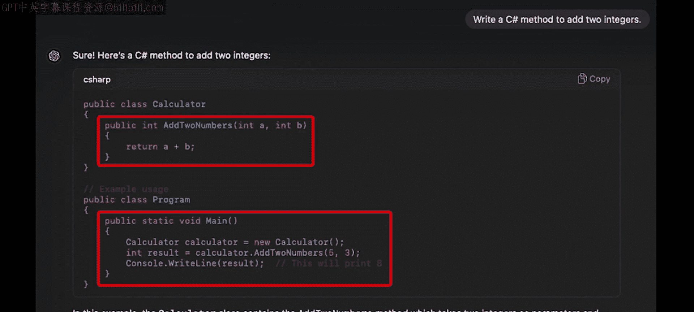

> 请创建一个JavaScript函数，用于将两个数字相加。

模型生成了以下JavaScript代码。从不同的语法可以看出，模型现在生成的是JavaScript，而不是Python。

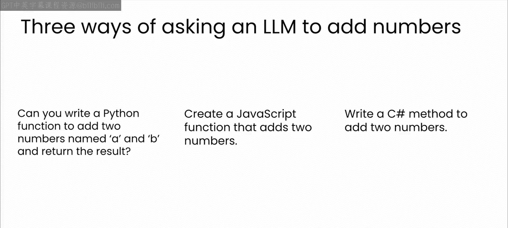

```javascript
function addTwoNumbers(a, b) {
    return a + b;
}

// 示例用法
let result = addTwoNumbers(5, 3);
console.log(result); // 输出：8
```

最后，我们让模型用C#编写相同的函数。

> 请用C#编写一个将两个数字相加的方法。

C#是一种更冗长的语言，但模型仍然成功地创建了一个名为`AddTwoNumbers`的方法，并在后面包含了一个调用该方法和打印结果的`Main`方法。模型甚至为你提供了所写代码的简要解释。

```csharp
using System;

class Program
{
    static int AddTwoNumbers(int a, int b)
    {
        return a + b;
    }

    static void Main()
    {
        int result = AddTwoNumbers(5, 3);
        Console.WriteLine(result); // 输出：8
    }
}
```

请注意，我针对每种语言稍微调整了提示词，以反映典型的命名和语法约定，例如在C#中称其为“方法”。这是一个重要的细节。

## 提示词技巧与开发者价值

有人认为这样的提示词可以完全取代开发者，但我不同意。对编程语言、API和支持库的领域知识，才能使你成为更好的开发者，也才能使你成为更好的提示词工程师。

此外，我认为，对你试图解决的业务问题的领域知识，将为你提供更好的方式来表达解决方案（无论是通过提示词还是代码）。因此，即使在提示词生成代码的时代，你的技能和知识也极具价值。

## 生成更复杂的代码

让我们通过使提示词更具体和详细来深入探讨。指定参数和条件有助于模型优化其输出。

我们要求一个使用NumPy将两个数组相加的Python函数。注意，我明确指定了NumPy。

> 请编写一个使用NumPy库的Python函数，用于将两个数组相加。

通过提及NumPy，ChatGPT知道包含适当的导入语句并使用该库的函数。例如，这里它使用了`np.add`函数来相加两个数组。然后，它包含了如何使用该函数的示例，最后对所生成的代码进行了简要解释。

```python
import numpy as np

def add_two_arrays(arr1, arr2):
    return np.add(arr1, arr2)

# 示例用法
array1 = np.array([1, 2, 3])
array2 = np.array([4, 5, 6])
result = add_two_arrays(array1, array2)
print(result)  # 输出：[5 7 9]
```

## 交互式迭代改进代码

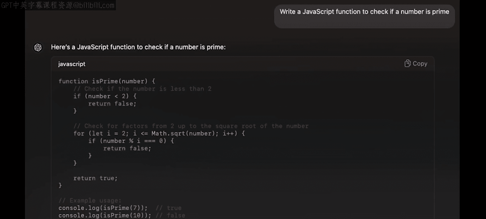

现在，让我们考虑交互式编码的概念，以持续更新你的代码。这不必是一次性从GPT获取代码就直接使用的情况。你可以持续提示模型以创建更好的代码。

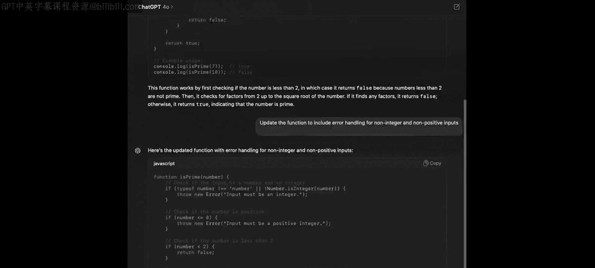

让我们通过迭代改进一个函数来观察这一过程。你将首先要求模型编写一个基本的JavaScript函数来检查一个数字是否为质数。

> 请编写一个JavaScript函数来检查一个数字是否为质数。

模型返回了一些代码。首先，该函数检查数字是否小于2；接着，它检查从2到该数字平方根之间的所有潜在因子；如果找到任何因子，则返回`false`，否则返回`true`。

```javascript
function isPrime(num) {
    if (num < 2) return false;
    for (let i = 2; i <= Math.sqrt(num); i++) {
        if (num % i === 0) return false;
    }
    return true;
}
```

虽然这不是最高效的算法，但它肯定有效。然而，我现在想解决一个不同的问题，即缺乏错误处理。

所以，我们要求模型添加一些错误处理，以确保输入是一个正整数。

> 请为上面的`isPrime`函数添加错误处理，确保输入是一个正整数。

模型更新了其代码以添加错误处理。首先，它检查输入是否为整数，然后检查输入是否为正数。如果任一检查失败，新函数将抛出错误。注意，函数的其余部分与之前相同。在示例用法代码中，已更新为使用`try`和`catch`来测试刚刚添加的错误处理。

```javascript
function isPrime(num) {
    // 错误处理：确保输入是正整数
    if (!Number.isInteger(num)) {
        throw new Error('Input must be an integer.');
    }
    if (num < 0) {
        throw new Error('Input must be a positive integer.');
    }
    if (num < 2) return false;
    for (let i = 2; i <= Math.sqrt(num); i++) {
        if (num % i === 0) return false;
    }
    return true;
}

// 示例用法，包含错误处理
try {
    console.log(isPrime(7)); // true
    console.log(isPrime(10)); // false
    console.log(isPrime(-5)); // 抛出错误
    console.log(isPrime(3.14)); // 抛出错误
} catch (error) {
    console.error(error.message);
}
```

## 编写详细提示词以生成完整功能

通常，模糊的提示词会导致模糊的输出。例如，考虑这个提示词：“创建一个函数”。就像人类同事一样，模型会回应一个后续请求，要求提供更多细节，因为我没有指定该函数应该做什么。

让我们通过用所需的指令更新提示词来纠正这一点。如你所见，模型现在能够帮助我完成该任务。因此，在使用提示词生成代码（或任何东西，但可能尤其是代码）时，你应该具体、使用清晰的语言，并提供尽可能多的上下文，以便模型成功完成任务。

以下是另一个例子。让我们指示ChatGPT使用Flask（一个流行的Python Web框架）构建一个Web API端点。这个提示词非常详细。你告诉ChatGPT你确切需要什么：框架、请求类型、端点URL、参数、预期输出等等。

> 请使用Flask框架创建一个Web API端点。该端点应处理GET请求，URL路径为`/multiply`。它应接收两个名为`a`和`b`的整数查询参数，并返回它们的乘积（JSON格式）。请包含错误处理，例如检查参数是否存在以及是否为整数。

结果如下。如你所见，模型编写了一个完整的Flask应用，其中包含一个将两个整数相乘的端点，并包含了错误处理，例如检查输入是否存在以及确保它们是整数。

```python
from flask import Flask, request, jsonify

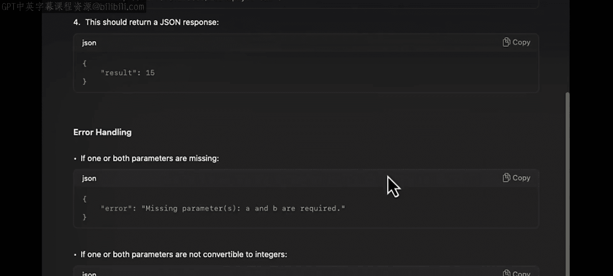

app = Flask(__name__)

@app.route('/multiply', methods=['GET'])
def multiply():
    # 获取查询参数
    a = request.args.get('a')
    b = request.args.get('b')

    # 错误处理：检查参数是否存在
    if a is None or b is None:
        return jsonify({'error': 'Parameters "a" and "b" are required.'}), 400

    # 错误处理：检查参数是否为整数
    try:
        a_int = int(a)
        b_int = int(b)
    except ValueError:
        return jsonify({'error': 'Parameters must be integers.'}), 400

    # 计算乘积并返回结果
    result = a_int * b_int
    return jsonify({'result': result})

if __name__ == '__main__':
    app.run(debug=True)
```

这个例子表明，通过提供清晰详细的指令，你可以让模型生成功能齐全、随时可用的代码。请记住，你提供的上下文和清晰度越高，输出就越准确和相关。

## 使用LLM调试代码

无论是AI生成的还是人类编写的，代码都难免存在错误。因此，让我们快速了解一下如何使用LLM来帮助你调试。

首先，给ChatGPT一些代码。这段代码中有一个错误，你能发现它吗？如果你想挑战一下，可以暂停视频几秒钟，看看是否能想出一些情况下这段代码可能无法按预期工作。

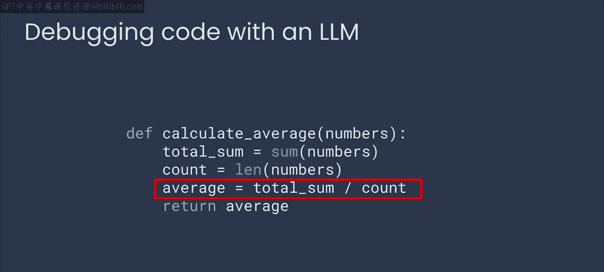

```python
def calculate_average(numbers):
    total = sum(numbers)
    count = len(numbers)
    average = total / count
    return average
```

这个错误相当微妙：如果列表为空，`count`将为0，那么在这一行`average = total / count`就会出现除以零的错误。

你可以将你的代码包含在给模型的提示词中，并要求它查找任何错误。如你所见，模型立即发现了问题，并给出了如何处理以及如何改善函数调用者体验的建议。

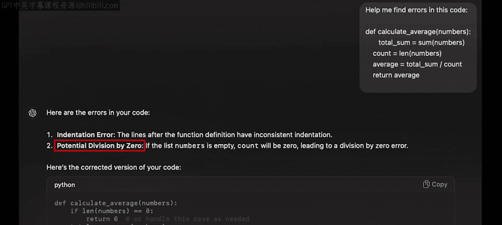

> 以下Python函数有一个错误。请找出错误并提供修复建议。
> ```python
> def calculate_average(numbers):
>     total = sum(numbers)
>     count = len(numbers)
>     average = total / count
>     return average
> ```

模型回复：
> 错误：当`numbers`列表为空时，`len(numbers)`返回0，导致`total / count`出现除以零的错误（`ZeroDivisionError`）。
>
> 修复建议：在计算平均值之前，检查列表是否为空。
>
> ```python
> def calculate_average(numbers):
>     if not numbers:  # 检查列表是否为空
>         return 0  # 或者可以抛出异常，如 raise ValueError(“列表不能为空”)
>     total = sum(numbers)
>     count = len(numbers)
>     average = total / count
>     return average
> ```

## 练习：生成计算圆面积的函数

现在你已经看到了几种使用模型帮助完成编码任务的方法，请尝试一个简单的练习。让ChatGPT编写一个函数，根据给定的半径计算圆的面积。暂停视频，试一试，完成后回来。


这是一个有趣的练习，因为你可能会想是否需要告诉ChatGPT计算圆面积的公式（面积 = π * r²）。像这样的通用信息已经存在于模型训练的数据中，因此你不需要明确提供。

以下是我的提示词。注意，我包含了诸如“它应将圆的半径作为参数”之类的细节。我还要求它为非数字输入添加错误处理，并添加注释解释每个步骤。

> 请编写一个Python函数`calculate_circle_area`，它接收圆的半径作为参数，并返回圆的面积。请包含对非数字输入的错误处理，并为每一步添加注释。

ChatGPT为我生成的输出如下。该函数按我的要求接收半径作为输入，还包含了对非数字输入的错误处理，并且整个函数都有清晰的注释。

```python
import math

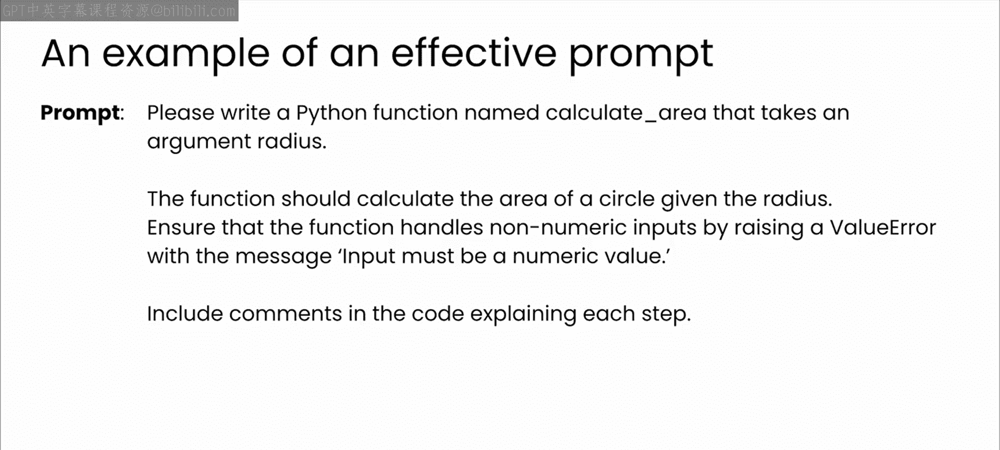

def calculate_circle_area(radius):
    """
    计算给定半径的圆的面积。

    参数:
    radius (int 或 float): 圆的半径。

    返回:
    float: 圆的面积。

    异常:
    ValueError: 如果半径不是数字或为负数。
    """
    # 错误处理：检查输入是否为数字
    if not isinstance(radius, (int, float)):
        raise ValueError("半径必须是数字（整数或浮点数）。")

    # 错误处理：检查半径是否为非负数
    if radius < 0:
        raise ValueError("半径不能为负数。")

    # 使用公式 面积 = π * r² 计算面积
    area = math.pi * (radius ** 2)
    return area

# 示例用法
try:
    print(calculate_circle_area(5))  # 输出：78.53981633974483
    print(calculate_circle_area(2.5))  # 输出：19.634954084936208
    print(calculate_circle_area(-1))  # 抛出 ValueError
    print(calculate_circle_area("five"))  # 抛出 ValueError
except ValueError as e:
    print(f"错误：{e}")
```

更好的提示词带来更好的代码。如果你没有包含错误处理的细节，模型就不会提供。尝试返回去优化你的提示词，加入这些新的指令。

## 总结

本节课中，我们一起学习了如何使用大语言模型（如通过ChatGPT访问的GPT-4）来辅助编程。我们从生成简单的跨语言函数开始，逐步深入到通过编写具体、详细的提示词来生成包含错误处理、使用特定库（如NumPy、Flask）的复杂代码。我们还探讨了交互式迭代改进代码以及利用LLM进行代码调试的方法。

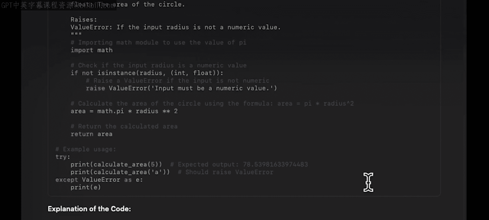

记住，清晰的指令、具体的需求以及你对问题领域的知识，是让AI成为你高效编程伙伴的关键。你的技能在AI时代依然至关重要。