# 10：迭代式提示 🔄

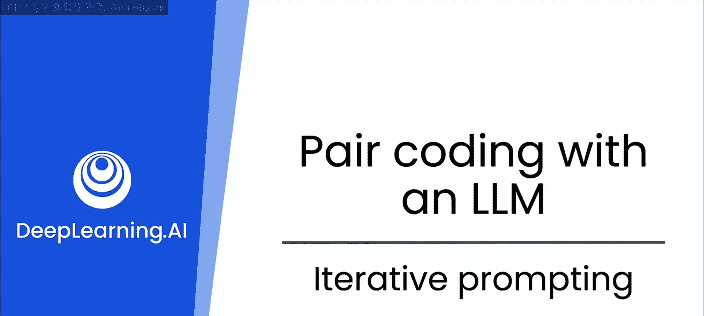

在本节课中，我们将要学习如何通过迭代式提示来引导大型语言模型生成更高质量的代码。我们将探讨如何通过增加细节、提供上下文以及多轮对话来逐步优化模型的输出。

## 清晰度的重要性 ✨

上一节我们介绍了如何编写提示词来生成代码。本节中我们来看看提示词的清晰度如何直接影响你收到代码的准确性。

让我们比较两个例子。如果我们从一个模糊的提示词开始：

**模糊提示示例：**
```
写一个函数。
```

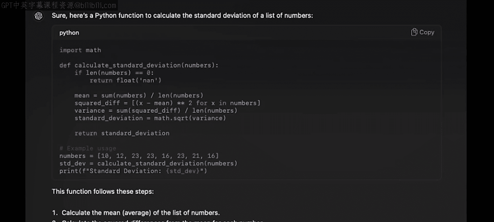

你会从LLM得到一个困惑的回应。因此，我们需要在提示词中添加更多细节，以帮助模型更好地理解你的意图。

**精确提示示例：**
```
写一个Python函数，接收一个数字列表作为输入，并返回该列表的平均值。
```

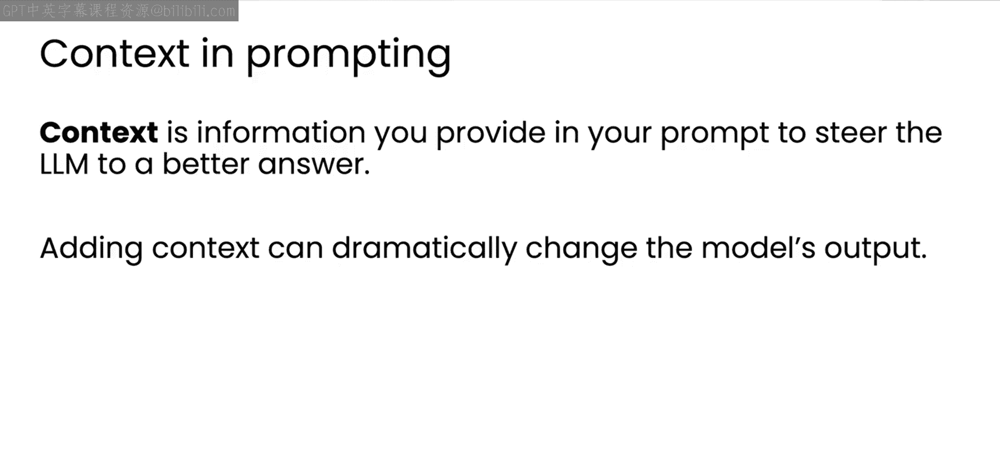

模型将用一个更详细的答案来回应。精确的提示词会产生一个合适的Python函数，它甚至可能可以直接使用。但在接受模型的建议之前，进行充分的测试始终是最佳实践。

## 添加上下文 🧭

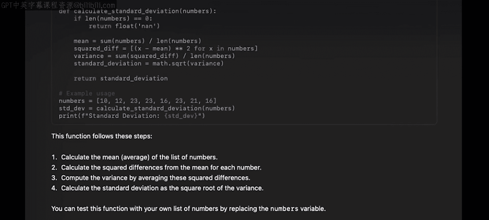

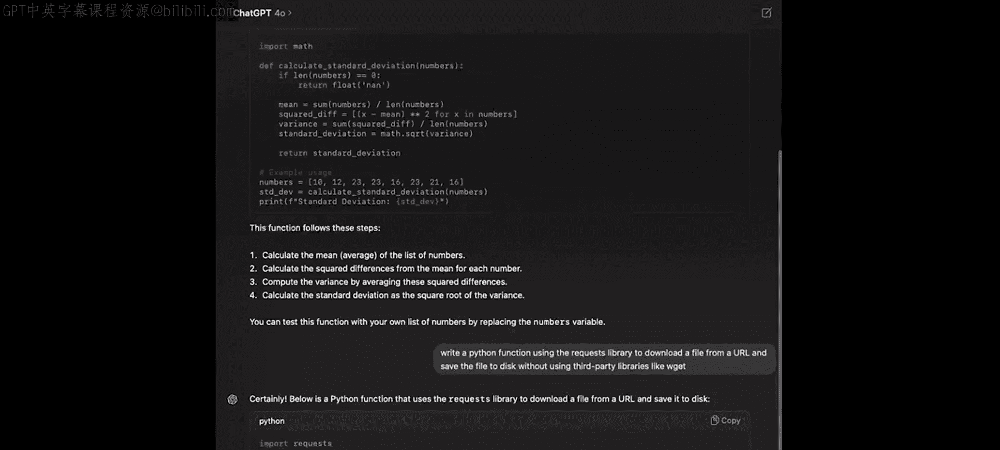

接下来，让我们更深入地探讨提示词中上下文的概念。

上下文本质上是提示词中的信息，它可以引导LLM给出更好的答案。添加上下文可以极大地改变输出，使其更符合你的实际需求。

例如，假设你想写一个Python函数来下载文件并保存到磁盘。

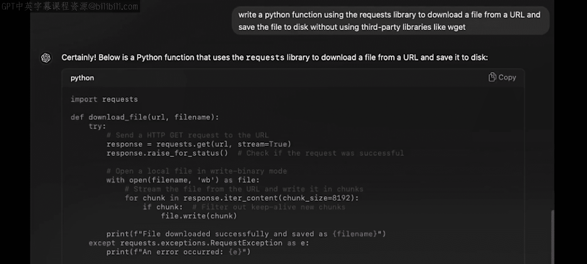

**带有上下文的提示词示例：**
```
写一个Python函数来下载一个文件并保存到磁盘。不要使用wget，请使用requests库。
```


以下是模型可能的回应方式。这个定制的函数满足了你提示词中提供的特定标准。请注意，它确实按照要求使用了requests库，并且没有使用任何其他第三方库。通过仔细测试这个函数，你可以确定它是否恰当地解决了手头的问题。

## 迭代式改进 🔄

在上一部分，你看到了如何通过迭代提示词来优化LLM的输出。现在让我们更详细地探讨这一点。

以下是一个创建API的简单指令提示词，它没有太多细节。

**初始提示词示例：**
```
创建一个简单的用户管理API。
```

模型返回了这段代码。即使你不熟悉Flask，也能看到它创建了一个简短的用户对象列表（Alice, Bob, Charlie），然后似乎为应用包含了不同的端点，用于获取完整用户列表或单个用户信息。如果找不到单个用户，这个函数似乎会抛出404错误。这是一个不错的起点，但目前没有代码来处理这个404错误。事实上，这段代码根本没有包含任何良好的错误处理。

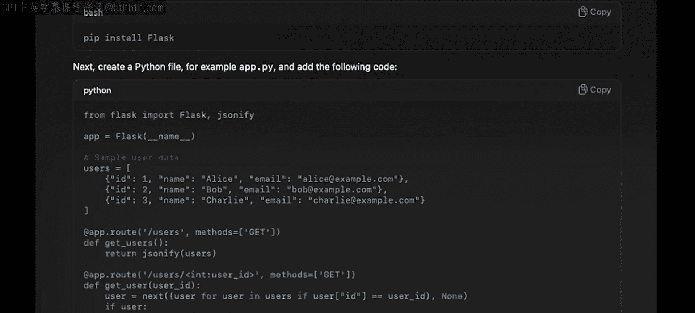

因此，让我们在后续提示词中要求模型为API添加错误处理。

**后续提示词示例：**
```
为上面的API添加错误处理。
```

这里需要指出，这是另一个绝佳的例子，说明你的领域专业知识能使你成为更好的提示词编写者。那种认为没有技能的人会因为提示词而完全颠覆开发者角色的恐惧，在我看来是没有根据的。因为像这样的代码只有在包含这样的错误处理时才值得信赖。而关于Web开发、部署、测试和错误处理的知识，对于任何代码（无论是生成的还是人工编写的）都至关重要。

以下是模型响应后续提示词生成的代码。它看起来相当不错，你可以看到模型添加的新错误处理代码。

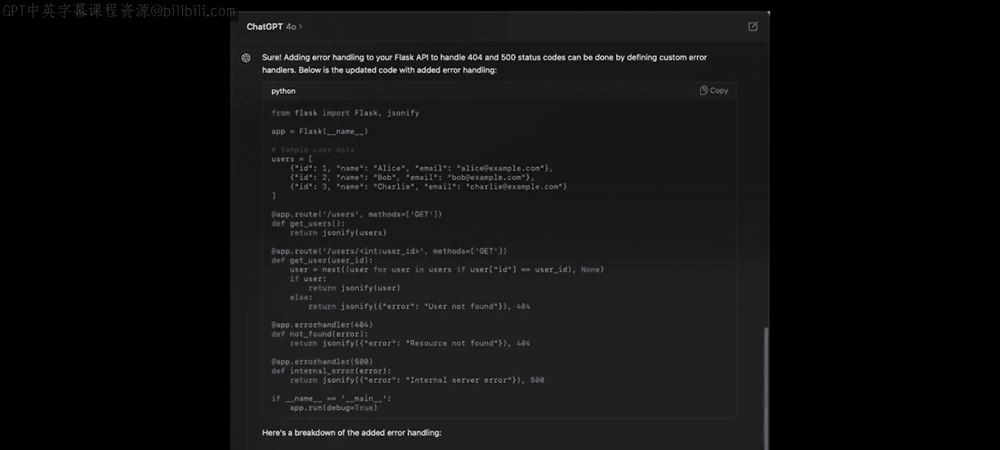

代码看起来不错，但文档记录得不够好。因此，让我们继续跟进，请求对代码进行彻底注释，以便将来可能接手我代码的人能更容易理解它的功能。

**再次迭代的提示词示例：**
```
为上面的代码添加详细的注释。
```

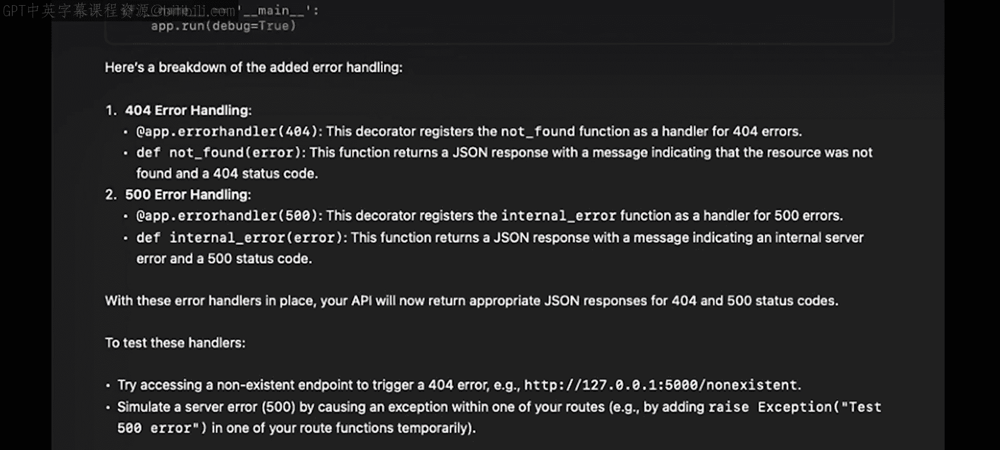

模型输出了结果。它用上次生成的相同代码进行了回应，但现在在整个代码中添加了有用的注释。正如你所见，通过与LLM的这种来回互动，你迭代地改进了API的功能和可读性。

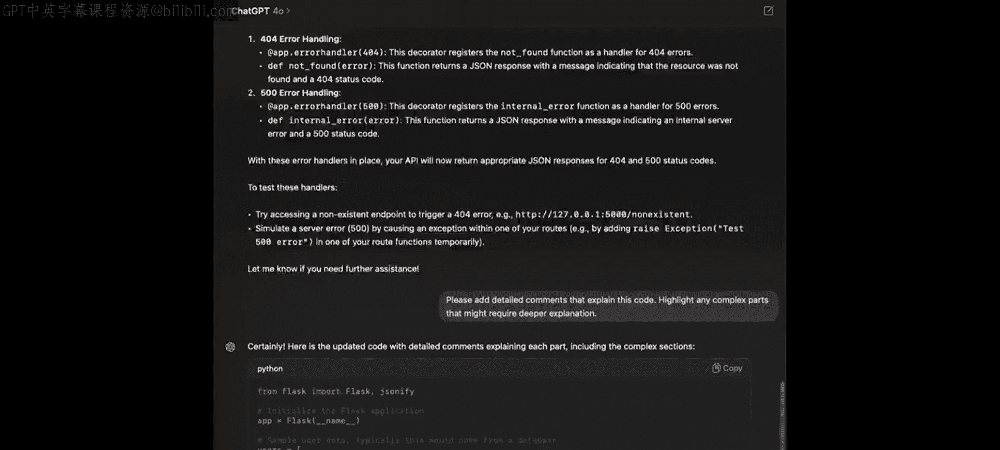

## 总结 📝

本节课中我们一起学习了迭代式提示的核心技巧。

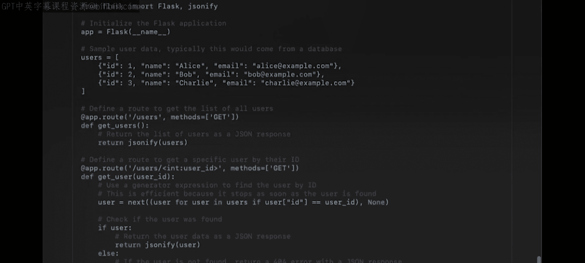

代码永远不会真正完成，因此通过提示词持续改进代码的能力是一项非常重要的技能。掌握它将使你成为一名更出色的开发者。

以下是有效提示的关键要点：
*   **清晰具体**：模糊的提示导致模糊的代码。提供精确的指令和期望的输出格式。
*   **提供上下文**：在提示词中包含相关背景信息、约束条件（如“不要使用wget”）和具体要求，以引导模型生成更符合需求的代码。
*   **迭代优化**：不要期望一次成功。将代码生成视为一个对话过程：生成初始代码 -> 审查 -> 提出改进要求（如添加错误处理、注释、优化性能）-> 再次生成。
*   **善用专业知识**：你的开发知识（如知道需要错误处理、代码注释的重要性）是编写有效提示词、评估和迭代模型输出的关键。