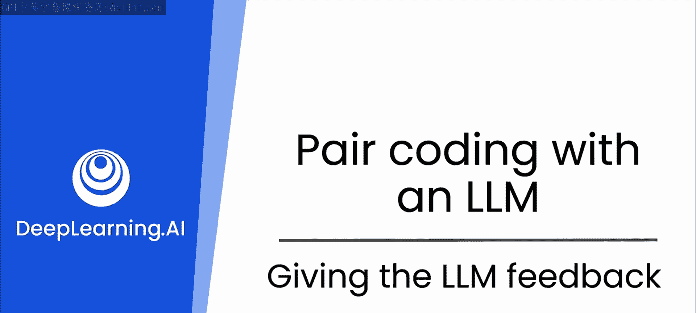
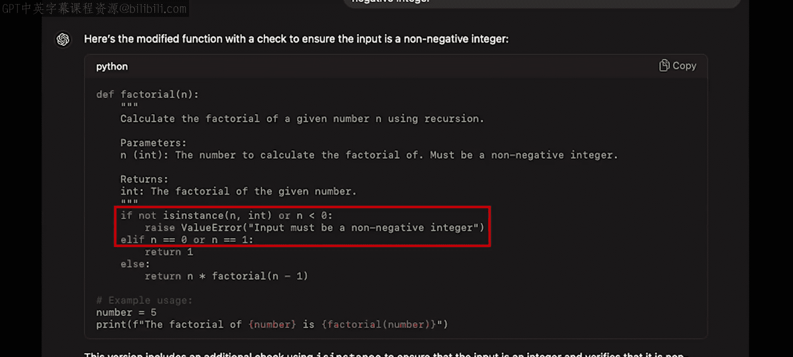
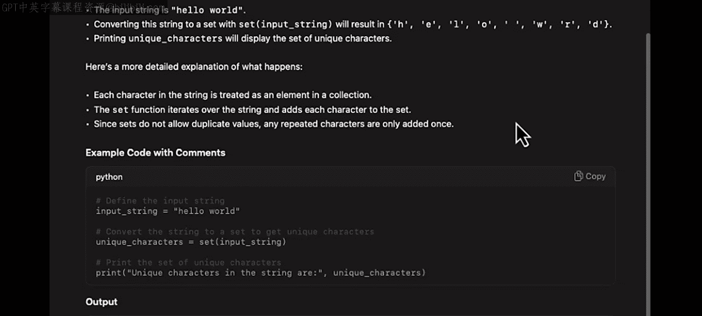

# 11：给LLM反馈 🧠



在本节课中，我们将学习如何通过提供反馈来引导大型语言模型（LLM）迭代改进代码。这是一种将你的专业知识与AI能力相结合，以生成更健壮、更高效代码的关键技能。

## 概述：迭代开发与反馈

上一节我们介绍了迭代开发的概念，即通过不断重新提示模型来更新和改进代码。本节中我们来看看反馈的细微差别。这是一个相似的理念，但更侧重于运用你自己的专业知识来发现并纠正代码中的错误或不足。

我喜欢将从LLM获得的代码视为初稿。初稿就完美的情况极为罕见，因此需要一些工作来引导模型不断重写，直到正确为止。

## 通过反馈改进代码示例

以下是几个通过反馈引导LLM改进代码的具体例子。

### 示例一：计算阶乘的函数

我们可以从一个经典的计算机科学问题开始，要求模型编写一个计算数字阶乘的Python函数。

**初始提示：**
```
编写一个Python函数，计算一个数字的阶乘。
```

**模型的初始响应代码：**
```python
def factorial(n):
    if n == 0:
        return 1
    else:
        return n * factorial(n-1)
```

这段代码存在一个天真的假设：它默认输入是一个整数。如果传入非整数，代码的行为将不明确。

因此，我们向模型提供反馈，要求修复这个问题。



**新的提示（包含反馈）：**
```
更新这个阶乘函数，使其包含输入验证，确保输入始终是非负整数。
```

**模型改进后的代码：**
```python
def factorial(n):
    if not isinstance(n, int) or n < 0:
        raise ValueError(“Input must be a non-negative integer”)
    if n == 0:
        return 1
    else:
        return n * factorial(n-1)
```

通过指定输入验证的需求，ChatGPT修改了函数，确保输入始终是非负整数，从而增强了函数的健壮性和错误处理能力。


### 示例二：判断回文字符串

另一个常见的问题是判断一个字符串是否是回文。回文是指正读反读都一样的字符串。

**初始提示：**
```
编写一个Python函数，判断一个字符串是否是回文。
```

**模型的初始响应代码：**
```python
def is_palindrome(s):
    return s == s[::-1]
```

这段代码利用了Python内置的字符串方法，使任务变得简单。然而，它存在一个不足：没有检查字符串是否为空。

因此，我们再次提供反馈。

**新的提示（包含反馈）：**
```
更新这个回文函数，使其能处理空字符串，并忽略大小写和空格。
```

**模型改进后的代码：**
```python
def is_palindrome(s):
    if not isinstance(s, str):
        raise TypeError(“Input must be a string”)
    # 转换为小写并移除非字母数字字符（例如空格）
    processed_s = ''.join(char.lower() for char in s if char.isalnum())
    return processed_s == processed_s[::-1]
```

反馈帮助模型编写了一个更复杂的函数，能够处理大小写变化、忽略空格，当然也处理了空字符串。

由于模型具有长上下文窗口，我们可以引用聊天记录中之前的内容，只需说“更新这个函数”，LLM就能理解我们的意图。

### 示例三：查找字符串中的唯一字符

让我们看一个稍复杂一点的例子：编写一个函数来查找字符串中的所有唯一字符。

**初始提示：**
```
编写一个Python函数，找出字符串中的所有唯一字符。
```

**模型的响应代码：**
```python
def unique_characters(s):
    return set(s)
```

你可能会以为这会更复杂，例如使用`if`语句检查每个字符是否已被见过。但由于Python中的`set`函数，它实际上变得非常简单。

如果你想了解更多关于集合（set）及其工作原理，可以查阅文档或直接询问模型。

**后续学习提示：**
```
告诉我更多关于Python中`set`数据类型的信息。
```



这是一种学习新数据类型的绝佳方式。

## 反馈过程的重要性

当你使用LLM辅助编码时，这种融入反馈的过程对于定制代码以满足你的特定需求和功能至关重要。你应该始终审查和优化代码，以确保它不仅能够工作，而且是最优、最高效、最健壮的解决方案。

## 总结与展望

本节课中，我们一起学习了如何通过持续与LLM进行来回提示，不断更新和优化模型输出，这非常契合迭代开发流程。这与多人协作的软件开发项目的演进方式非常相似。

你还看到了如何通过运用自己的专业知识，对代码错误或不足提供反馈，从而微调代码使其变得更好。

如果使用得当且谨慎，这两种提示策略都能帮助你成为更出色的软件工程师。像ChatGPT这样的LLM的辅助，对于像你这样的开发者来说确实是无价之宝。

在下一节视频中，你将看到如何为模型分配一个角色，以帮助你获得更有用、更具体的响应。让我们继续前进，一探究竟。