# 12：为LLM分配角色 🎭

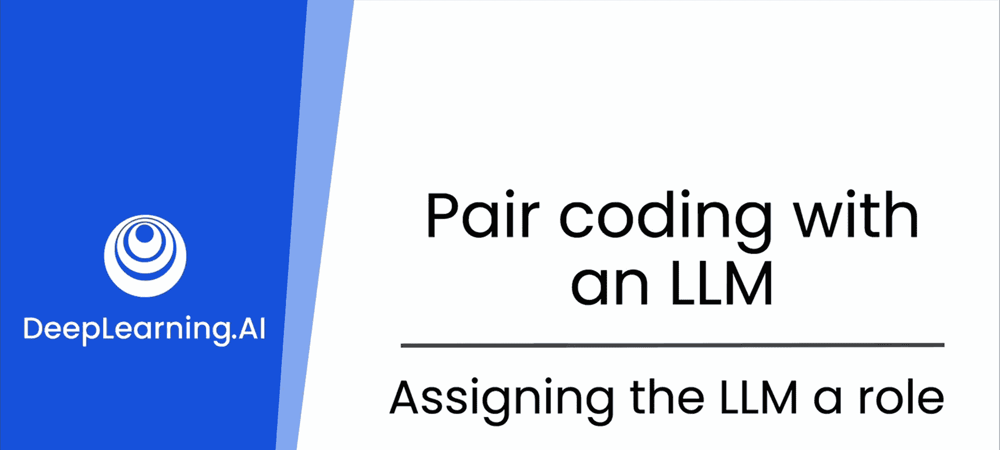

在本节课中，我们将要学习如何通过为大型语言模型（LLM）分配特定角色，来引导其生成更符合我们需求的代码和解释。我们将探讨角色定义如何影响模型的输出风格、详细程度和视角，从而让AI助手成为更得力的编程伙伴。

到目前为止，你已经了解到，通过具体、清晰地陈述需求，并利用你的领域知识直接要求使用已知的依赖项，可以帮助模型编写出良好、高效的代码。你也看到了通过持续向模型提问的迭代开发策略，如何帮助你优化和改进它编写的代码。

在本视频中，你将看到如何通过为LLM在响应你的提示和生成代码时分配一个角色，来获得更具体的结果。

当你与像ChatGPT这样的AI互动时，你构建提示词的方式对于塑造AI的回应起着至关重要的作用。通过在提示词中指定模型要扮演的角色，你设定了期望，并引导了它的语气、详细程度以及它处理查询的视角。

这里的核心思想是，你希望引导模型的完整输出（不仅仅是代码），使其符合你的需求。根据你的专业水平，你可能希望生成不同的代码。初学者可能希望代码更易于阅读，而专家可能希望代码更简短、紧凑和高效。

例如，当我刚开始学习C++时，我写的代码是这样的：
```cpp
if (condition) {
    result = value1;
} else {
    result = value2;
}
```
而我的专家朋友写的代码是这样的，我完全看不懂：
```cpp
result = (condition) ? value1 : value2;
```
第二种形式被称为三元运算符，它是编写if-else语句的一种简写方式。它的优点在于紧凑，但如果你是C++新手，则很难直观理解它在做什么。

因此，当你与像ChatGPT这样的LLM互动时，你可以要求它扮演一个适合你场景的角色。让我们更详细地探讨这一点。

例如，看看这两个提示词。你期望LLM如何回应每一个？

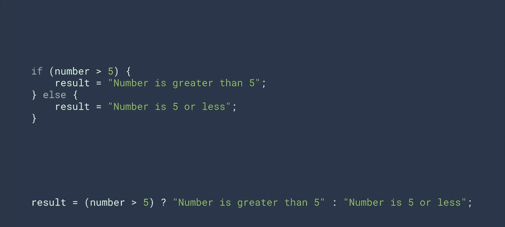

**提示词1：** “写一个计算阶乘的Python函数。”

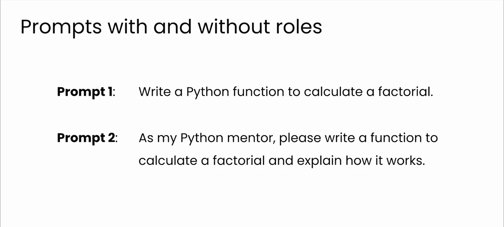

**提示词2：** “你是一位经验丰富的软件工程师，专注于编写高效、可读的代码。请写一个计算阶乘的Python函数。”

在第一种情况下，模型生成的代码可能像这样。我认为它采取了一种非常直接的方法：首先检查输入是否为负数，然后处理0和1的特殊情况，对于大于1的有效输入，通过从2开始迭代相乘直到n来计算阶乘。

现在，让我们看看模型在分配了角色的第二个提示词下是如何回应的。注意，这次它采取的方法略有不同。它仍然检查负数输入并处理0或1的特殊情况。但对于大于等于2的数字，模型决定采用递归方法。回应中还包含了对其所编写代码的更详细解释，包括递归在此实例中如何工作的逐步描述。这非常酷。

因此，在本课的剩余部分，你将探索定义角色如何改变你与AI的互动。你将从适合初学者的基本概念开始，然后逐渐转向适合高级用户的更复杂和高级的例子。到本节结束时，你将能够调整你的提示词以适应特定需求，从而提高你的生产力和项目质量。

那么，让我们开始吧，释放你与AI互动的全部潜力。

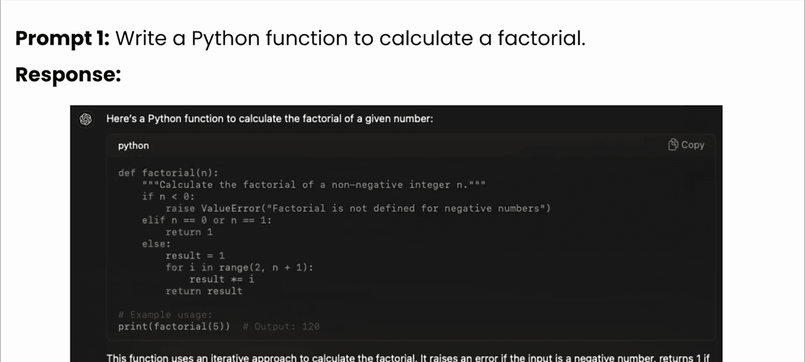

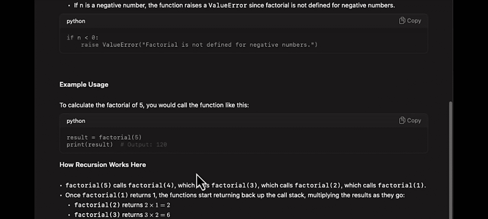

## 什么是角色？

在AI提示词的语境中，角色是你分配给AI的角色或视角。这可以是一位导师、教练、代码审查员，甚至是一个虚构角色。你选择的角色会影响AI构建其回应的方式，使其语言和内容适应该角色预期的知识和行为。

让我们通过实践来看看这一点。

## 基础示例：Python列表

这里有一个简单的任务：你想知道如何在Python中创建列表并向其中添加元素。

首先，让我们在不定义角色的情况下提问。提示词如下：
> “如何在Python中创建列表并添加元素？”

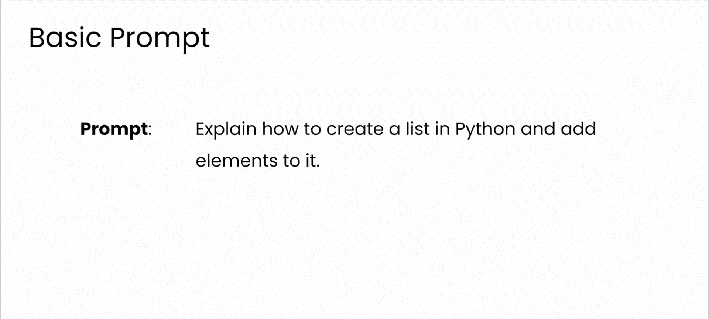

这是使用该提示词与GPT互动时发生的情况。这是一个很好的回应。它直接且技术准确。

但是，让我们看看如果你修改提示词，指定一个角色（在本例中是面向初学者的Python导师）会发生什么。提示词如下：
> “你是一位面向初学者的Python导师。请解释如何在Python中创建列表并添加元素，使用简单易懂的语言和类比。”

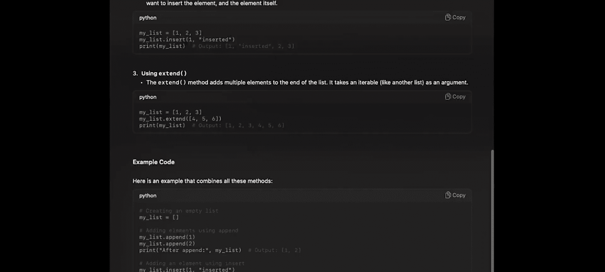

我倾向于在提示时使用“作为...”，但你并不局限于此。你可以使用诸如“你是一位友好的编程导师”之类的表述，这也同样有效。找到你最习惯使用的表达方式。

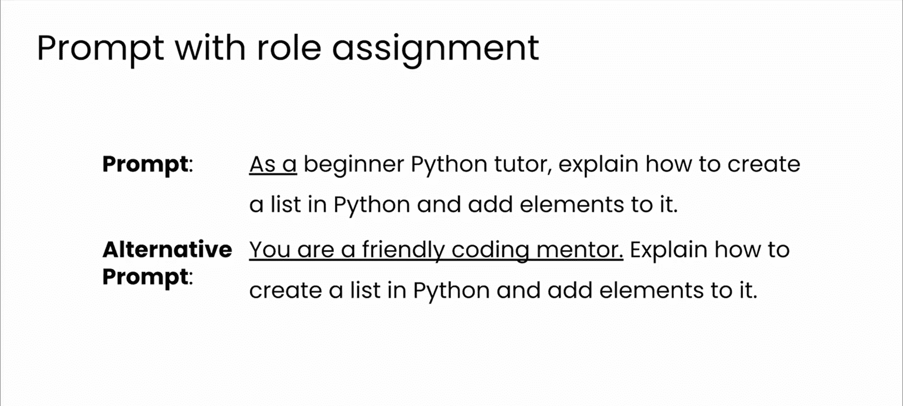

现在，模型是这样回应的。看看这个答案有多详细。初学者导师的角色将回应转变为更具视觉化和关联性的形式，这对于编程新手（或者即使是想要复习列表工作原理的专家）来说非常有用。

## 进阶示例：解释循环概念

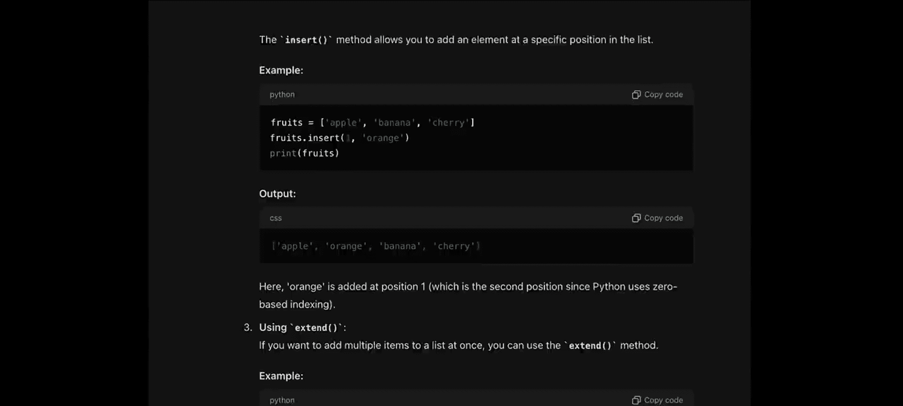

定义角色有效地建立了一个反馈循环，其中提示词引导AI，而AI的回应能更好地与用户的期望保持一致。这使得你的互动更加直观和有效。

让我们尝试另一个例子。假设你想让模型解释Python中循环的概念。在这里，你将使用“友好的代码向导”这个角色。提示词如下：
> “你是一位友好的代码向导。请向一个从未编程过的人解释Python中`for`循环的概念。”

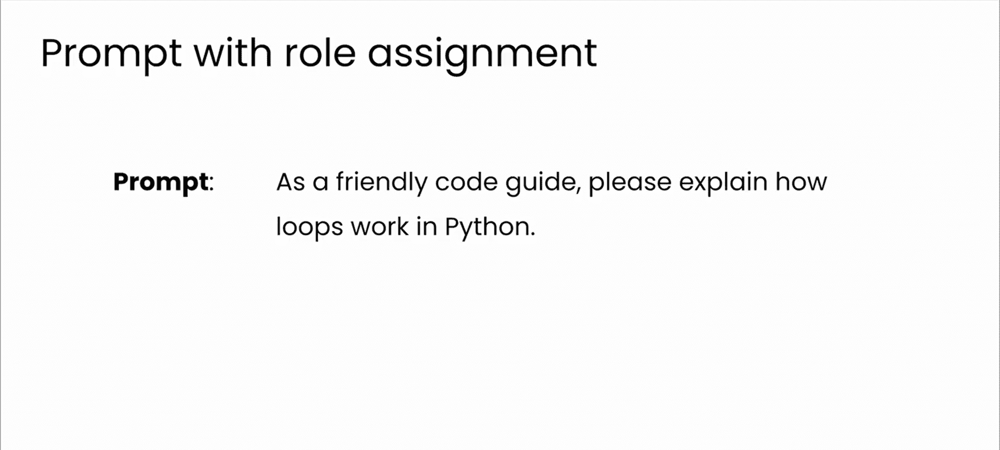

以下是回应。GPT很好地解释了它。扮演友好的代码向导角色，它的解释比我作为导师更出色。解释具有邀请性和安抚性，强调简单性和实用性，这对于建立初学者的信心非常有益。

## 总结与核心要点

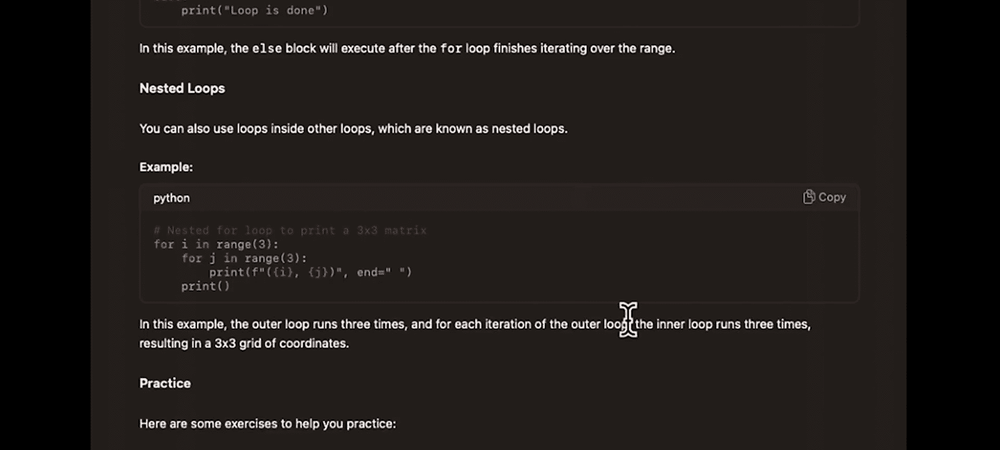

因此，请始终记住，你分配的角色将有助于构建对话框架并驱动最佳结果。无论你是在学习一门新语言、调试代码还是探索高级概念，正确的角色都可以让你的互动更高效、更愉快。

本节课中我们一起学习了为LLM分配角色的重要性。我们了解到，通过指定如“导师”、“工程师”或“向导”等角色，可以显著影响AI生成代码的风格、详细程度和解释方式。这使我们能够根据自身技能水平（初学者需要详细解释，专家需要高效代码）和具体任务，定制AI的输出，从而更有效地利用生成式AI进行软件开发和学习。