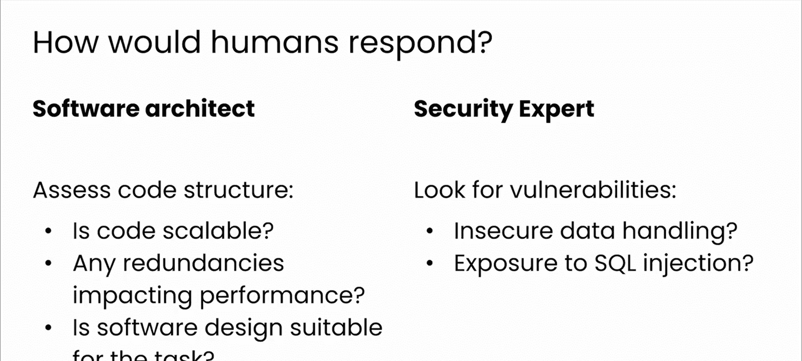
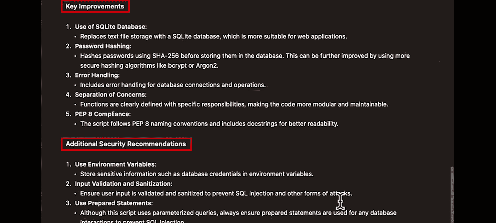

# 13：通过多重角色提升能力 🎭

在本节课中，我们将学习如何通过为模型指定多重角色，来获得更复杂、更具洞察力的反馈。上一节我们介绍了单一角色对模型输出的影响，本节中我们来看看如何组合多个角色，让模型同时从不同专业角度分析问题。

你已经看到了角色如何影响模型的输出。现在，让我们探索如何组合角色，使模型不仅能生成复杂的回应，还能提供极具洞察力的分析。

想象你有一个用于Web应用的Python脚本，你需要一份涵盖架构和安全性的全面反馈。以下是你如何构建提示词，让模型同时扮演软件架构师和安全专家的角色。

你要求ChatGPT同时戴上两顶帽子：一顶是软件架构师，一顶是安全专家。让我们在提示词中加入一些代码，如下所示：

```python
# 示例：一个简单的用户登录验证脚本
def validate_login(username, password):
    # 从文本文件读取用户数据
    with open('users.txt', 'r') as file:
        for line in file:
            stored_username, stored_password = line.strip().split(',')
            if username == stored_username and password == stored_password:
                return True
    return False
```

现在，在提示词中定义了角色并提供了要分析的代码后，人类专家会如何思考呢？以下是不同角色的思考路径：

**软件架构师**会评估脚本的结构：
*   代码是否具有可扩展性？
*   是否存在影响性能的冗余？
*   整体设计模式是否适合应用的目的？

**安全专家**则会仔细检查脚本中的漏洞：
*   是否存在不安全的数据处理流程？
*   脚本是否使应用面临SQL注入或跨站脚本攻击的风险？




让我们看看当被要求承担这些角色时，ChatGPT生成的回应。

模型发现了一些问题，例如代码使用文本文件作为数据库，以及用户名和密码以明文形式存储，这些都是安全漏洞。模型还建议了一个改进后的脚本，这非常有用。正如你所见，你获得了具体、可操作的、能增强代码质量的建议。




因此，正如你所看到的，有效使用高级角色可以将大语言模型转变为更强大的软件开发和项目规划工具。

本节课中我们一起学习了如何通过组合多重角色，引导模型从多维度（如架构与安全）提供深度分析，从而获得更全面、专业的代码反馈。请继续关注我们下一节关于专家级提示词工程的内容。