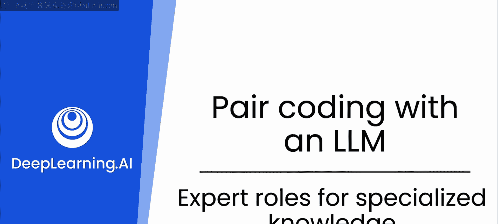
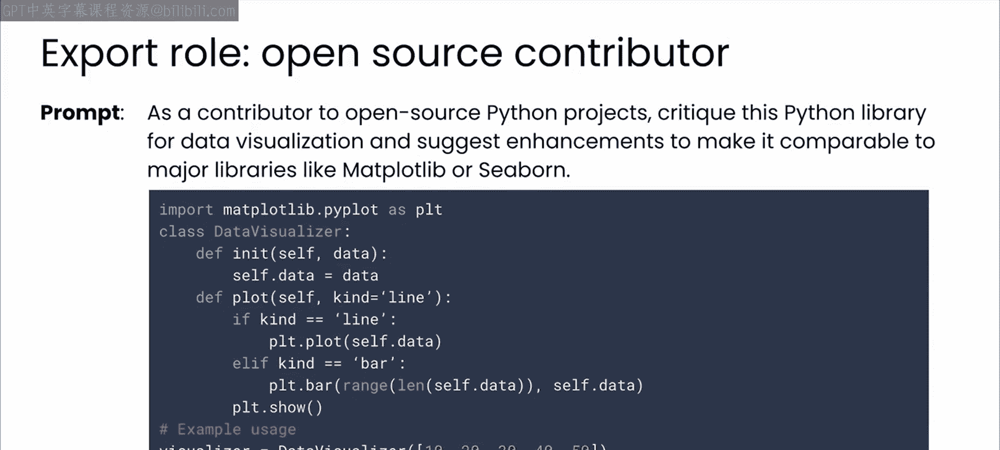
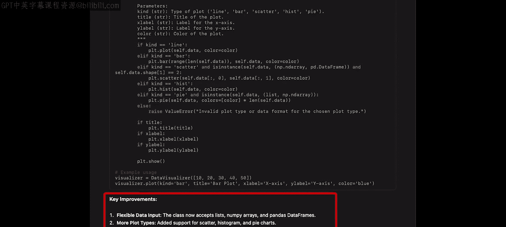
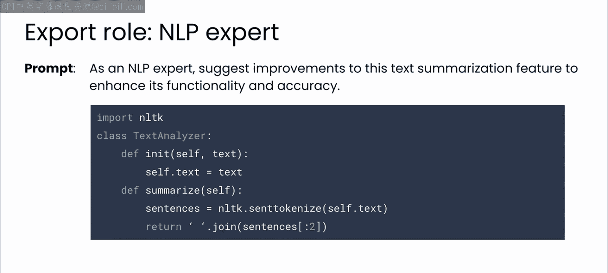
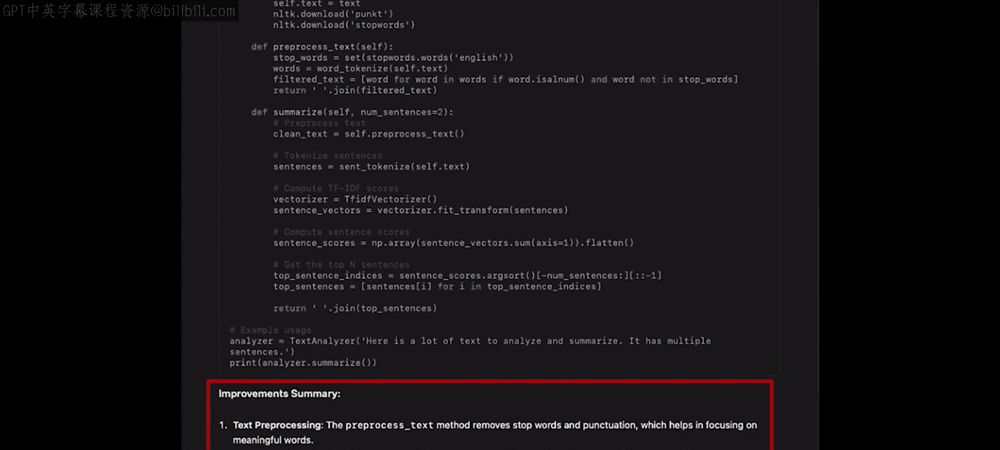
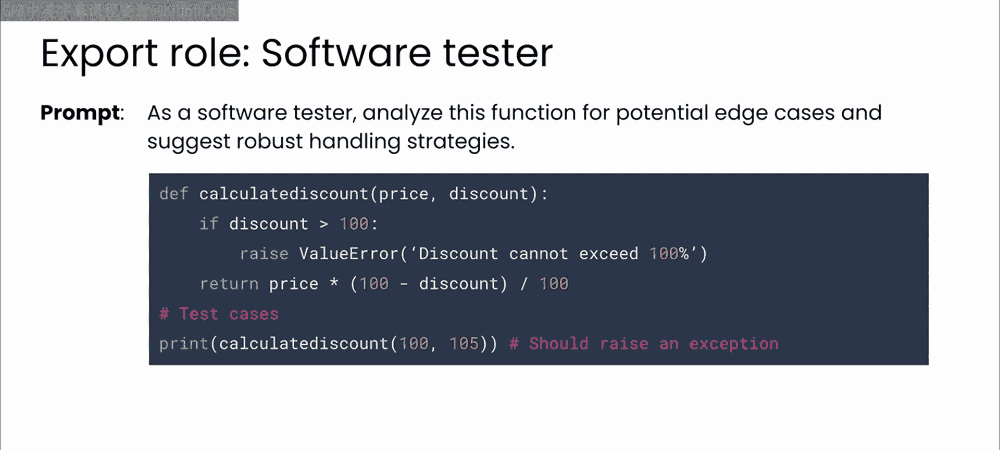
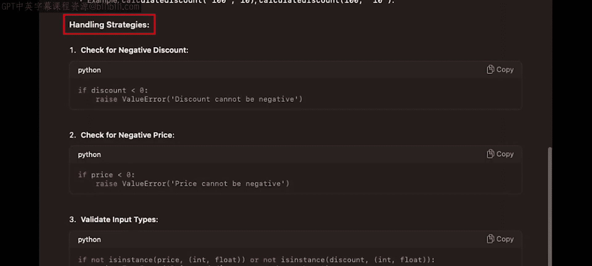
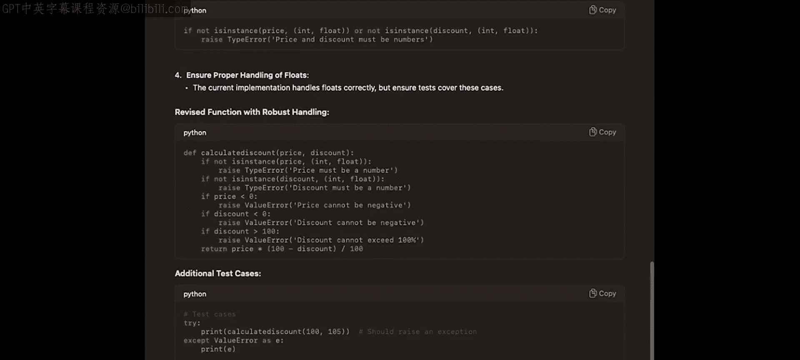

# 14：13_专业角色用于专门知识




在本节课中，我们将学习如何通过为大型语言模型（LLM）指定专业角色，来获取更具深度和针对性的反馈。我们将看到，通过让AI扮演特定专家角色，可以使其超越简单的代码生成，成为开发团队中提供专业见解的关键成员。

## 概述：利用专业角色深化AI协作

上一节我们介绍了使用角色来优化LLM的响应。本节中，我们将把这一技巧提升到新的水平：指导AI模型不仅仅是代码生成器，更要成为开发团队的关键成员。这意味着让它基于其训练的海量数据提供见解，并从经验丰富的程序员视角来回应问题。

我们将通过几个具体示例来演示如何应用这一技巧。

## 示例一：Python库代码审查 🐍

我们的第一个示例指导模型执行一次Python库的代码审查。你将使用一个数据可视化库的示例设计，并提示ChatGPT对其进行批判性评估，提出改进建议，使其达到行业标准。



以下是初始代码：

```python
# 示例：一个简单的数据可视化库设计
class SimplePlotter:
    def __init__(self, data):
        self.data = data

    def plot_line(self):
        # 简单的折线图绘制逻辑
        print(f"Plotting line chart for data: {self.data}")
        # ... 绘图实现 ...
```

接下来，我们提示模型扮演一个开源软件项目贡献者的角色，并指导它将你的代码与知名的类似库进行比较。


通过指定这个角色，你期望模型能对你的代码在功能、性能和可用性方面提供详细的批评，并提出具体的改进建议。

在GPT中运行这个提示后，模型会给出对代码的深度剖析，随后是改进建议。你可以花时间阅读这些内容，或者自己用LLM尝试相同的提示。



模型的回答非常详细，并包含了许多可操作的改进项。例如，在最后的“关键改进”部分，LLM总结了它建议实施的更改，包括灵活的数据输入、更多的图表类型、自定义选项等等。


## 示例二：集成高级功能探索 🤖

接下来，我们看看如何与LLM协作，探索高级功能的集成。假设我们想为现有应用程序增强AI能力，例如自然语言处理（NLP）功能。

我们从以下代码开始，并赋予GPT“NLP专家”的角色来分析它。



```python
# 示例：一个基础的文本处理应用
class TextProcessor:
    def __init__(self, text):
        self.text = text

    def summarize(self):
        # 简单的总结逻辑
        sentences = self.text.split('.')
        return ' '.join(sentences[:2]) + '...'
```

在这里，你鼓励模型不仅要批评，还要提供应用最先进的NLP技术来改进应用功能的建议。




模型会这样回应：它首先修正了类初始化中的一个错误，然后提供了一些改进代码的建议，比如文本预处理和用于摘要的更高级NLP方法。这正是你期望从与你并肩工作的代码审查员那里得到的反馈，尤其当他们是一位NLP专家时。

## 示例三：扮演软件测试员角色 🧪

让我们转向另一个角色，利用该角色的专业知识来帮助我们成为更好的程序员，那就是软件测试员的角色。软件测试员拥有许多技能，其中我最喜欢的一项是他们发现代码边界和极端情况的天生能力。

我们来看看GPT是否能在这方面帮助我们。以下是一些代码：

```python
# 示例：一个除法计算函数
def safe_divide(numerator, denominator):
    return numerator / denominator
```



你将赋予模型软件测试员的角色，看看它如何帮助你识别和缓解这里的边界情况。通过关注软件的健壮性，你引导AI不仅要考虑正常操作，还要考虑可能导致故障的异常或极端条件。


如果你使用GPT并附上这个角色提示和代码，你会得到类似这样的反馈。内容很多，建议你花时间观看视频并阅读反馈。同时，也花时间自己尝试这个提示代码。

这里最重要的收获是，当你指定软件测试员角色时，模型理解了你的需求。它识别出许多潜在的边界情况，描述了它们，然后提出了处理这些情况的策略。




它甚至还编写了一个包含针对这些边界情况测试的Python脚本。




## 总结：AI在完整开发流程中的应用 🔄

最后，让我们讨论如何将AI集成到典型的开发工作流程中，从规划到测试和部署，用AI驱动的见解增强所有这些过程。

以下是AI可以发挥作用的一些环节：
*   **自动化代码审查**：你可以使用AI自动化部分代码审查过程。
*   **识别优化机会**：在开发过程中识别潜在的优化点。
*   **辅助生成文档**：甚至可以根据代码库协助生成文档。

可能性是广泛的，通过精心设计提示以获得详细、专业的回答，你可以利用AI的潜力来解决复杂问题并简化工作流程，从而显著提高开发效率和准确性。

我鼓励你继续尝试这些技巧，看看它们如何改变你的项目。

本节课中，我们一起学习了如何通过为大型语言模型指定专业角色（如开源贡献者、NLP专家、软件测试员），来获取深度、专业且可操作的代码反馈与改进建议。这种方法能将AI从代码生成工具转变为具有专业视角的开发伙伴，从而在代码审查、功能增强和边界测试等多个环节提升开发质量与效率。