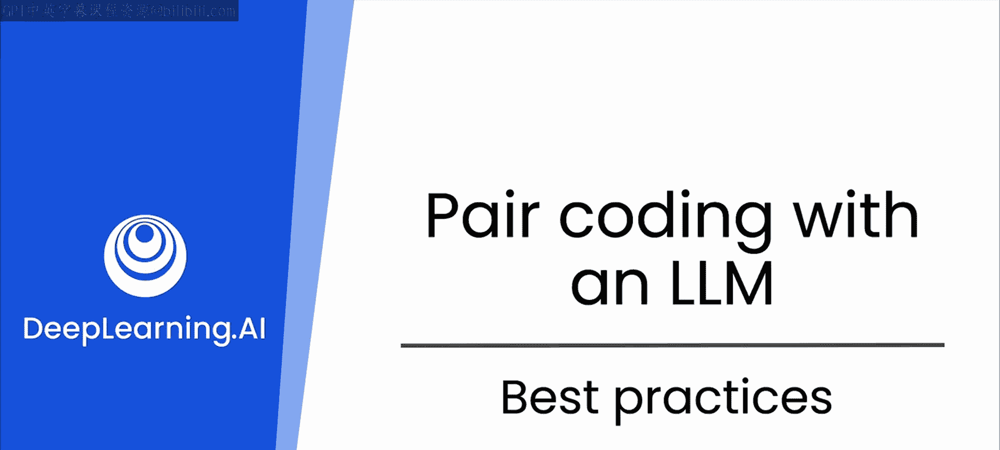
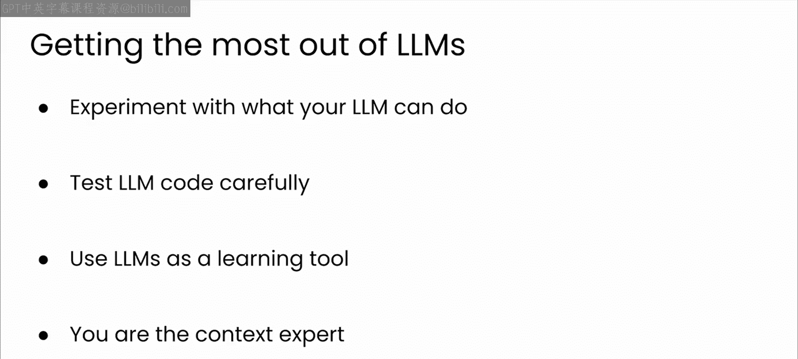

# 15：LLM最佳实践 🚀

在本节课中，我们将总结与大型语言模型（LLM）协作时的核心提示工程最佳实践，并探讨开发者角色在AI辅助下的变化。掌握这些原则将帮助你更高效地利用LLM进行软件开发。

## 概述

我们将从四个关键方面介绍如何有效地向LLM发出指令，然后讨论如何将LLM整合到你的工作流程中。理解这些实践能让你从AI工具中获得更精准、更有用的输出。

## 提示工程最佳实践

上一节我们概述了课程内容，本节中我们来看看与LLM交互的具体技巧。遵循以下原则可以显著提升你从LLM获得响应的质量。

### 1. 具体明确
提供问题的详细背景和上下文，帮助LLM准确理解你的需求。本课程早期介绍过，LLM底层的Transformer模型能够轻松处理大量文本。这意味着你可以编写包含项目详细信息甚至需要编辑或反馈的大段代码的长提示词。你的提示词越具体，得到的响应就越好。

### 2. 分配角色
通过解释你希望LLM以何种视角来回应，帮助其定制输出内容。例如：
*   如果你分配“**乐于助人的编程导师**”这一角色，你可能会得到代码友好、注释详尽的代码。
*   如果你分配“**专业高效的程序员**”这一角色，你可能会得到更简洁、更注重效率的代码。

建议尝试不同的角色，以找到能产出你所需输出的那一个。

### 3. 征求专家意见
将LLM指定为一个或多个领域的专家，然后请它评估你的工作。例如，你可以将其角色设定为“**软件测试专家**”或“**网络安全专家**”，然后请求对你已编写的代码提供反馈。这有助于你发现潜在缺陷、提出优化建议并提升工作的整体质量。

### 4. 提供反馈
迭代式地提示LLM，并对其输出提供反馈，以便逐步接近你的预期结果。LLM能够记住持续对话的上下文。因此，如果你对初始响应不满意，可以要求它进行修改以更接近你的目标。大多数与LLM的交互都需要经过几轮来回提示，才能得到你愿意尝试使用的结果。

## 开发者角色的转变

了解了如何优化提示后，我们来看看与LLM协作将如何改变你作为软件开发者的工作方式。以下是一些有助于你将这个新工具整合到工作中的建议。

以下是整合LLM到工作流程中的四个关键理念：

1.  **探索LLM的能力边界**：LLM功能强大，其能力范围常常令人惊讶。建议你预留时间尝试LLM能协助完成的不同任务，并有意识地探索其能力极限。例如，它能理解你代码库中最复杂的部分吗？它能重构整个库吗？即使某些实验失败了，以好奇的心态对待LLM也将帮助你发现新的可能性。

2.  **仔细测试LLM生成的代码**：LLM可以快速生成代码，但这并不意味着它总能按预期工作。避免仅仅将LLM生成的代码复制粘贴到你的项目中就了事。务必审查所写内容并进行测试，以确保代码不仅能正常工作，而且与你代码库的其余部分兼容。

3.  **将LLM用作学习工具**：LLM可以建议你未曾考虑过的设计、软件库甚至更广泛的解决方案。你可以随时提出后续问题、请求示例代码，或者让模型呈现其所提供解决方案的优缺点。当然，网络搜索、查阅文档、在线论坛或向同事朋友求助仍然很有价值，但LLM的对话特性使其成为帮助你个性化持续学习的绝佳工具。

4.  **记住：你才是上下文专家**：即使提供了详细的提示词并进行了冗长的来回对话，LLM对你项目背景的了解也远少于你。最终，你仍然需要成为批判性评估所编写代码并决定其是否符合项目需求的人。一次成功的LLM交互应该让你感觉是你和项目的需求在驱动着代码的开发。

## 总结

本节课中我们一起学习了与大型语言模型协作的核心最佳实践。我们强调了**提示词要具体明确、为LLM分配角色、征求专家意见以及提供迭代反馈**的重要性。同时，我们也探讨了开发者应如何适应新角色：**积极探索LLM能力、严谨测试其输出、将其作为学习工具，并始终牢记自己才是掌握项目全局的专家**。掌握了这些与LLM交互的最佳实践，现在，是时候向前迈进，成为一名更出色的开发者了。