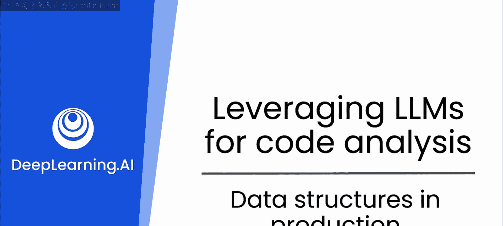

# 16：15_生产环境中的数据结构




## 概述

在本节课中，我们将要学习如何利用像ChatGPT这样的大语言模型来探索数据结构，并构建适用于生产环境的代码。我们将超越基础概念，深入探讨如何运用这些知识来解决工程中的可扩展性、可维护性和安全性等问题。

## 从代码助手到工程伙伴

上一节我们介绍了如何通过提示词和角色扮演（如专家软件工程师或初学者导师）来使用LLM改进代码。本节中，我们将把焦点转向数据结构。

你或许已经理解了数组或链表这类基础数据结构。这个认知是正确的。然而，令人兴奋的是，这些数据结构能帮助我们更深入地理解工程问题，例如可扩展性、可维护性、安全性等更多方面。

因此，在本模块中，我们将重温一些关于链表、树或图的旧有概念，并以LLM为伴，更深入地构建生产级代码。

## 重温核心数据结构

以下是几种在计算机科学中常见的基础数据结构，它们构成了复杂系统的基石。

*   **数组**：一种在连续内存位置存储相同类型元素的集合。其元素可以通过数字索引直接访问。
    *   **公式/代码示例**：`int scores[5] = {85, 92, 78, 90, 88}; // 访问第一个元素：scores[0]`
*   **链表**：由一系列节点组成的数据结构，每个节点包含数据和指向下一个节点的指针。它允许动态内存分配。
    *   **公式/代码示例**：
        ```python
        class Node:
            def __init__(self, data):
                self.data = data
                self.next = None
        ```
*   **栈**：一种遵循后进先出原则的集合。主要操作是压入（添加）和弹出（移除）项。
    *   **公式/代码示例**：`stack.push(item); item = stack.pop();`
*   **队列**：一种遵循先进先出原则的集合。主要操作是入队（添加）和出队（移除）项。
    *   **公式/代码示例**：`queue.enqueue(item); item = queue.dequeue();`
*   **树**：一种分层数据结构，由具有父子关系的节点组成。一个常见的例子是二叉树。
    *   **公式/代码示例**：
        ```python
        class TreeNode:
            def __init__(self, value):
                self.value = value
                self.left = None
                self.right = None
        ```
*   **图**：由顶点和连接这些顶点的边组成的网络。它可以是有向的或无向的。
    *   **公式/代码示例**：通常使用邻接表或邻接矩阵来表示：`graph = {‘A’: [‘B’, ‘C’], ‘B’: [‘A’, ‘D’], ...}`

## 从理论到生产实践

理解了这些结构本身只是第一步。接下来，我们将探讨如何将这些知识应用于实际的软件工程挑战。

例如，当设计一个需要频繁插入和删除的系统时，链表可能比数组更高效。而在实现撤销功能时，栈是天然的选择。理解这些结构的时间复杂度和空间复杂度（通常用大O符号表示，如 **O(1)， O(n)， O(log n)**），对于构建可扩展的应用程序至关重要。

通过与LLM协作，你可以：
1.  **优化算法**：询问LLM：“对于频繁搜索操作，哪种数据结构最合适？请比较二叉搜索树和哈希表。”
2.  **设计系统**：描述你的应用场景，让LLM帮助你选择并论证核心数据结构的选型。
3.  **调试与重构**：提供一段性能低下的代码，请LLM分析其数据结构使用的缺陷，并提出改进方案。

## 总结

本节课中，我们一起学习了如何超越对数据结构的表面理解，借助大语言模型的力量，将它们应用于解决真实的生产环境问题。我们从重温数组、链表、栈、队列、树和图这些核心概念出发，并探讨了如何利用LLM将这些理论转化为优化算法、设计系统和改进代码的实践能力。记住，强大的工具加上扎实的基础知识，是成为高效开发者的关键。