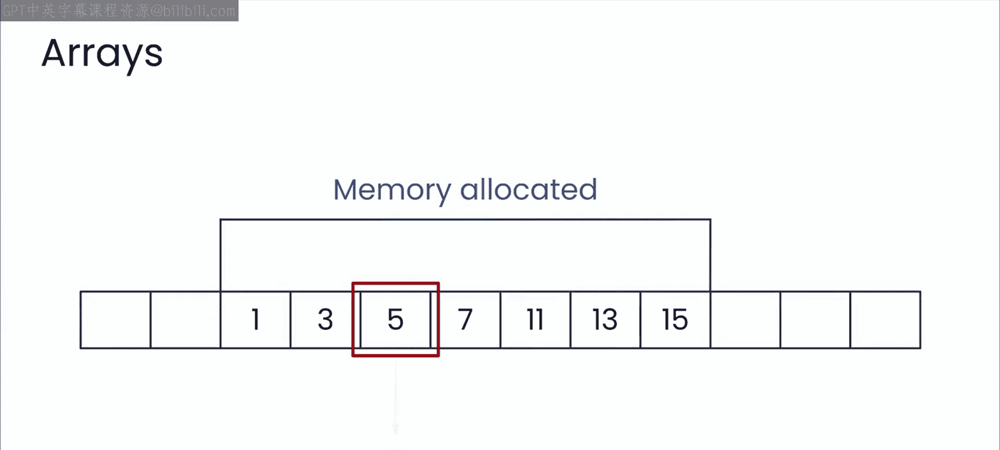
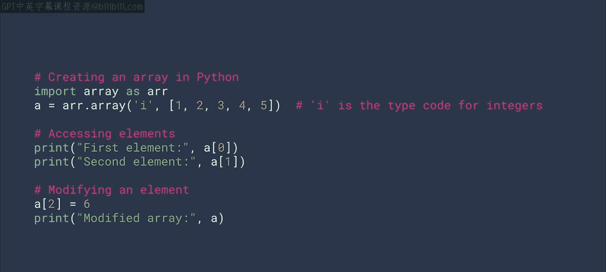
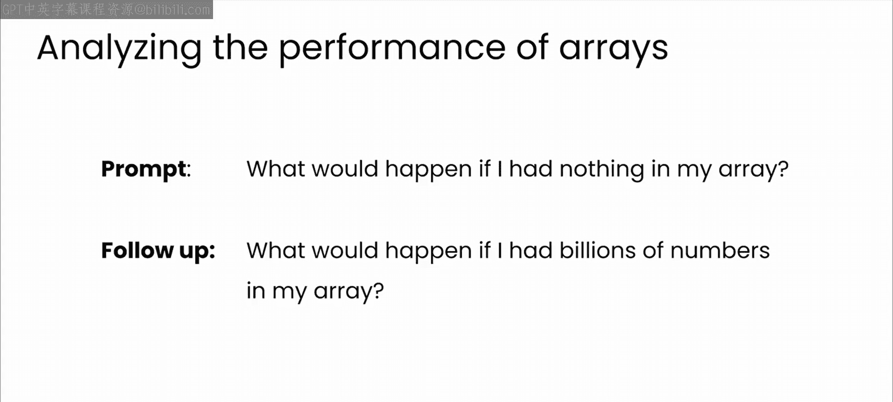
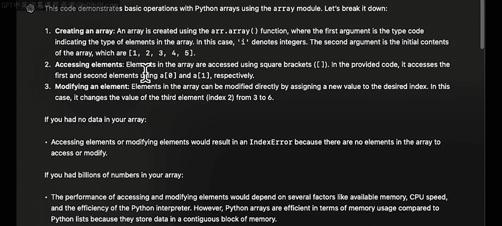
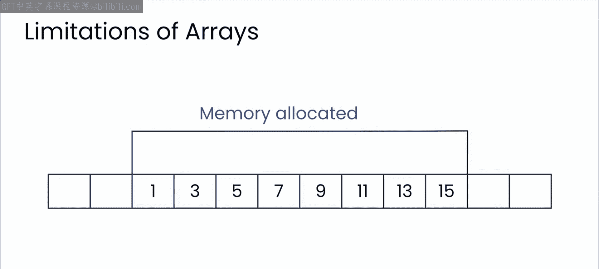

# 17：数组

## 概述
在本节课中，我们将学习数据结构的基础——数组。我们将探讨数组的基本概念、性能特点，以及如何利用大型语言模型（如GPT）来分析和优化数组相关的代码实现。

---

## 数组基础

最基础的数据结构是数组。

数组有许多局限性，这些局限性通常由更复杂的数据结构（如链表）来克服，我们稍后会探讨它们。但重要的是，这不是一门需要你从第一性原理学习这些数据结构的计算机科学入门课，你很可能已经见过它们。

相反，你将深入探索像GPT这样的大型语言模型的特性，看看它如何通过重温一些基础知识，并让模型与你一起推理代码，帮助你探索这些基础数据结构的属性以及如何高效地实现它们，从而成为一名更好的计算机科学家或软件工程师。

首先，我们来谈谈数组。数组是存储在连续内存位置中的项目集合。这意味着，如果你知道所需项目的索引，数组非常适合快速访问且效率很高。

如你所见，在Python中访问和修改数组元素是直接且非常快速的。

---

## 性能影响分析

但这如何影响性能？像我们在之前视频中那样，思考所有情况总是很重要的，当时我们让模型扮演软件测试员的角色。

所以，让我们请ChatGPT来解释。例如，你可以写一个这样的提示词：“如果我的数组里什么都没有会怎么样？”。

这里有一个小专业提示：通常在面试像谷歌这样处理大量数据的科技公司时，你会被要求用代码解决一个问题。但随后真正的问题会接踵而至，那就是如果你有更多数据（比如数十亿行）会发生什么，以及你将如何改变你的解决方案。

我将从这个角度出发，从简单开始，然后在与大型语言模型交互的过程中逐步扩大规模。

这是模型的回应。现在，你得到的结果可能与视频中看到的略有不同，因为大型语言模型是非确定性的，但你很可能会看到类似的主题和关键点，特别是在涉及数十亿数据的问题上，模型会强调需要考虑内存等因素。

Python对于数组非常高效，因为它将数据存储在连续的内存块中。但是，一旦涉及内存问题，就会存在风险，因此你可以向模型询问这些风险。如果你使用数组实现数十亿个数字，你会面临什么风险？

你可以写一个这样的提示词，并获得大量有用的信息反馈，详细说明诸如内存消耗、碎片化、性能问题、灵活性有限等问题。此外，访问数据之类的问题也可能被强调，虽然数组的访问操作时间复杂度是O(1)，但搜索数组并没有简单的方法。

或者，正如你在上一个模块中看到的，你可以给模型分配一个角色，比如专家软件工程师，然后让它分析你的代码，它会给你这样的建议。

现在，与模型的所有这些交互以及它提供的分析，让你在决定是否使用数组时有了大量需要考虑的信息。最终，你将根据你的具体场景做出决定。

---

## 数组的局限性与进阶

正如你可能从计算机科学101课程中回忆起的，数组数据结构的一些限制可以通过实现更复杂的数据结构来缓解。例如，基本数组的一个限制是没有固有的顺序。你只是不断将东西添加到数组的末尾。

如果你想要有序数据，比如排序的数字，那么要插入一个新值，你必须将所有其他元素向下移动，以创建一个存储新值的位置。或者，如果你想从数组中删除一个项目，你必须删除该项目，然后将所有其他元素向上移动。

在一个包含数十亿个项目的数组中，这些移动操作是不可行的。因此，链表的概念应运而生。我们将在下一个视频中更仔细地研究链表。

---

## 总结
本节课中，我们一起学习了数组作为基础数据结构的概念、其高效的随机访问特性（通过索引，时间复杂度为O(1)），以及它在处理大规模数据时可能面临的内存和性能挑战。我们还探讨了如何利用大型语言模型来分析数组的使用场景和潜在风险，并引出了链表作为解决数组某些局限性的方案。