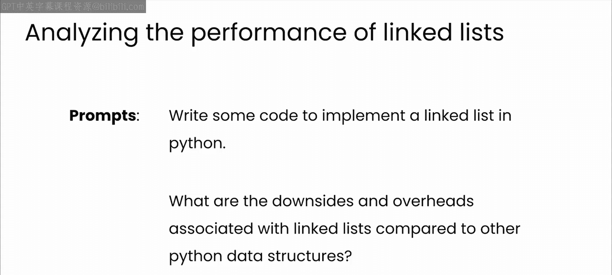
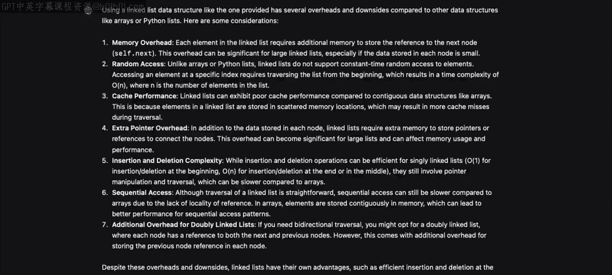
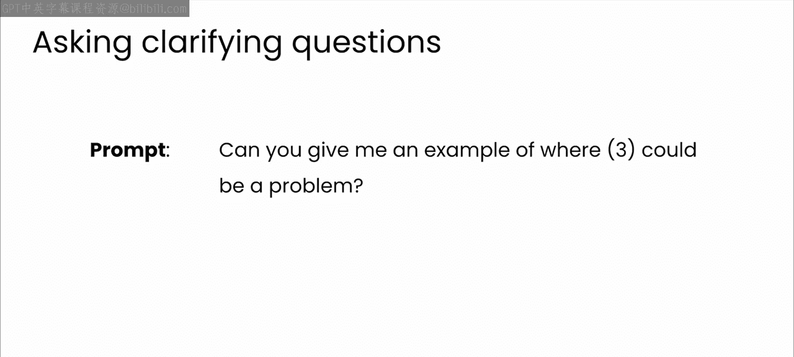
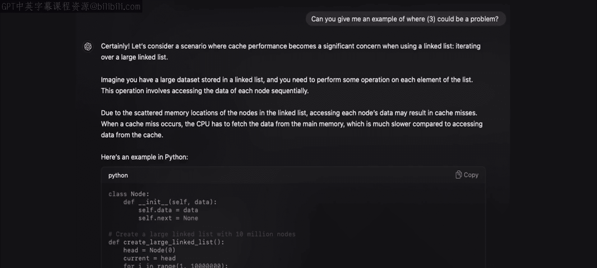
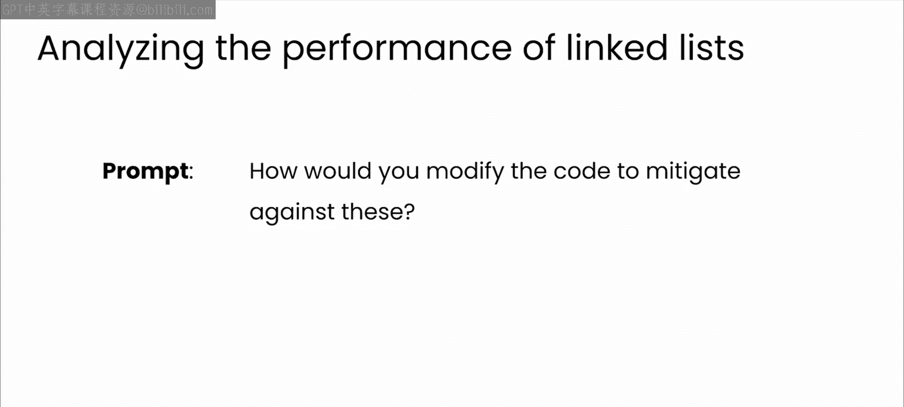
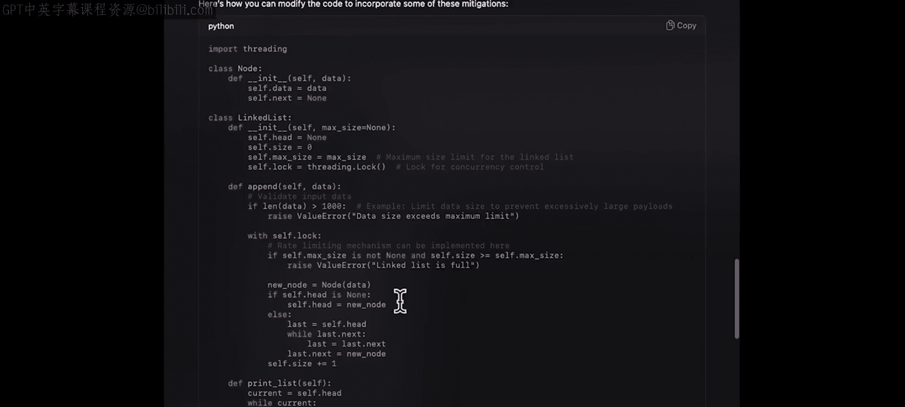
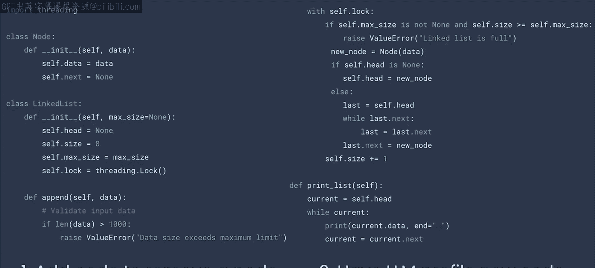
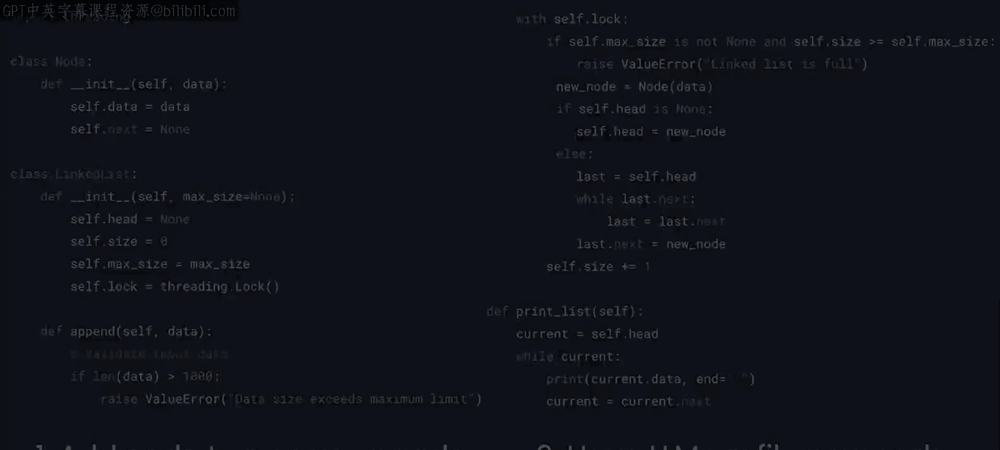

# 18：链表与LLM辅助编程 🧠

在本节课中，我们将学习如何利用大语言模型（LLM）辅助实现链表数据结构，并深入理解其背后的原理、潜在问题及安全考量。我们将看到，LLM不仅能生成代码，更能作为“结对编程”伙伴，帮助我们进行深度分析和学习。

---

## 链表简介与LLM的代码生成

在计算机科学入门课程中，实现链表是一个常见的作业。如今，有了大语言模型，你可以直接要求模型为你编写代码。

但这可能养成一个坏习惯。虽然让ChatGPT生成代码很容易，但如果你不理解代码的**正确性**，或者更重要的是，不理解模型为何选择特定的实现方式，你可能会做出糟糕的决定，积累技术债务，这些债务将来可能需要你或你的同事来偿还。

因此，在使用LLM编写代码时，务必询问模型为何做出这样的建议。

回到链表本身。这种数据结构的设计初衷是为了克服我们之前看到的数组的缺陷。在数组中，插入或删除元素（特别是对于大型数组）的代价极高。

在链表中，数据并非存储在连续的内存空间中。每个项目存储在一个内存位置，并包含一个指向下一个项目位置的**指针**。

现在，如果你想在数组中插入一个值，你可以将其放在内存中的任何位置，让前一个项目的指针指向它，然后让它的指针指向在你插入之前前一个项目所指向的内容。

这非常巧妙。它提供了插入和删除元素的灵活性，而无需像数组那样移动大量元素。

---

## 链表的优势与潜在问题

这是一个相当酷且实用的数据结构，虽然它解决了数组的一些问题，但链表也有自身的开销和缺点。你能看出可能有哪些问题吗？

请暂停视频，思考一下。

链表数据结构存在一些潜在问题，如果你没有全部想到，也不用担心。这正是LLM作为结对编程伙伴的能力真正派上用场的地方。

你可以要求LLM编写实现链表的代码，然后要求模型为你讲解潜在的缺点和开销。

在查看模型的回答之前，请再次暂停视频，尝试向LLM提出这些问题。完成后，我将向你展示ChatGPT是如何回应我的。

以下是ChatGPT对我提示的回应。如你所见，模型提供了详细信息，并列出了一长串需要考虑的潜在问题。说实话，我自己只想到了这七项中的四项。我没有考虑到诸如**缓存性能**之类的问题。

这再次证明，与LLM进行结对编程可以使你成为更好的开发者。

花点时间阅读模型给出的反馈。这就像与真人合作一样，不同的对话会给你不同的见解。回想一下你与团队成员的协作，不同的同事基于各自独特的经验，往往会对如何解决问题提出不同的意见。

对于LLM而言，确切的回答会因随机种子的变化而不同，但总体效果是一样的。你可以获得多种观点和见解，利用它们来更深入地了解工作的基本原理。

如果你对某些内容没有完全理解，不要害怕要求澄清或更多解释。

例如，我对这里的缓存性能观点感到好奇，所以我要求提供更多信息。

模型回应了一个详细的答案，包括一些可用于测试该假设的代码。

所以，请再次暂停视频，回到你刚才与LLM开始的对话。选择模型提出的一个观点，要求它告诉你更多信息。

当模型深入探讨时，不要犹豫提出后续问题，利用这种来回交流来更好地学习和理解你的代码及底层问题，从而更有效地解决你的业务问题。

---

## 结合业务场景进行代码分析与改进

欢迎回来。我希望你能从与LLM的对话中学到新东西，或者至少感觉自己的专业知识得到了模型回应的验证。我强烈鼓励你在使用LLM编写代码时养成这种来回交流的习惯。这是你带来的价值：你的经验、你的洞察力、你的智慧。

不要陷入许多人会掉入的陷阱：用LLM生成代码，不加疑问地使用它，然后不考虑更深层的影响就继续前进。现在，即使对于像链表这样相对简单的结构，如果你在生产环境中实现它们，也需要考虑严重的后果。

回到角色扮演，让我们要求LLM来分析我的代码，假设扮演这样一个角色：一家遭受拒绝服务攻击公司的专家软件开发者。在这种情况下，我将面临哪些风险？让我们看看。

模型提供了一些反馈，有点令人担忧。资源耗尽、操作缓慢、算法复杂性攻击、内存泄漏漏洞、并发问题。仅仅这个简单的数据结构就存在许多不同的风险。

为了缓解这些问题，你可以要求LLM帮助你改进代码。

如果你向模型提出这个请求，你会从模型那里获得一些非常有用的见解，了解如何使链表更安全，例如速率限制、内存管理等等。你还会得到新的代码，这些代码会执行输入验证检查、实现最大大小限制、通过线程等进行并发控制。

---

## 实践练习：为链表添加删除功能

现在，我希望你暂停视频，从这段代码开始。这是我使用ChatGPT生成的链表。我希望你考虑一下缺失的功能：**删除节点**的能力。

我希望你花点时间弄清楚如何添加这个功能，无论是手动编码还是生成代码，然后回去再次要求模型以拒绝服务专家的身份来分析代码，以确保它能缓解安全风险、有效扩展、性能良好等等。请花时间探索如何正确地完成它。

作为一名专业开发者，人们对你有很高的交付期望，随着LLM代码编写能力的增强，这些期望只会越来越高。我确实希望这些内容能帮助你熟悉LLM能做什么以及你如何使用它们，从而让你走在前面。

坦率地说，你可能不会在生产系统中实现像单链表这样简单的结构，但它们确实有助于你看到主要观点：LLM可以帮助你分析和深入思考你的代码。

因此，让我们开始研究一些更复杂的数据结构，看看你能学到什么关于在生产环境中实现它们的知识，以及你可能需要考虑哪些类型的问题和难题。幸运的是，LLM是引导你应对所有这些复杂性的绝佳伙伴。

---

## 总结

本节课中，我们一起学习了如何利用LLM辅助实现和分析链表数据结构。我们认识到，LLM不仅是代码生成工具，更是能提供深度见解、帮助我们发现潜在问题（如缓存性能、安全风险）的“结对编程”伙伴。关键在于，开发者需要主动与模型对话，理解其建议背后的原理，并结合具体业务场景（如防范DoS攻击）进行代码审查与改进，从而避免积累技术债务，成为更高效、更全面的软件工程师。