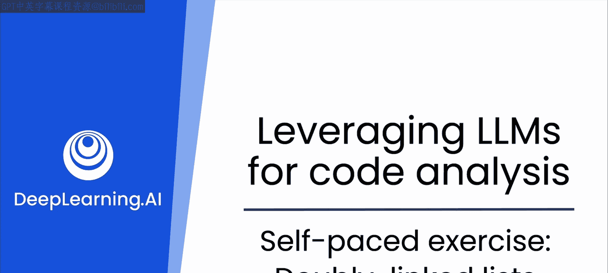
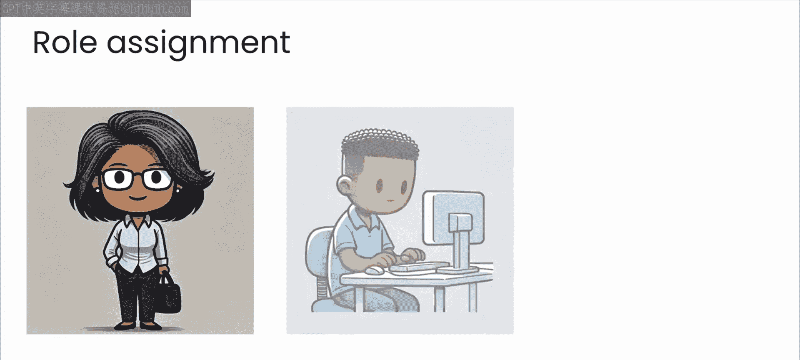
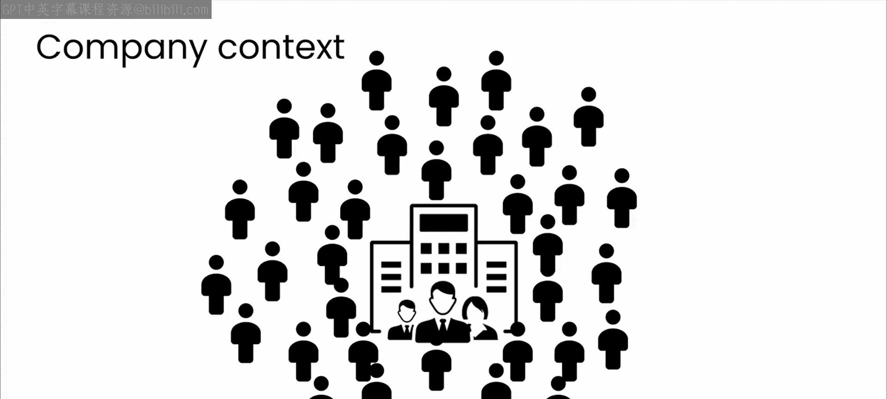

# 19：18_自学练习：双向链表

## 概述
在本节课中，我们将学习如何将单向链表升级为双向链表。我们将分析双向链表的优势，并借助生成式AI的帮助，完成一个双向链表的实现练习。

---

你刚刚学习了数组和链表，特别是**单向链表**。

在单向链表中，每个节点包含一个数据项和一个指向下一个节点的指针。这让你能够轻松地插入或删除数据，因为你避免了在内存中移动大量元素的问题。你还在链表实现中添加了删除节点的代码。

做得很好。

现在，我希望你花更多时间，将你的链表代码提升到新的水平。

你已经实现了单向链表。通常在计算机科学课程中，下一步是实现**双向链表**。

在双向链表中，每个节点不仅指向下一个节点，还指向前一个节点。当你执行插入新节点等操作时，新节点必须同时指向前一个和后一个节点。

请暂停片刻，思考一下为什么有人会选择实现双向链表而不是单向链表。初次学习时，你可能直接从单向链表跳到双向链表，而没有深入分析为什么需要这种新的数据结构。

思考片刻后，或许可以向ChatGPT提出同样的问题，看看模型如何回应。

如你所见，模型提供了大量反馈。其中一些是显而易见的，例如能够从特定节点向前和向后遍历，以及存储额外指针带来的内存成本。

但模型也提供了关于双向链表在更复杂场景下更强大的见解，例如用于缓存和内存管理算法，如LRU（最近最少使用）。其中一些回答是我没有立刻想到的，这再次证明了与AI一起重温基础知识是多么有用。

和之前一样，请在此处暂停视频，仔细阅读模型的反馈以及你提问时它给出的回答。

请记住，你始终可以要求模型对你好奇的任何项目提供更多细节或解释。

所以，下一步是一个自定进度的练习，你需要在实验项目中提供的编码环境中完成。

你的任务是实现一个双向链表。你可以从我的单向链表代码开始，也就是你之前添加了删除节点功能的那段代码。

然后，与大型语言模型进行头脑风暴，思考如何实现这种数据结构。尝试让模型扮演不同的角色，并表达它给出的反馈。

在这里尽量发挥创意。要求模型表现得像一位经验丰富的软件工程师、一位偏执的安全专家或一位站点可靠性工程师，看看每次它如何回应。

你还可以探索在不同场景下如何推进实现，例如一家遭受拒绝服务攻击的公司，或一家需要快速从数千用户扩展到数十亿用户的公司，然后思考这些场景对你的代码有何影响。

例如，在扩展时，ChatGPT可能会提供替代的数据结构。现在不必担心那些，只需坚持使用双向链表，即使它的规模有限。

最后，尝试让你的代码得到充分的文档记录和解释。回想第一个模块，你看到了大型语言模型如何帮助你编写详细的注释，使你的代码易于理解。

花时间把它做好。很容易养成让模型为你生成代码的坏习惯。始终要批判性地看待模型的回应，并进行测试以确保代码完全按照你的意愿工作。

当你完成后，我们将在下一个视频中再见。

---

## 总结
本节课中，我们一起学习了双向链表的概念及其相对于单向链表的优势。我们探讨了如何借助生成式AI进行头脑风暴和角色扮演，以深入理解数据结构的应用场景。最后，我们明确了实现一个带完整文档的双向链表的练习任务，并强调了测试与批判性思考的重要性。