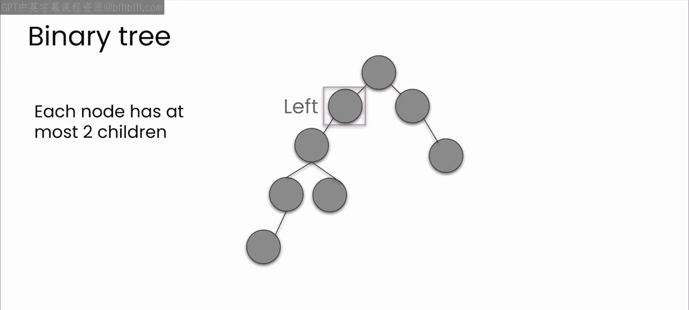
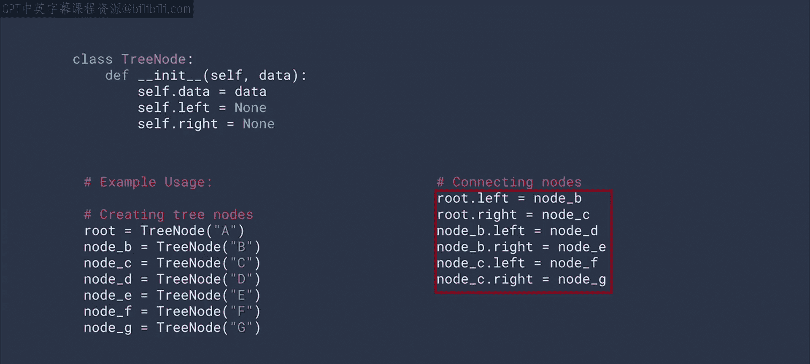
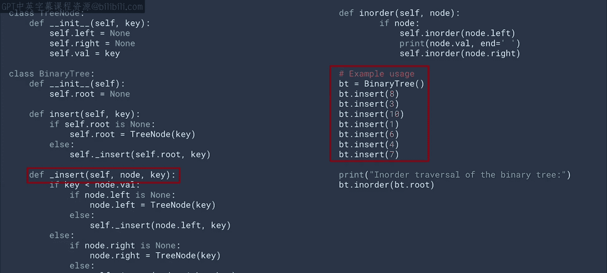
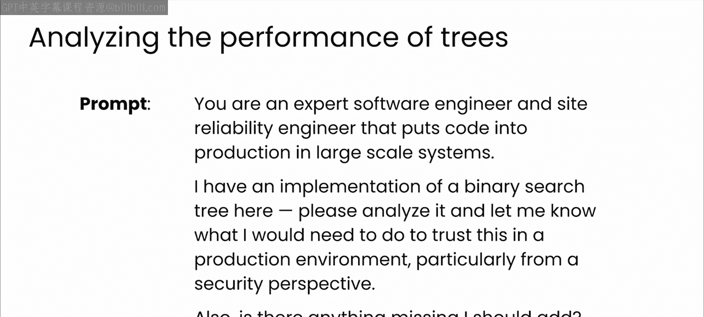
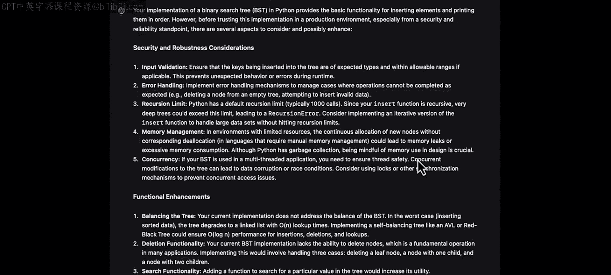
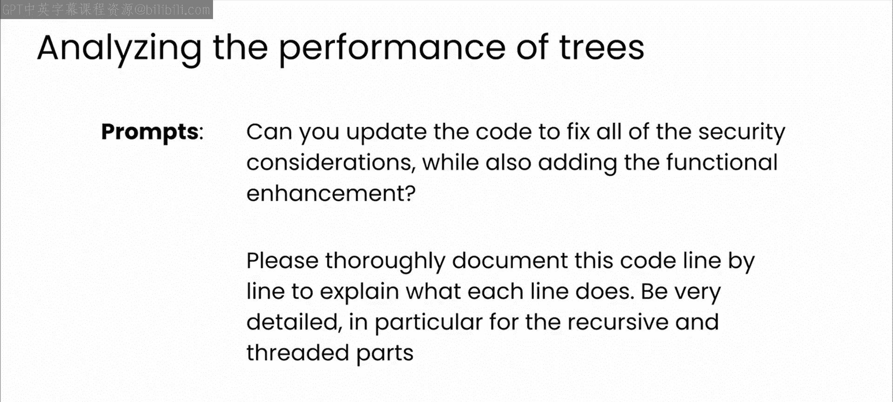
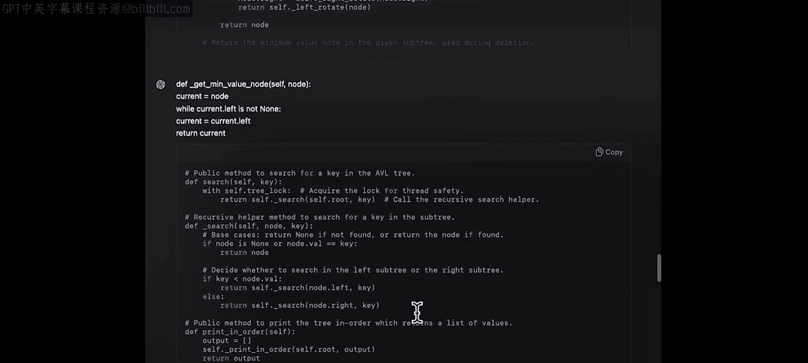
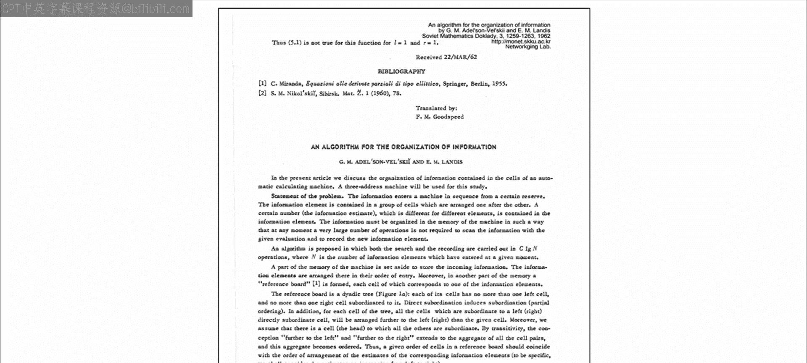

# 20：19_树 🌳

在本节课中，我们将学习树（Tree）这种非线性数据结构。我们将探讨其基本概念、实现方式，特别是如何利用大语言模型（LLM）作为编程伙伴，来帮助我们构建更健壮、可扩展且安全的代码。

---

## 概述

之前，我们学习了数组，并探讨了何时应该以及何时不应该使用它们。接着，我们实现了类似的数据结构，以克服数组的一些限制，首先是单链表，然后是你在动手练习中创建的双链表。

现在，你可能会想，如果你使用了大语言模型来帮助创建代码，包括所有使其可扩展和安全的代码，它是否仍然有效？这是一个很好的问题。我鼓励你继续在自己的代码中探索这一点。尽可能多地进行测试。

如果你使用Python，一个很好的方法是使用像Google Colab这样的在线托管笔记本。运行代码，想出一些测试用例，然后尝试破坏你的代码。对于其他语言，同样的原则也适用，你可以使用自己选择的环境。在本专业的后续课程中，你将探索使用ChatGPT作为伙伴来创建帮助你测试工作的代码。

但不要等到那时才养成测试的习惯。现在，让我们回到数据结构。

---

## 链表与数组的对比

你创建的链表相对于简单数组的一个好处是高效的存储和检索。从一个节点移动到下一个节点或移回前一个节点非常容易。

然而，如果不遍历整个数据结构，你就无法在这些链表中搜索数据。因此，随着存储的数据增多，搜索特定项的成本会变得过高。

考虑到这一点，让我们以LLM为向导，探索其他一些数据结构的特性。你将了解树、图甚至哈希表。

这些数据结构是许多编码面试的基础。因此，深入了解它们的工作原理，以及如何扩展它们并使其更安全，是非常有益的。让我们从树开始。

无论你是复习知识还是希望更深入地理解树结构，本视频都将提供有价值的见解。让我们一起增长知识。

---

## 树的基础知识 🌱

以下是基础知识的回顾：树是一种非线性数据结构，由存储数据的节点和连接节点的边组成。

树的一个定义性特征是，有一个节点被指定为根节点，这个节点位于树的顶部。根节点然后链接到一个或多个子节点。在这个例子中，你可以看到两个子节点。子节点本身也可以有一个或多个子节点。

根节点下方没有任何子节点的节点称为叶节点。注意，树中没有循环。

最常见的树类型之一是二叉树，其中每个节点最多有两个子节点，通常称为左子节点和右子节点。

---

## 二叉树的实现

现在，这是你可以编写这种特定类型二叉树的一种方式。与其从整个树的角度思考，你可以从编写一个树节点类开始，其中每个节点实例都有一个左子节点和一个右子节点。

然后，你可以通过指定所有单独的节点，然后将它们分配为适当父节点的子节点，来创建上一张幻灯片中的二叉树。

这种方法效果不错，但代码不够友好。更重要的是，没有节点排序的概念。因此，当你插入一个节点时，你只是让一个节点成为另一个节点的子节点。

---

## 二叉搜索树（BST）

树提供的一个优点是，与数组和链表这样的线性数据结构不同，如果你在插入或删除项时选择了顺序，它能够进行搜索。因此，让我们修改我们的树，使其成为可搜索的树，即二叉搜索树（BST）。

这就是树应该被修改的地方，这样你就不会盲目地添加子节点。你将从一个根节点开始。每次插入一个值时，你遵循这个模式：如果你想添加的值比当前值大，你将其作为右子节点插入；否则，作为左子节点插入。这可能会变得递归，因为右子节点可能已经被占用，然后你必须做同样的决定。

假设你从值8开始。这将是根节点。现在，如果你想将3插入树中，它小于8，所以它成为左子节点。现在，如果你想将10插入树中，它大于8，所以它成为右子节点。现在，如果你想插入1，它小于8，所以你将其插入左子节点。但这已经被3占用了。因为1小于3，它将成为3的左子节点，依此类推。

为什么这很重要？现在，如果你在从左到右遍历打印字符串时进行递归，你实际上会得到一个有序的数字集合。

这是一个按此方式工作的二叉搜索树的示例实现。数字一开始并不是有序的，但当你调用按顺序打印时，它们就是有序的了。

但这并不是计算机科学101。那么，作为一名工程师和正在学习本课程的人，你认为在将使用BST的代码投入生产之前，下一步要考虑什么？暂停视频，思考一下，然后再继续。

---

## 生产环境下的考量

好的，你发现了什么？

首先，简单的一点是，这个实现没有删除操作，只有插入。

然后考虑一些事情，比如这里的代码在插入时使用了递归。当你在代码中进行递归时，它可以使你的代码非常整洁和优雅，这会让你在本科教授那里得到很高的分数。

但这是正确的方式吗？考虑一下必须维护递归栈对内存的影响。

这个实现还假设了简单的整数。但是，例如，如果你存储的是大型数据结构呢？在那里使用递归的内存成本可能过高。

或者你可能想到了输入验证。这里假设你输入的是整数，但它是否可能因为不过滤输入而导致某种拒绝服务攻击？

最后一个问题很微妙，但很重要。如果数字在插入之前就已经是有序的，会发生什么？

你会得到一个实际上是一个链表的树，根节点有一个子节点，然后那个子节点又有一个子节点，依此类推。如果你试图访问树上的内容，你将无法获得树的最佳性能。因此，有时平衡树会更好。一个完美平衡的二叉树将有N层深度，当有2^N个数据项时。所以，如果你有8个数据项，你可以平衡树，使其只有3个节点深。或者如果你有1000个数据项，它可以只有10个节点深。因此，搜索可以非常快。

现在，也许你已经识别了所有这些问题，或者也许你只意识到了其中的几个。但好消息是，我相信你现在已经猜到了，你可以让LLM通过扮演专家软件工程师或站点可靠性工程师等角色，来帮助你更全面地考虑问题。现在，让我们看看那是什么样子。

---

## 利用LLM进行代码审查与改进

以下是提示。在分配角色后，你可以将代码粘贴到模型的上下文窗口中供其评估。

在这里，GPT写了一个冗长的回复，涵盖了必要的内容，如输入验证、错误处理等。

说实话，我读到这个才知道Python有一个默认的递归限制。通常是1000次调用。所以，一个完美平衡的二叉搜索树理论上可以容纳2^1000个值，这是一个难以想象的高数字，但是，当然，树越深，递归栈就越深。因此，再次强调，有人可能利用插入调用来进行拒绝服务攻击。你可能想要限制Python的递归深度。

你能想出如何做到这一点吗？我把它留作你的练习。

现在，在提示GPT进行专家和SRE分析并得到大量反馈后，想想你会如何要求它跟进这些反馈。

以下是我做的一些例子。

但在这一点上，你应该考虑自己的提示，并评估返回的代码。

查看这个视频，了解我如何与GPT互动以持续改进和巩固代码，然后自己尝试一下，看看你能做些什么来改进自己的代码。

---

## 动手实践与总结

你可以在本课程的下载资料中找到本视频中的树实现代码，它是在ChatGPT的帮助下创建的，名为`avl.py`。AVL是以这种自平衡二叉搜索树的发明者Georgy Adelson-Velsky和Evgenii Landis的名字命名的。希望我发音正确。下载它，测试它，看看你是否能破坏它。里面有一些明显的错误。所以，使用它，然后使用LLM作为你的编码伙伴来帮助你修复这些错误。

花点时间，仔细研究代码。你会发现这个实现已经远远超出了我们最初的二叉搜索树，它看起来更像你在专业生产环境中期望找到的代码。

完成后，我们将在下一个视频中再见，在那里你将重新学习下一个数据结构：图。

---

## 总结

在本节课中，我们一起学习了树数据结构，特别是二叉树和二叉搜索树。我们探讨了其基本实现，并深入研究了在生产环境中需要考虑的关键问题，如递归限制、输入验证和树平衡。最重要的是，我们学习了如何利用大语言模型作为专家伙伴，对代码进行审查、提出改进建议，并帮助我们编写更健壮、安全的代码。请务必下载提供的代码进行实践，并尝试使用LLM来完善它。