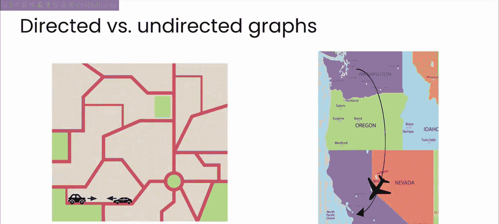
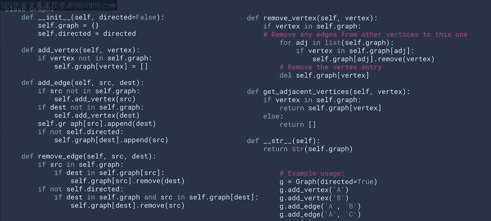
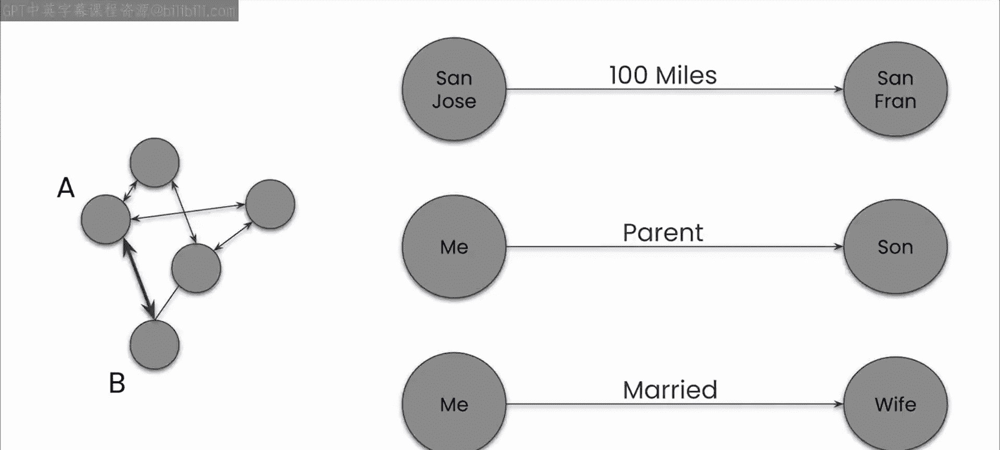
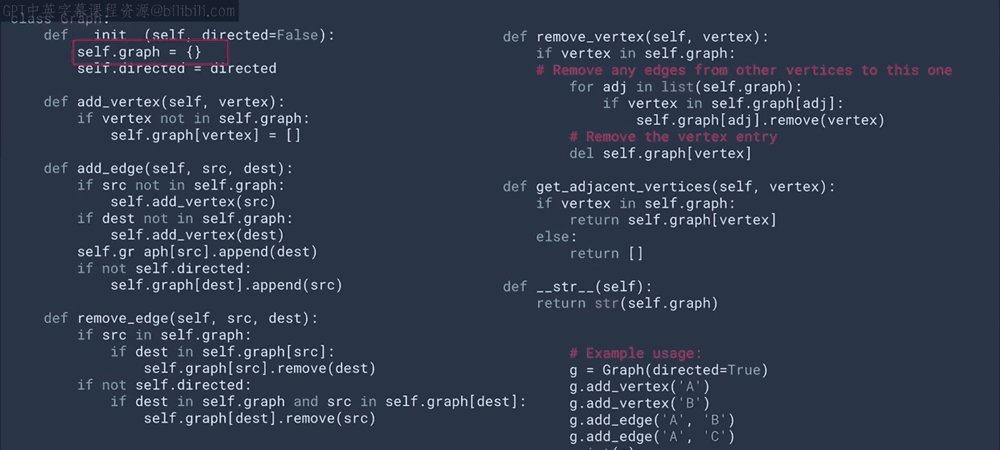
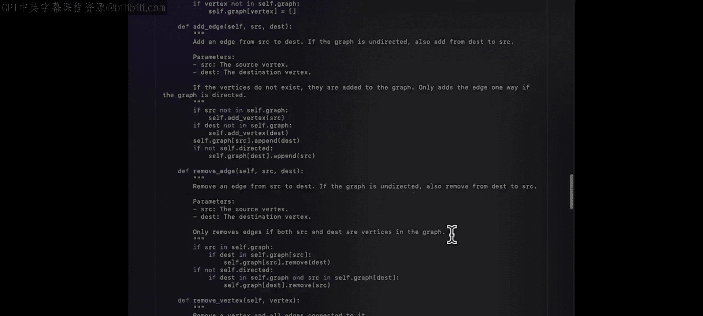
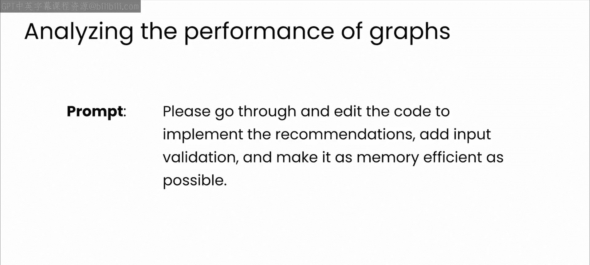
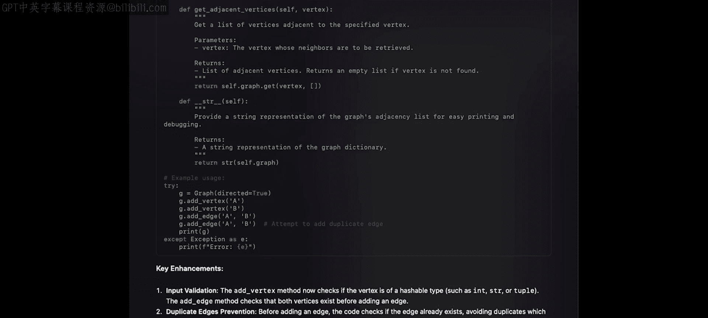

# 21：图数据结构入门与应用

在本节课中，我们将要学习一种新的数据结构——图。图是一种用于建模对象之间关系的强大工具，广泛应用于社交网络、地图导航和推荐系统等领域。我们将从图的基本概念开始，逐步探讨其实现、潜在问题以及如何利用AI工具进行改进。

## 概述

到目前为止，我们已经学习了数组和链表这两种线性数据结构，以及树这种非线性数据结构，并探索了它们在各种场景下的应用。本节中，我们将转向另一种数据结构——图。图结合了前述结构的元素，专门用于表示对象间的复杂关系。

## 什么是图？🤔

图用于建模对象之间的关系。当你使用在线地图进行导航时，你就在使用图。其中，每个地点是一个**节点**，连接这些地点的道路、路径或铁路则是**边**。

在像现实世界这样的复杂系统中，从A点到B点通常有多种方式。如果不使用专门为此场景设计的图结构，对这种关系进行建模会非常困难。图使用节点来表示一个事物，并使用边来表示该事物与其他事物之间的连接。

以下是图的一些应用实例：

*   **社交网络**：你是节点，你的朋友是通过边连接到你的其他节点。朋友的朋友则是连接到你的朋友节点，但未直接连接到你的节点。
*   **购物推荐**：你购买的商品是节点，相关的配件（或同时被购买、被同一人购买的商品）是通过边连接的其他节点，这构成了推荐系统的基础。

图的另一个细微差别在于，边可以是有向的或无向的。

*   在**有向图**中，从A到B的边可以是单向的。
*   在**无向图**中，从A到B的边是双向的。

这种区别在何处有用？回顾地图导航的概念：通常，道路是两个地点之间的双向连接。但像下午3点从西雅图飞往圣何塞的特定航班，就是一个单向连接。如果你要构建一个具有时间敏感性的导航系统，你的地点图可能需要包含这两种类型的连接，或者更可能的是，你会使用多个图。

图是一种极其灵活的数据结构，正如你所见，它有许多用途。但作为开发者，如何最大限度地利用它们呢？让我们深入探讨一下。

## 图的代码实现与初步审视

我们将从这段使用ChatGPT创建的用于实现有向图的代码开始，你可以在课程资料中的 `graph.py` 找到它。

你可以直接使用提供的代码，当然也可以自己编写。但接下来，我希望你查看代码并思考它如何在生产环境中使用。和之前一样，暂停视频，思考一下，运行它，然后思考这个实现需要如何修改才能达到生产质量。花些时间，完成后回来。

## 代码评估：从原型到生产

那么，你想到了什么？对我来说，第一个也是最明显的问题是，图只提供了A和B之间的连接，但这对于像地图导航这样的应用来说信息量不够。例如，可能需要距离信息；对于人际关系，可能需要连接类型（我与妻子、孩子和朋友之间的连接类型重要性不同），但当前结构没有包含这些。因此，我们需要解决这些语义问题。

此外，还需考虑可扩展性。如果你将其用于地图上带有连接的地点，可能会有数百万个地点，每个地点都有许多通往其他地点的路线。这个结构必须能够处理海量数据。

然后是底层实现。你可以看到 `self.graph` 是一个字典。但这种数据类型在巨大规模下是否合适？它是否会带来任何安全隐患？

当然，还有你在本课程到目前为止一直在考虑的所有问题：类型检查、拒绝服务攻击等等。养成这种代码审查的思维模式，并在朝着生产代码努力时保持这种心态，是非常有益的。

## 利用AI改进图实现

现在，让我们开始与ChatGPT合作，评估并改进这个图的实现，看看它能带我们走向何方。

首先，让模型分析代码，看它是否能提出你我未曾想到的问题。大语言模型在此提供了许多有用的反馈。首先，修复一些明显的问题，比如缺乏方向性，或许添加一些注释。你已经知道如何操作，可以自己尝试与ChatGPT对话。以下是我操作的方式：

接着，给模型分配一个角色，比如专家软件开发者或SRE，并告诉它你希望代码运行得快速且安全。它发现了很多我未曾考虑的问题，其中许多你可能也想到了。例如，没有检查边是否已存在，或者并发问题（由于使用Python，存在锁机制，这在需要大规模扩展时可能成为瓶颈）。

现在，让我们在ChatGPT的帮助下返回并修改图代码以修复这些问题。这只需要一个简单的提示，因为我仍在同一个ChatGPT会话中。

模型在此生成的输出存储在 `graph_improved.py` 中，你可以下载并亲自尝试。看看是否能找出它的破绽。如果你找到了，思考你会如何修复它。暂停视频，试一试。

希望你会发现一些问题，也许不是崩溃，但我很乐意听到你的发现，可以考虑在课程社区页面分享你的边界情况。一个明显的问题是，当你尝试在一个节点和其自身之间添加边时，什么也不会发生，但你不会收到错误信息。我相信还有很多其他问题。

## 总结与下一步

好了，现在你已经重温了图的基础知识，并看到了在处理大规模图时必须应对的一些问题。接下来是了解一些算法，这些算法能让你利用图来解决现实世界的问题的好时机。

让我们进入下一个活动，也就是本课程的评分实验。在那里，你将在大语言模型的帮助下，着手编写这些算法。