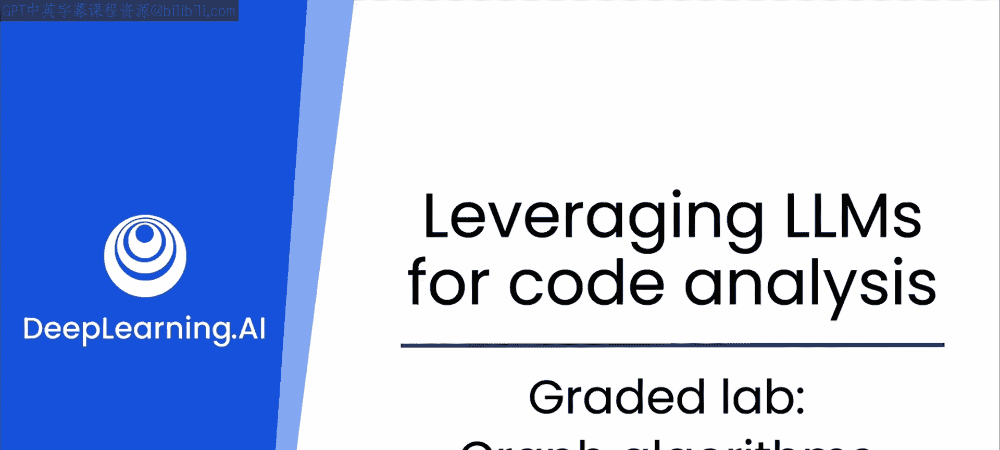
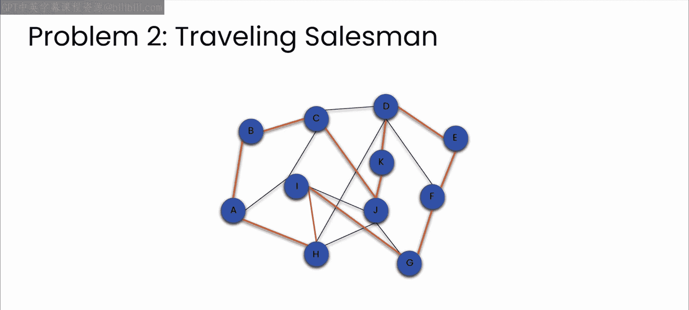

# 22：图算法分级实验

在本节课中，我们将进行一个分级实验，目标是利用LLM实现图数据结构相关的核心算法。我们将重点关注两个经典问题：计算两点间最短路径和求解旅行商问题，并确保代码具备生产环境所需的专业质量。

到目前为止，本模块的所有视频都展示了如何与LLM协作来实现一些基础数据结构。我们不仅涵盖了CS101课程中的基础知识，还探讨了如何将这些结构应用到现实世界中，同时考虑可扩展性、安全性，并确保它们有良好的文档和测试。

现在，我们进入本课程的分级实验环节。你的任务是实现一些用于处理图的重要算法。

## 实验起点与问题概述

我提供了一个图实现 `Gra3.py`，你可以将其作为起点。

你将需要解决两个问题，并且每个问题都需要处理两种情况。第一种情况是针对一个大约有10个节点的小型图。第二种情况是针对一个拥有数千个节点的大型图。

以下是两个具体问题：

### 问题一：计算两点间最短路径

给定图中的两个顶点，你需要实现一个算法来计算它们之间的最短路径。一个常见的解决方案是**迪杰斯特拉算法**。在与LLM交流时，你可能会学到其他算法。

### 问题二：计算访问所有顶点的最短回路

给定一个起始顶点，计算一条访问图中所有顶点的最短回路。一个小提示：这通常被称为**旅行商问题**，并且经常出现在工作面试中。

## 实验要求与建议

请花时间解决这些问题，并在过程中彻底测试由ChatGPT生成的代码。同时，请仔细思考如何确保代码达到专业质量并准备好投入生产环境，这包括考虑安全性、可扩展性、可维护性等属性。

实验室将通过在一些测试用例上运行你的代码来评估你的工作。如果你遇到困难，可以参考一些提示。希望LLM能成为你完成此活动的有用工具。

完成实验后，我们将在下一个视频中讨论本模块的最后一个数据结构：哈希表。

## 总结

本节课我们一起进行了一个实践性分级实验。我们利用LLM辅助实现了图的两个核心算法：最短路径计算和旅行商问题求解。我们不仅关注算法的正确实现，还强调了代码在生产环境中的专业质量要求，包括可扩展性和安全性。通过这次实验，我们巩固了将理论知识转化为实际、健壮代码的能力。