# 23：哈希表和映射 🗂️


在本节课中，我们将深入学习哈希表（或哈希映射）这一数据结构。我们将探讨其基本概念、工作原理，并通过一个实际的单词计数问题，演示如何与大型语言模型（LLM）结对编程，共同构建、分析和优化代码解决方案。

---

在本模块中，我们一直在回顾和探索用于解决编程中复杂问题的不同数据类型。

上一节我们介绍了多种数据结构，本节中我们来看看我最喜欢的数据结构之一：哈希表或哈希映射。为什么同一个东西有两个不同的名字，这常常令人困惑。

如果你问五个不同的程序员关于这个命名约定，你可能会得到十个不同的答案。所以我要给出我的看法。我认为这是因为Java语言曾经有两种功能大致相同但名称不同的数据类型，它们现在大多已过时。我相信这导致了当前的混淆。

你可能会听到哈希表和哈希映射这两个术语互换使用。如果你遇到这种情况，只需认识到这本质上是同一事物的两个术语。

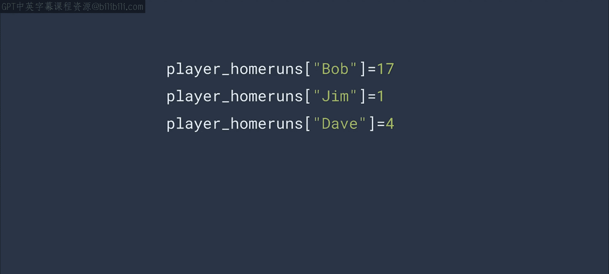

这是一种看起来和感觉上都像数组的数据结构，但其索引可以是任何值，而不仅仅是数字。所以，如果一个数组看起来像这样：
```python
array = [value1, value2, value3]
```
那么一个等效的哈希表看起来会是这样：
```python
hash_table = {"key1": value1, "key2": value2, "key3": value3}
```
虽然这样可读性更好，但对于追踪球员的本垒打数来说，这可能不是最佳解决方案。让我们考虑另一种方法。这实际上是一个常见的面试题。事实上，我在谷歌面试时就被问到了这个问题。

---

想象你有一个包含莎士比亚所有作品的数据集。你的任务是统计每个单词出现的次数。“the”出现了多少次，“ex ya”出现了多少次，“ans”出现了多少次，诸如此类。

现在，你可以看到算法是如何开始成形的。我们从那部苏格兰剧开始（你知道的，就是演员们因为迷信而不敢说出名字的那部）。它开头是这样的。第一个词是“thunder”，所以你可以用这样的哈希表来追踪出现次数。下一个词是“and”，所以你可以这样做。

这暗示了一个相当简单的算法。遍历所有单词。如果它存在于哈希表中，则将其值加一。如果不存在，则创建它并将其值设为一。

如果你对每个单词都这样做，你就会得到语料库中每个单词的计数。很简单，对吧？

算法之所以简单，是因为数据结构使之如此。在底层，Python的字典对象使用哈希函数将像“thunder”或“and”这样的单词转换为数值。

如果你要实现自己的哈希表，理解这样的哈希函数如何工作是很重要的，以避免冲突。例如，如果你在统计莎士比亚作品中的每个单词，而你的哈希函数给“thunder”和“and”赋予了相同的数值，那么这些单词的计数就会混在一起。

创建哈希函数超出了本课程的范围，但这是你在使代码达到生产级别时需要留意的事情。

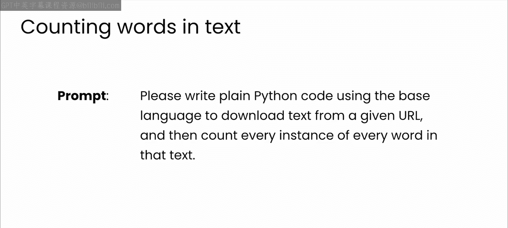

---

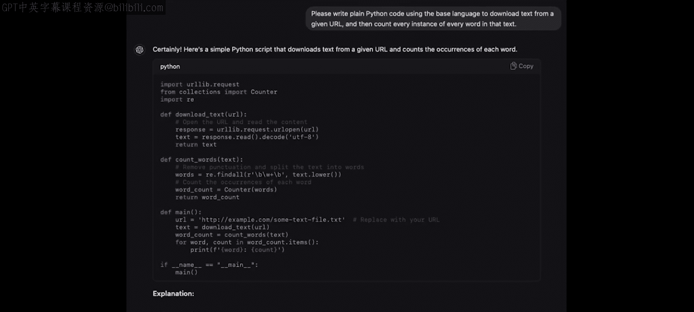

让我们探索这类数据结构，以及如何利用LLM作为你的编码伙伴，构建更大更好的实现。让我们从使用Python和哈希映射来解决类似前面提到的单词计数问题开始。

我将从一个提示开始。我要求模型编写Python代码，给定一个URL，脚本应下载该URL处的文本并统计每个单词的出现次数。

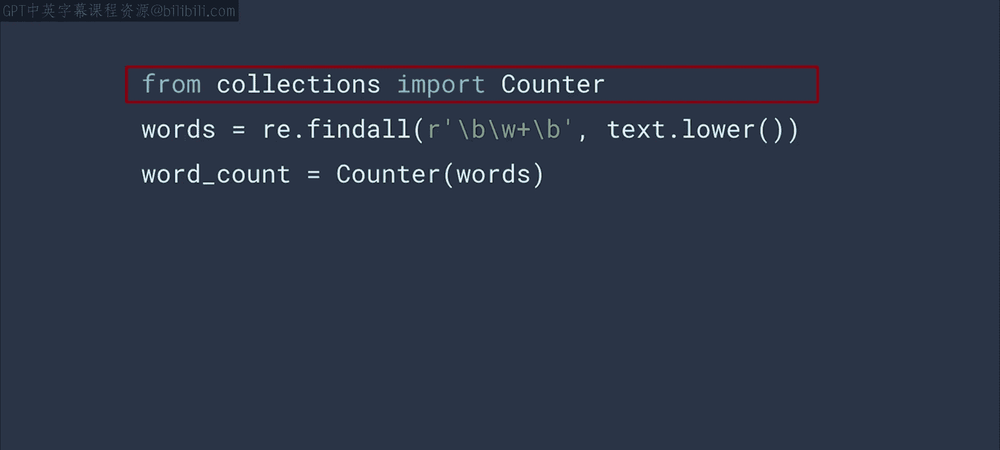

模型将返回类似你在这里看到的`count_words.py`中的Python代码。

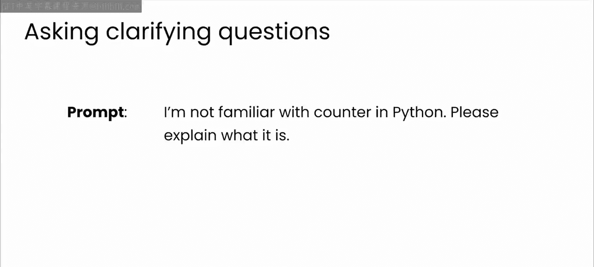

有趣的是，LLM从`collections`库中导入了一个名为`Counter`的类型。除非我是Python生态系统的深度专家，否则我可能不会知道这个，我可能会像之前那样直接开始手动编写自己的迭代器代码。

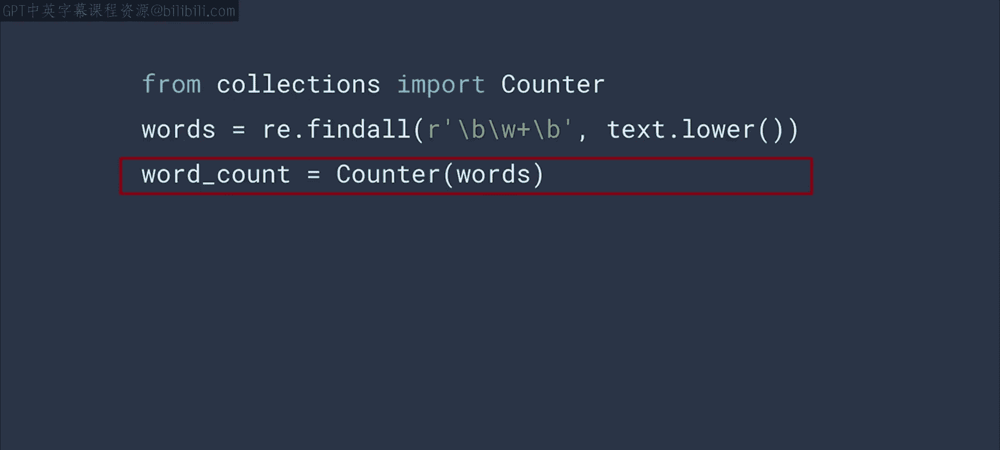

顺便说一下，这是一个很好的时机提醒你，如果LLM建议的代码你不熟悉，你总是可以要求它解释代码。

模型做的另一件事是使用正则表达式来查找每个单词的出现。这比我之前迭代文本的方式要整洁和快速得多。

得到的单词集合然后被传递给`Counter`，我们就得到了正确的结果。

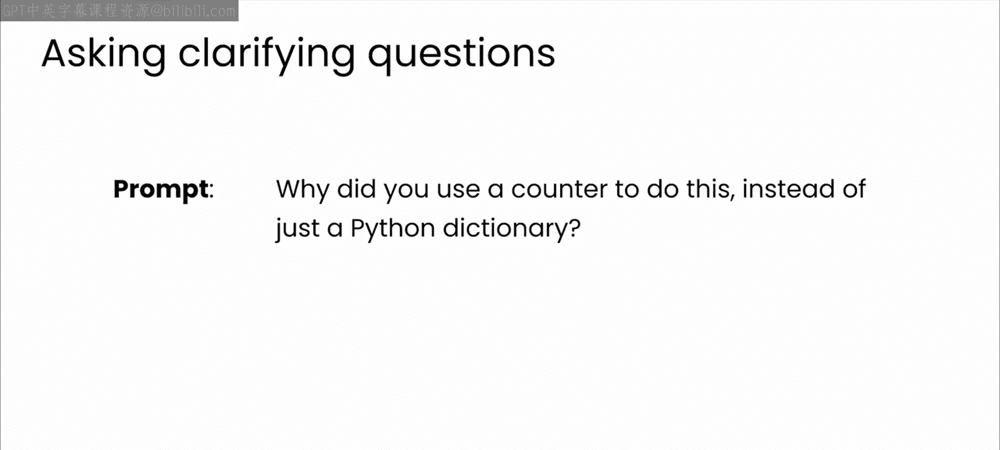

这很棒。LLM编写的代码可以工作，但你能信任它吗？`Counter`真的是最适合使用的数据结构吗？正则表达式真的比我预想的更快或更好吗？

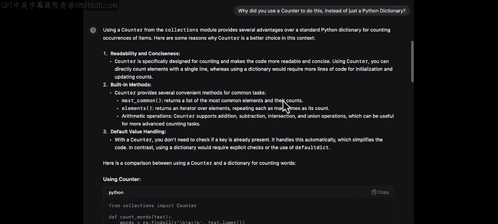

老实说，我不知道。我猜你可能也不知道。

所以让我们与LLM合作，检查这是否是最佳解决方案。从`Counter`开始。你可以直接问模型为什么使用它。

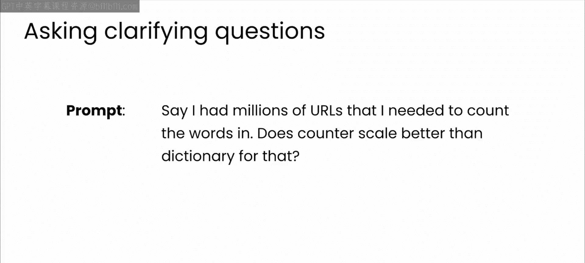

它给出的答案非常酷且有见地：可读性和简洁性，拥有内置方法和默认值处理，所以你不需要所有那些`if-else`代码。这很酷。

但我相信你现在已经意识到，总有一个后续问题。在这种情况下，再次是关于规模的问题。假设你在代码中使用`Counter`来统计一本书中的单词。

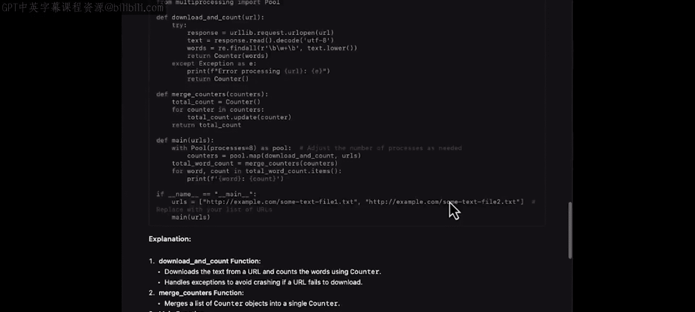

但如果你想统计数百万本书中的单词呢？另一个选择可能是字典，但`Counter`比字典扩展性更好吗？让我们问问模型的想法。

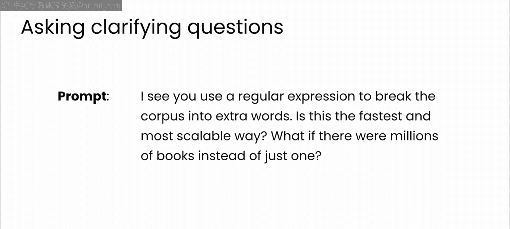

答案是，`Counter`是字典的一个子类。所以开销大致相同。它还支持一个合并函数，允许你合并计数器。例如，如果你在统计多本书，你可以为每本书创建一个计数器。完成后，你可以很容易地将它们全部合并。当然，受限于内存和空间，但那是另一个问题。

好的，现在多亏了LLM，你可以更有信心地使用`Counter`了。

但另一个问题是关于正则表达式的：那真的是查找所有单词最高效、扩展性最好的方式吗？

让我们问问。从回答中你会了解到，对于这个任务，使用基本的字符串方法可能更好，但文本必须相对干净并遵循一致的结构。例如，当有很多标点符号时，分割文本可能会非常困难。

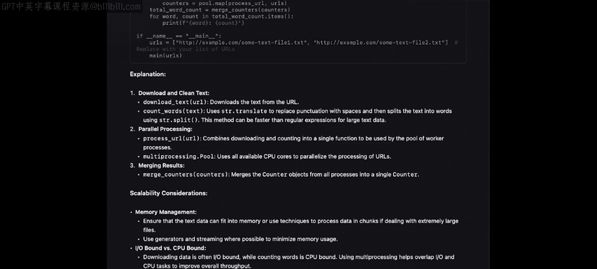

我认为这很大程度上取决于具体情况，根据你的数据，正则表达式可能更适合你。记住，没有放之四海而皆准的解决方案，运用你对自己系统的专业知识来理解问题至关重要。像这样与LLM合作可以产生一些很棒的想法，但它们不一定总是适合你特定系统的正确想法。

---

好的，现在你已经启动了一个基本的算法来统计作品中的单词。你开始使用Python中的一些基本库，如`Counter`和正则表达式来提供帮助。你甚至已经开始解决关于扩展到更大问题的典型后续问题——在这种情况下，统计所有英语作品中单词的出现次数。

你最终得到了类似课程仓库中`count_t2.py`那样的代码。看看代码，想想它的漏洞。还有其他可能有问题的地方吗？暂停视频片刻，探索一下代码。你怎么看？

我尝试用GPT Omni测试，它发现了六个潜在问题，而我只想到了三个。

第一个是未经验证的URL输入。没有验证或清理，所以你如何信任那个URL列表？对于真正的解决方案，你会有一个可能由网络爬虫生成的列表，这可能导致一系列新问题，尤其是作品可能重复。莎士比亚全集在许多不同的地方都有在线版本，所以你如何避免重复计数？还有，你如何避免列表中混入你不想索引或统计的内容？

第二个，也是稍微容易解决的问题，是错误处理。代码有一个捕获所有错误的`try-except`块，但这无助于你修复错误。我认为那里的代码可以做得更好。

第三个，对我来说，是正则表达式。它很简单，但也很晦涩。你需要对正则表达式语法有深入的了解才能确保它正常工作。这里的一个问题是健壮性。它可能无法处理所有类型的标点符号。

GPT还识别出了并发问题、资源管理和缺乏日志记录，这些我都没注意到。那么如何修复呢？很简单，问模型。你可以对你的代码做类似的事情。始终检查、测试、迭代、提问、探索并提示更多。

一个我甚至作为经验丰富的开发者都忽略的明显陷阱是：对服务器的请求没有设置超时，所以如果远程服务器没有响应，线程可能会挂起很长时间。

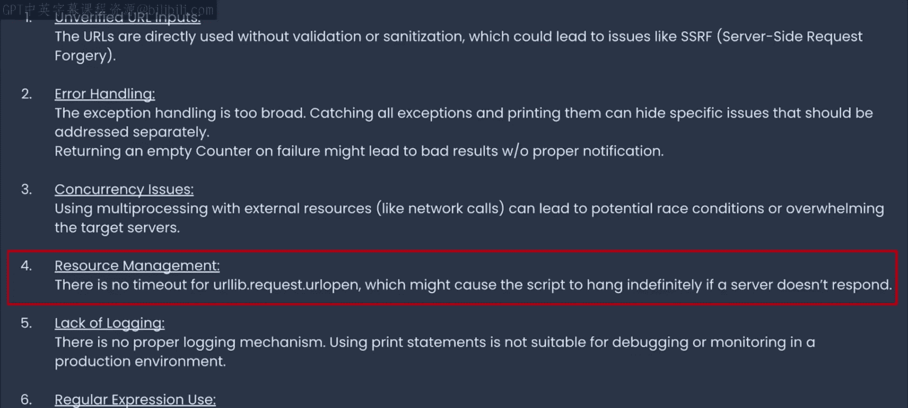

---

在解决了所有这些问题之后，你应该得到类似`count_text3.py`的东西，你可以在课程材料中下载。

我很想听听你像这样与LLM结对编程的经历。也许那里还有其他我们没有涉及到的陷阱。或者，尽管我反复提示改进，你仍然可能在该文件中发现问题。如果你发现了，请务必在课程社区页面分享。

至此，你已经为一个常见的计算机科学问题开发了一个相当健壮的解决方案。

但如果你一直跟着学，你可能知道我要建议什么了。那就是，看看像`count_text3.py`这样的代码，想想你接下来会做什么，如何让它变得更好？这部分我将留给你。

但请考虑这些你可以与你最喜欢的LLM合作完成的事情：
*   你可以为代码编写测试用例，也许尝试许多不同的URL。
*   你可以看看它对非英语语言的表现如何，正则表达式是否仍然有效。
*   你可以彻底地记录代码。
*   你可以重构代码以使其在另一种语言中工作——可以是编程语言，也可以是字符/单词集与英语不同的语言，比如日语。

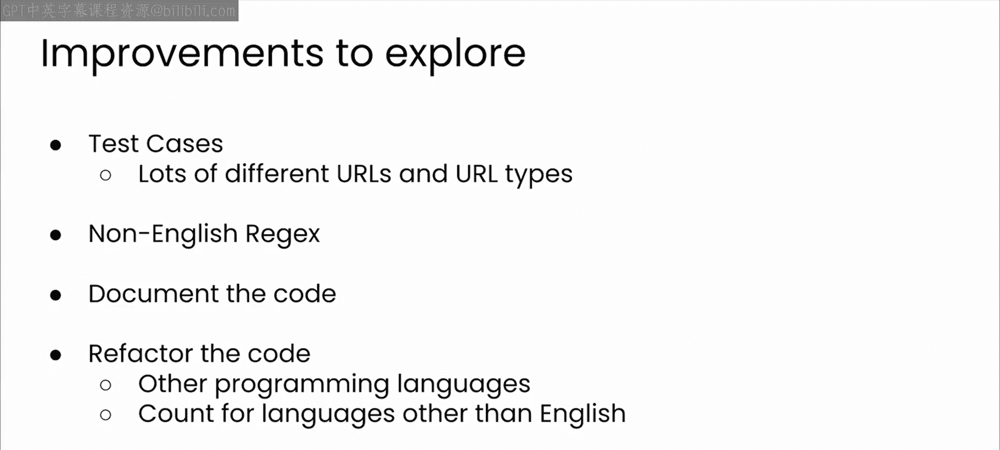

可能性太多了。

---

本节课中我们一起学习了哈希表的基本概念，并通过一个单词计数的实际案例，深入体验了如何与LLM结对编程。我们从简单的算法构思开始，利用LLM生成初始代码，然后不断质疑、测试和优化，最终构建了一个更健壮、考虑更周全的解决方案。这充分展示了将你的领域专业知识与LLM的广泛知识相结合，共同构建更好代码的强大力量。正如我在整个模块中强调的，LLM是思考你在编程面试中必须解决的那类问题的绝佳方式，请在学习和准备时善加利用。