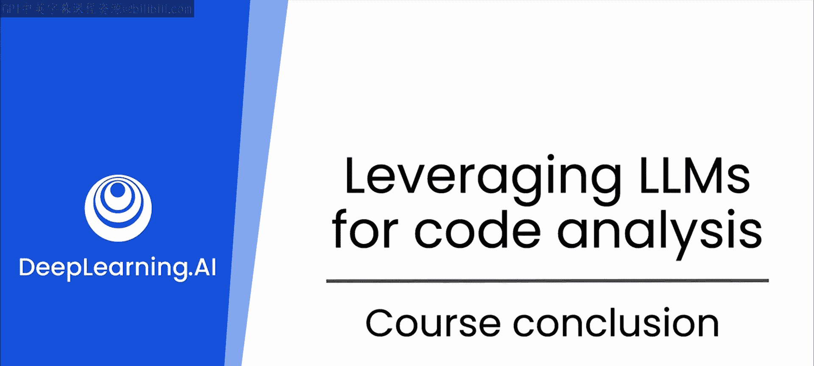

# 24：课程总结

在本节课中，我们将对《软件开发的生成式AI技能》这门课程进行全面的回顾与总结。我们将梳理从人工智能基础到生成式AI在软件开发中具体应用的核心知识脉络。

## 课程概述

本课程旨在帮助开发者掌握利用生成式AI提升软件开发效率与质量的技能。我们从基础概念出发，逐步深入到实际应用场景。

## 课程核心内容回顾

上一节我们探讨了数据结构在生成式AI辅助下的实践应用，现在让我们对整个课程的知识体系进行总结。

### 人工智能与机器学习基础

课程从人工智能的定义开始。你学习了什么是人工智能，以及机器学习如何使你能够构建具备人工智能的应用程序。

从那里，你进一步研究了机器学习如何实现这一目标，探索了不同类型的机器学习。这引导你理解了**Transformer**架构。

Transformer是支撑生成式AI（例如大型语言模型）的基础技术。

### 生成式AI在软件开发中的应用

生成式AI的一个核心能力是生成和分析源代码。你探索了如何利用这一能力来完成众多软件工程任务，这些任务远不止编码本身。

应用范围包括从编写文档到调试代码，以及更多其他方面。

### 提示工程技巧

接着，你深入学习了提示工程。你了解到，通过对提示词进行一些优化工作，就能从模型中获取最佳结果。

以下是优化提示词的一些关键技巧：
*   **具体明确**：给出清晰的指令。
*   **角色扮演**：让大型语言模型扮演特定角色。
*   **引入专业知识**：用你的专业知识来引导模型。
*   **提供反馈**：通过反馈帮助模型改进。

### 实践案例：数据结构

然后，你以数据结构作为一个绝佳案例，将这些技能付诸实践。课程选取了非常基础和核心的计算机科学概念。

但我们将这些概念延伸到了生产场景中，理解了如何扩展规模、评估漏洞、实现中的局限性、安全问题以及更多内容。这些知识对于软件工程面试也极为有用。

## 后续学习展望

你在这个专项课程中才刚刚起步。后续我们将更深入地探索如何将大型语言模型作为你的助手，从而成为一名更出色的开发者。

这包括如何使用和扩展数据、理解测试和测试用例，以及更多其他高级主题。

## 课程总结

本节课中，我们一起回顾了《软件开发的生成式AI技能》课程的全部核心内容。我们从人工智能与机器学习的基础讲起，认识了Transformer这一关键技术，并深入探讨了生成式AI在代码生成、文档编写、调试等软件开发全流程中的应用。我们重点学习了通过优化提示词来最大化模型效能的技巧，并以数据结构为例进行了实践。最后，我们展望了后续更深入的学习方向。很高兴能与你分享这段学习旅程，感谢你的参与。