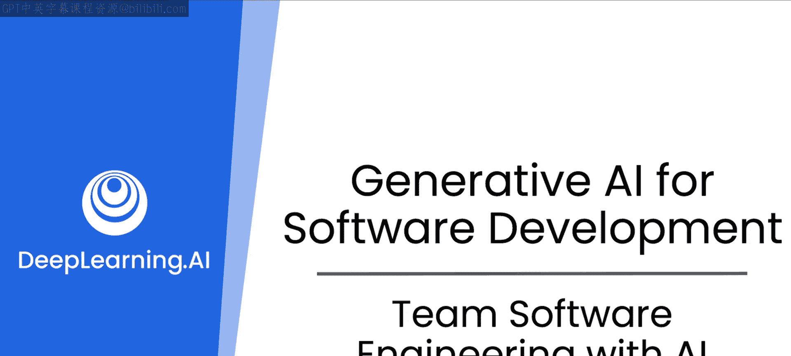

# 25：协作与代码维护

## 概述

在本节课中，我们将要学习生成式AI如何促进软件开发中的协作，并帮助解决代码在团队间传递时可能出现的痛点。我们将重点关注测试与调试、文档编写以及依赖管理这三个核心领域。

上一节课程介绍了生成式AI的基本工作原理，以及如何利用提示词原则和大型语言模型（LLM）来辅助完成软件开发任务并分析数据结构。本节中，我们来看看LLM如何润滑协作的齿轮，让你在与他人来回传递代码时，更好地处理那些可能成为痛点的事务。

## 核心内容

以下是本课程将重点关注的三个协作领域：

1.  **测试与调试**：帮助你编写测试用例，并协助你将测试用例移交给测试团队。
2.  **文档编写**：帮助你添加恰当的注释并进行正确的注释格式化，以便自动文档生成工具能将其转化为文档。
3.  **依赖管理**：帮助你不仅处理来自公司外部的第三方依赖，还能理解如何集成来自公司内部及与你合作的同事的依赖。

理想状态是拥有经过充分测试、文档完善的代码。但现实是，我们通常都很忙碌，难以始终达到我们期望并鼓励他人也达到的高标准。生成式AI在这方面提供了极大的帮助。

## 一个实际案例

我想分享一个关于代码共享的例子。我们合作开发过许多课程，这意味着我们需要与学习者共享代码。在其中一门关于TensorFlow移动应用（特别是iOS Swift应用）的课程中，我们遇到了一个典型问题。例如，在进行图像分类时，你需要将iOS上的`NSImage`数据结构转换为张量（Tensor），传递给TensorFlow Lite，再将返回的张量结果转换回原生数据格式。

我为此编写了一个简单的图像分类器代码。然而，在编写代码和教授课程之间的三周时间里，我完全忘记了这段代码的功能和原理。在LLM出现之前，我花了很长时间重新坐下来梳理和理解它。最近，在构建这门以LLM为结对编程伙伴的课程时，我尝试用LLM来处理那段代码。我成功地让它为代码生成了文档，并向我解释其工作原理——这已经是三年后的事了。这帮助我更好地理解了代码，LLM甚至发现并修复了代码中的一些问题。

当你与他人共享代码，或继承他人的代码时，身边有一个LLM来协助你理清思路，这种感觉非常棒。有人说，如果你太久没看自己的代码，那感觉就像是一个陌生人写的一样。在这个案例中，那个“陌生人”就是过去的自己。能够回顾并“批评”自己当初写得不够好，这本身就是一种进步。

## 机器学习代码的特殊性

我发现机器学习从业者（虽然并不以此为荣）的代码往往很复杂。部分原因在于机器学习具有很强的迭代性：我们尝试某种方法，看它是否有效，然后进行修改。当我们最终得到一个可工作的原型时，代码已经经历了比传统软件工程多得多的迭代。因此，有时文档会跟不上。我可能从某个云服务提供商的文档中复制了几行代码，一周后就完全不知道自己做了什么。如果能获得一些帮助来理解自己或他人的代码，那将非常受欢迎。很高兴听到你也这么说，我还以为只有我这样。

## 总结

本节课中，我们一起探讨了生成式AI如何通过辅助测试、调试、文档编写和依赖管理，使你成为一名更优秀的开发者，同时也成为团队中更出色的协作者。接下来，让我们进入下一个视频，具体看看这些功能是如何实现的。