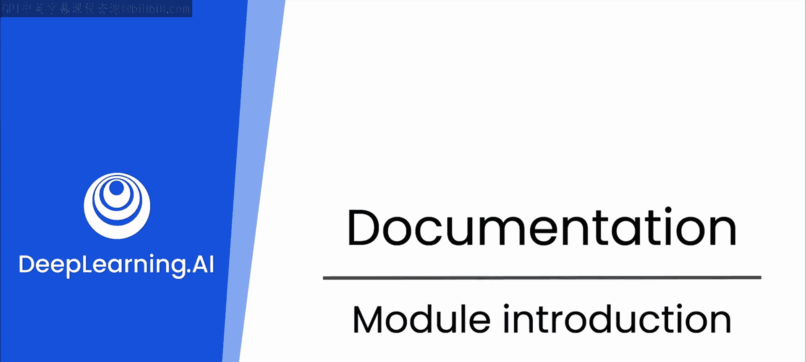
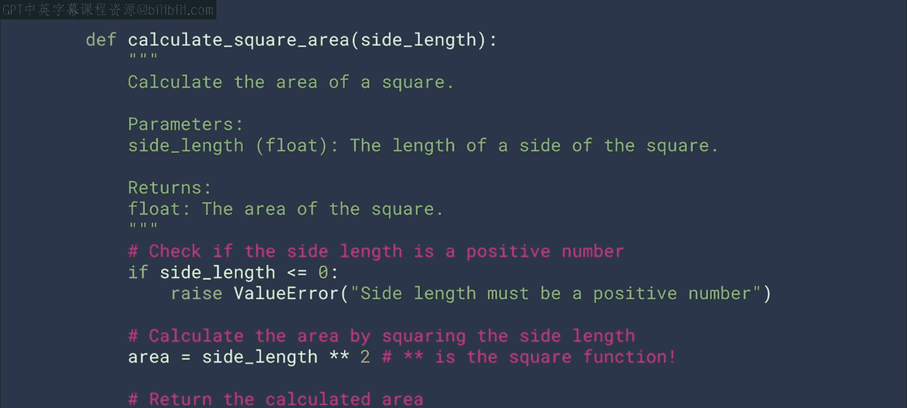
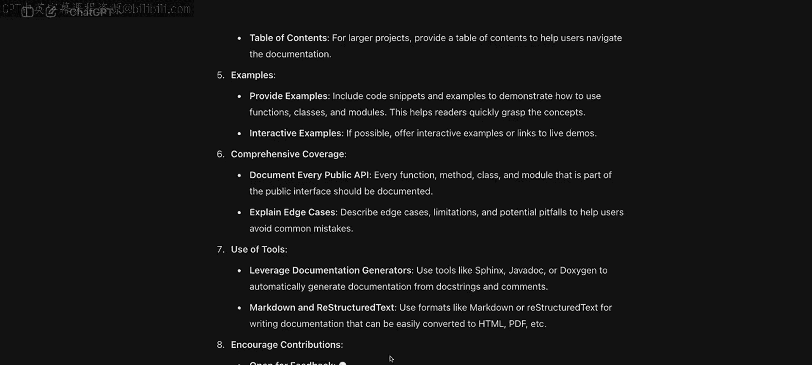

# 26：1_模块介绍 📚

在本模块中，我们将探讨文档在软件开发中的重要性。文档既是提升代码质量与易用性的手段，也是促进与团队成员及其他利益相关者沟通的工具。

## 概述

你可能认为编写文档很简单，只需写下解释代码功能的文字，记住注释的正确语法即可。从编程初期开始，我们就在做这件事。然而，尽管我们花费大量时间编写文档并自认为擅长，工作中仍常会遇到难以理解的代码。这是因为编写优秀的文档实际上是一门艺术。

关于优秀代码文档的标准存在多种观点。有人认为应尽可能精简，因为优美的代码不言自明；也有人倾向于在几乎每一行都添加注释，以确保代码意图没有歧义。

## 大语言模型的观点 🤖

如果你询问大语言模型（LLM）关于编写优秀代码文档的知识，它可能会生成一份包含多个要点的论述，类似以下内容：

以下是LLM可能提出的关于优秀文档的原则：

*   **优秀文档的原则**：例如清晰、准确、简洁。
*   **优秀写作的技巧**：使用主动语态、避免行话。
*   **文档的结构**：包含概述、使用说明、API参考等部分。
*   **面向特定受众**：为开发者、测试人员或最终用户调整内容。

显然，需要考虑的方面很多。

## 本模块学习路径

在接下来的几个视频中，我们将回归基础，深入思考两个核心问题：一是自行编写优秀文档的最佳实践，二是LLM如何能最有效地在此过程中为你提供支持。

毕竟，代码文档是与他人沟通的重要桥梁，无论是开发同事、代码测试员、安全专家，还是需要部署你代码的工程合作伙伴。你的文档越优秀，每个人的工作就会越轻松。

上一节我们介绍了文档的重要性与多样性观点，本节中我们来看看优秀文档的核心要素。

那么，让我们进入下一个视频，开始深入探讨究竟什么才是真正优秀的文档。

## 总结

本节课中我们一起学习了文档在软件开发中的核心价值，了解了关于文档风格的多种观点，并明确了本模块将聚焦于个人文档编写最佳实践以及如何利用LLM辅助文档创作。良好的文档是团队协作和项目成功的基石。