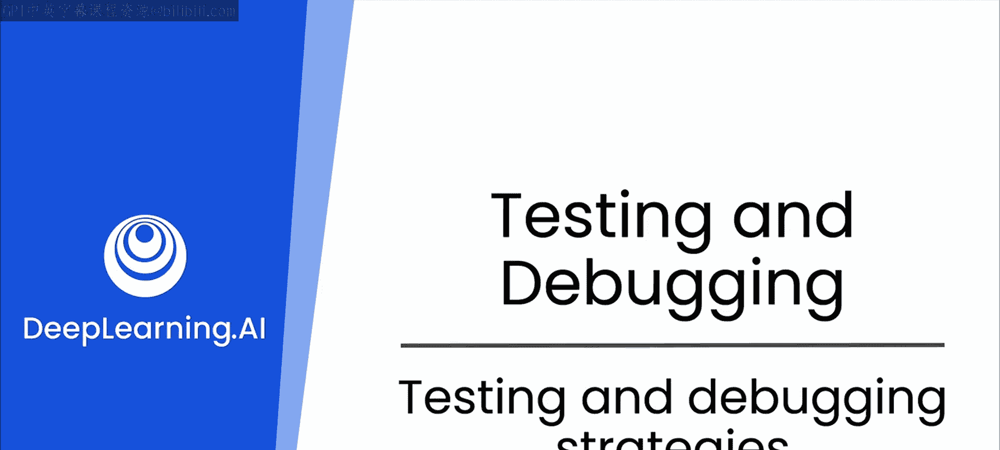
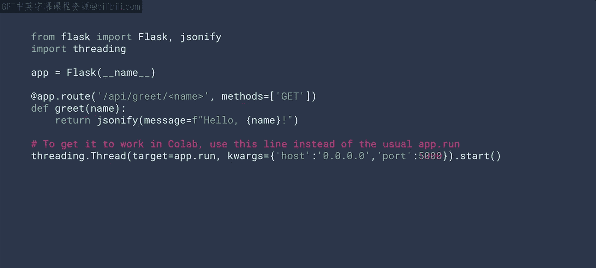
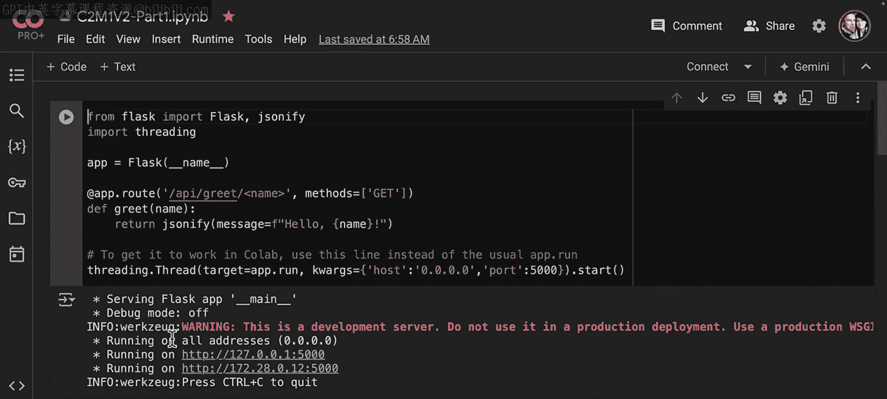
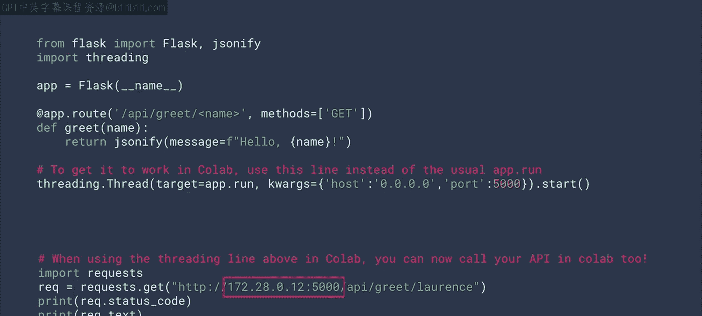
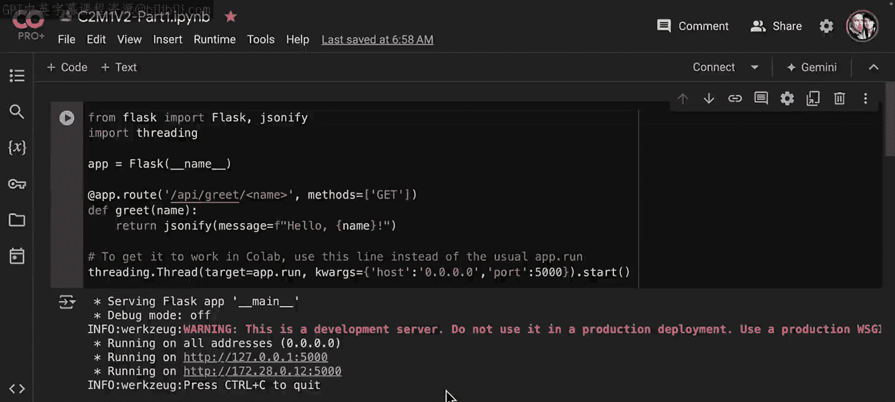
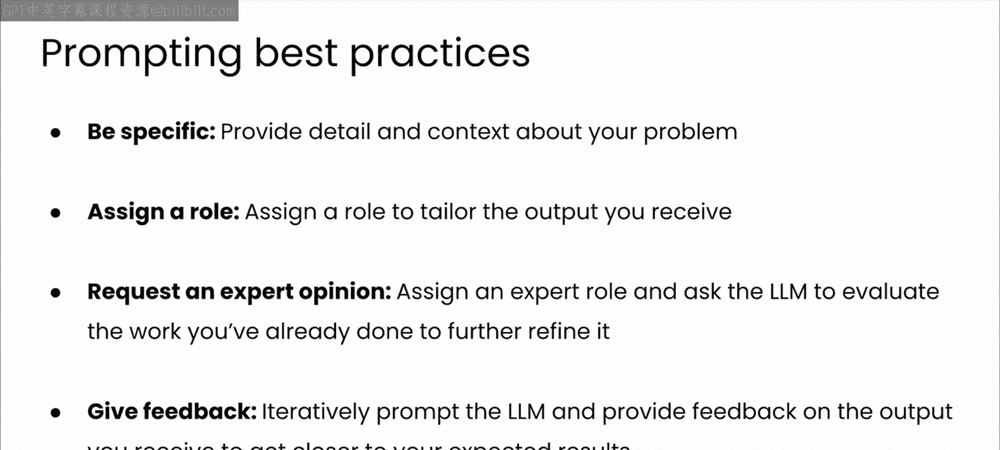
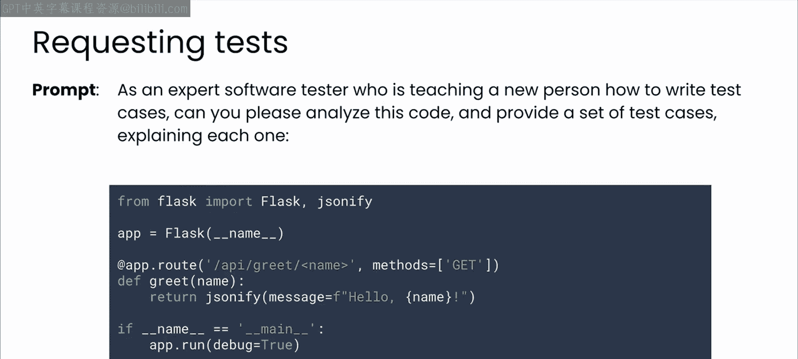
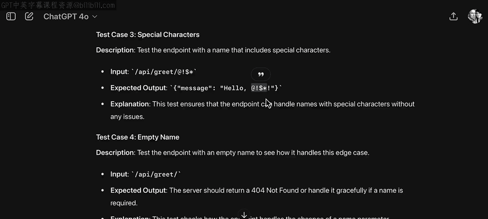
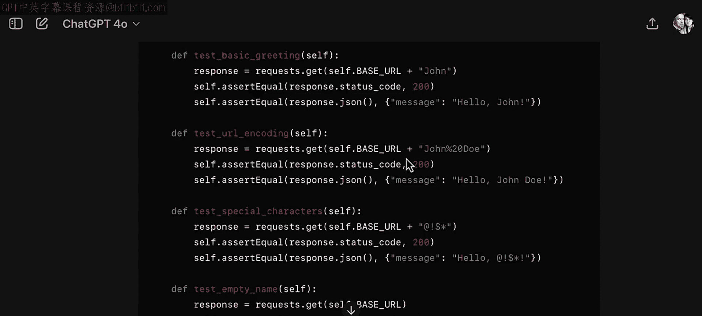
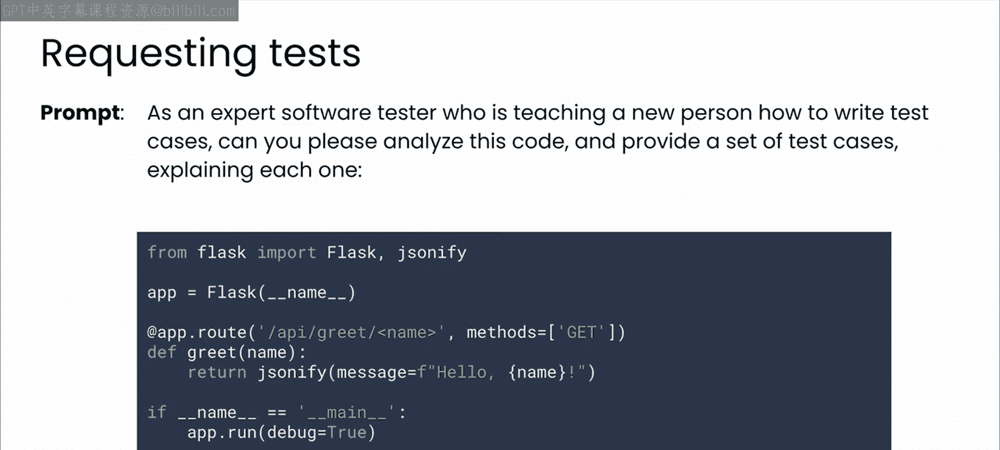

# 27：测试和调试策略 🧪



在本节课中，我们将学习如何利用大语言模型来构思测试策略。我们将从一个基础的Python Flask应用示例开始，逐步探讨如何与LLM协作，生成全面且实用的测试用例。

---

## 从基础示例开始

为了初步了解LLM如何帮助你思考测试策略，让我们从一个基础的Python示例开始。这是一个使用Flask框架的Web API应用。Flask是一个轻量级的Python Web框架，非常适合我们的演示。

让我们逐步分析这段代码，并仔细看看它是如何工作的。

这个应用只有一个端点：`/api/greet/<name>`。它会接收一个名字作为参数，并返回一条问候信息。

如果你在像CoLab这样的共享环境中运行它，需要稍作修改以使用线程。像Jupyter或CoLab这样的笔记环境，总是会先执行完当前单元格的代码，再继续下一个。因此，如果你想启动一个我们将要调用的API服务器，它确实需要在一个单独的线程中运行，这样你才能继续笔记本的其他部分。在生产环境中你可能不会这样做，但对于在笔记本中学习的目的来说，这完全没问题。

```python
# 示例Flask应用代码
from flask import Flask
import threading

app = Flask(__name__)





@app.route('/api/greet/<name>')
def greet(name):
    return f"Hello, 数据科学与人工智能笔记（一）!"

def run_app():
    app.run(host='0.0.0.0', port=5000, debug=False, use_reloader=False)



if __name__ == '__main__':
    # 在单独的线程中运行，适用于笔记本环境
    thread = threading.Thread(target=run_app)
    thread.start()
```

---

## 调用运行中的API

一旦你的API服务器运行起来，如果它在你的服务器上，你可以使用`curl`命令调用它。如果你想使用Python，可以像下面这样使用`requests`库。



```python
import requests

response = requests.get('http://YOUR_SERVER_IP:5000/api/greet/World')
print(response.text)
```

这将是你的服务器IP地址。

如果你在CoLab中使用线程代码运行，CoLab会向你报告服务器的地址。请确保使用报告给你的地址，而不是幻灯片中的地址。

---

## 构思测试用例

现在你的示例已经启动并运行，请暂停视频，思考一下你可能想为你的API使用哪些测试用例。

你会传入什么数据来检查它是否正常运行？你又如何能“破坏”它？



---

## 与LLM协作进行测试



希望你已经想出了一些主意。现在，我想让你尝试使用GPT或另一个LLM作为你的测试伙伴，看看它能提出什么建议。

在上一个课程中，你练习了使用一套提示词最佳实践来引导LLM输出你想要的内容。这里快速回顾一下：
*   你应该始终在提示词中保持具体，并提供关于你问题的细节和上下文。
*   为模型分配一个角色可以帮助其定制你收到的输出。
*   更进一步，要求模型表现得像专家一样并批判你的工作，可以帮助你获得非常具体且格式良好的输出。
*   最后，将你自己的专业知识融入其中，并与模型进行来回交流，可以帮助你引导LLM编写你确切需要和想要的代码。

考虑到这些最佳实践，以下是一个示例提示词，可以帮助你为那个简单的Web应用构思测试策略。

> **提示词示例**：作为一名正在教新人如何编写测试用例的专家软件测试员，你能分析这段代码并提供一组测试用例，并解释每一个吗？

---

## LLM生成的测试用例分析

以下是我使用这个提示词与GPT交互时得到的结果。请记住，LLM本质上是概率性的，所以你得到的确切输出将取决于许多因素，例如随机种子的变化或你使用的模型版本。

它查看了我的代码，分析了我的代码并理解了它，定义了它的功能。但更重要的是，它给了我测试用例。

以下是LLM建议的测试用例列表：

*   **基本问候功能**：测试端点 `/api/greet/John`，预期输出为 `"Hello, John!"`。
*   **URL编码处理**：测试传入包含空格的字符串，例如 `John%20Doe`（URL编码空格），预期输出应正确解码为 `"Hello, John Doe!"`。
*   **特殊字符**：测试传入包含特殊字符（如 `@`、`#`、`$`）的名字，检查API是否能正确处理或返回适当的错误/响应。
*   **空名字参数**：测试端点 `/api/greet/`（无名字参数），检查应用是否返回404错误或默认问候。
*   **数字输入**：测试传入纯数字作为名字，例如 `/api/greet/123`，检查处理方式。
*   **超长字符串**：测试传入非常长的字符串作为名字，检查应用性能或是否有输入长度限制。
*   **SQL注入尝试**：测试传入类似SQL注入的字符串（例如 `' OR '1'='1`），验证应用的安全性。
*   **跨站脚本尝试**：测试传入包含HTML或JavaScript标签的字符串，检查是否被正确转义或过滤。



所有这些都是在测试中需要考虑的重要边界情况。滚动到响应的底部，你可以看到模型还包含了每个测试用例的实现代码示例。



---

## 总结与过渡

本节课中，我们一起学习了如何利用LLM作为测试伙伴，为一个简单的Flask API生成全面的测试用例。我们从一个基础应用开始，通过赋予LLM“专家软件测试员”的角色并给出具体提示，获得了涵盖功能、边界条件、安全性的多种测试思路。

你在这里用来编写测试的提示词相当通用，没有指定任何特定的测试策略。例如，LLM在此处建议的测试主要关注功能，并且相当具有代表性，类似于你在早期开发阶段可能进行的手动探索性测试。



下一节中，我们将更详细地探讨探索性测试，特别是你如何利用LLM来帮助你和你的同事完成这个过程。