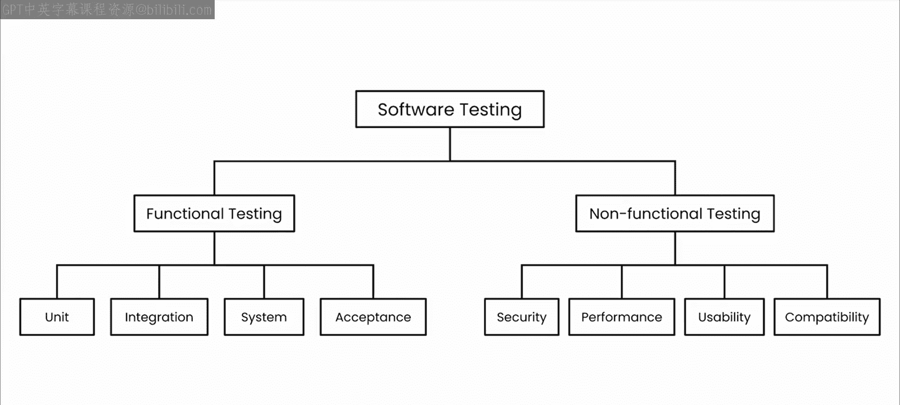
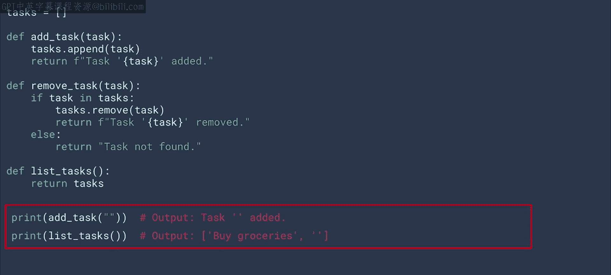
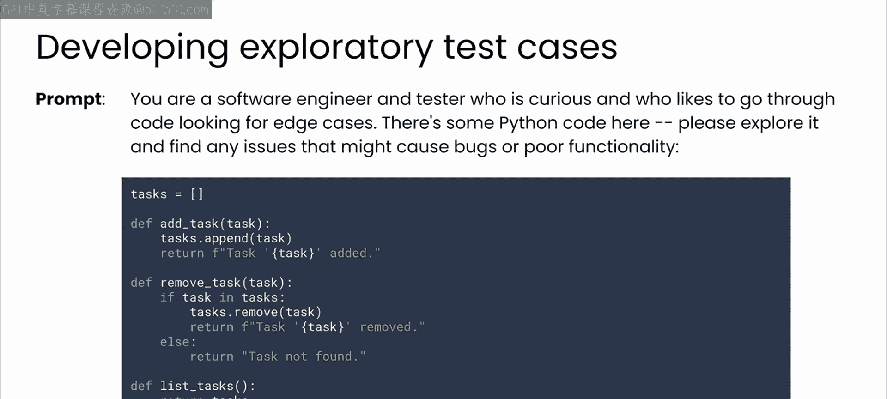
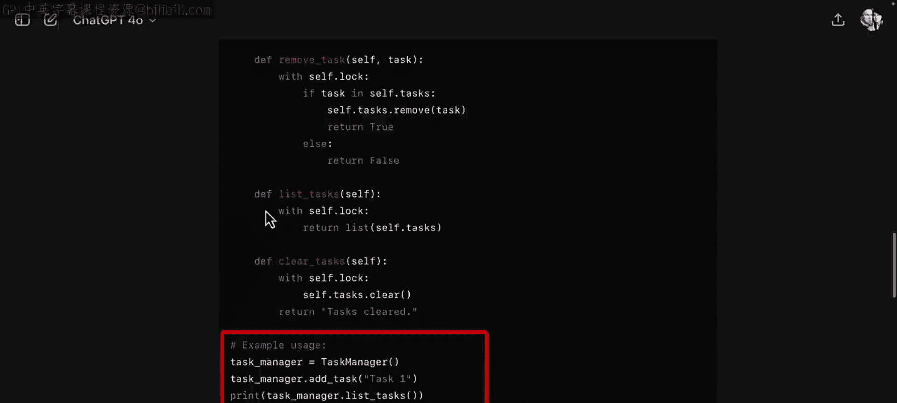

# 28：探索性测试 🧪

在本节课中，我们将学习探索性测试的概念，并了解如何利用大语言模型（LLM）来辅助实施这种测试策略。我们将通过一个简单的Python待办事项应用示例，演示如何发现潜在问题并改进代码。

## 概述

上一节视频我们讨论了测试中需要考虑和解决的诸多问题。即使是像Flask端点示例这样非常简单的应用，测试也至关重要。

在开发的早期阶段，你可能会专注于手动测试。你或测试人员可以直接与代码交互，无需自动化工具即可进行测试。测试人员将手动测试细分为许多子类型，因为这种特异性有助于创建更有效、更高效的测试流程。



通过与LLM合作，思考不同类型的测试活动，你可以让任何测试你代码的人的工作变得轻松得多。

## 什么是探索性测试？

探索性测试是一种相对非正式的测试模式，你在没有预定义测试用例的情况下，探索正在开发的应用。其目标是通过像用户一样使用应用程序来发现错误。这听起来可能有些随机，但确实如此。将自己置于用户的位置，以他们可能的方式操作，这非常有益。

为了理解探索性测试如何进行，我们将使用一个用Python构建的非常简单的待办事项应用程序。

以下是该应用程序的代码：

```python
tasks = []

def add_task(task):
    tasks.append(task)
    return f"Task '{task}' added."

def remove_task(task):
    if task in tasks:
        tasks.remove(task)
        return f"Task '{task}' removed."
    else:
        return f"Task '{task}' not found."

def list_tasks():
    if tasks:
        return "\n".join([f"{i+1}. {task}" for i, task in enumerate(tasks)])
    else:
        return "No tasks."
```

## 如何进行探索性测试？

如果你要使用这样的API，你会做哪些事情来测试它是否正常工作？

它的功能包括添加任务、删除任务和列出任务等，因此尝试每一项功能是合理的。

以下是示例使用代码。首先，你会添加一些任务，比如“骑自行车”、“买杂货”或“读书”。

```python
print(add_task("bike"))
print(add_task("groceries"))
print(add_task("read a book"))
```

然后，你会使用`list_tasks`方法来查看它们是否正确列出。

```python
print(list_tasks())
```

接着，你可能会尝试删除一个任务，然后再次检查任务列表，以验证任务是否被正确移除。



```python
print(remove_task("groceries"))
print(list_tasks())
```

这些是相当直接的测试，用于验证方法是否按预期工作。

## 测试边界情况

接下来，你可能会转向测试一些边界情况。例如，当你尝试删除一个不存在的任务时会发生什么？你可以看到`remove_task`方法应该告诉我们任务未找到，所以让我们测试并确认这一点。



```python
print(remove_task("non-existent task"))
```

现在，思考一些你可能尝试的其他用例。视频可以暂停，尝试自己编写代码。课程下载中提供了名为`task_manager.py`的代码，或者如果你不想自己编写，也可以用LLM生成一个类似的。

## 发现潜在问题

进行得如何？希望你想出了一些点子。有一个你可能发现的问题，它并不立即显而易见，那就是**可以添加一个空任务**。

```python
print(add_task(""))
```

然后，当你列出任务时，列表中会出现那个空位，这可能是你想要修复的问题。

```python
print(list_tasks())
```

## 探索性测试的本质

以上便是探索性测试的一些精髓。经验丰富的软件测试人员非常擅长这种自由形式的测试。

但在项目的早期阶段，你并不总是有专门的测试人员陪伴。那么，如果你尝试用LLM来帮助你复制刚才看到的过程，会发生什么呢？

## 利用LLM辅助探索性测试

在这个提示词中，我为LLM分配了两个角色：软件工程师和测试人员。我要求它探索代码中可能导致问题的潜在边界情况。如果我包含代码供其分析，我们来看看模型的回应。

以下是提示词示例：
> 你是一名软件工程师，同时也是一名测试人员。请分析以下Python待办事项管理代码，探索所有可能导致问题的边界情况，并提出改进建议。

让我们看看ChatGPT的回应。它发现了一些问题并提出了潜在的改进建议，例如：
*   **全局变量使用**：代码使用了全局列表`tasks`，如果模块被多次使用或在多线程环境中，可能会导致问题。
*   **函数返回类型不一致**：`remove_task`函数在任务未找到时返回字符串“Task not found”，但在找到时返回任务列表，这是不一致的。
*   **任务重复**：`add_task`函数在添加任务时不检查重复项。
*   **空任务处理**：不处理空任务或`None`值。
*   **线程安全**：当前的实现不是线程安全的。在多用户环境中，如果很多人使用它，对任务列表的修改可能会导致竞态条件。建议使用线程锁来确保线程安全。
*   **缺乏测试**：尽管本课程是关于测试的，但代码中没有包含任何测试。建议添加单元测试。

最终，它给出了一个修订版的代码，解决了上述问题，例如添加了线程处理、检查任务是否为空等。在底部，模型还包含了一些示例使用代码，看起来很像之前看到的人工编写的探索性测试代码：创建任务列表、添加任务、列出任务、删除任务，然后打印结果。

## 总结

如你所见，LLM非常擅长生成示例使用代码，这正是探索性测试的典型成果。以这种方式工作可以帮助你在流程早期识别边界情况和异常行为。通过带着测试意识进行开发，当你将代码传递给同事时，会让他们的工作更轻松。



手动测试的下一步是将探索性测试的结果形式化为一组功能测试。请在下一个视频中与我一起，看看LLM如何帮助你做到这一点。