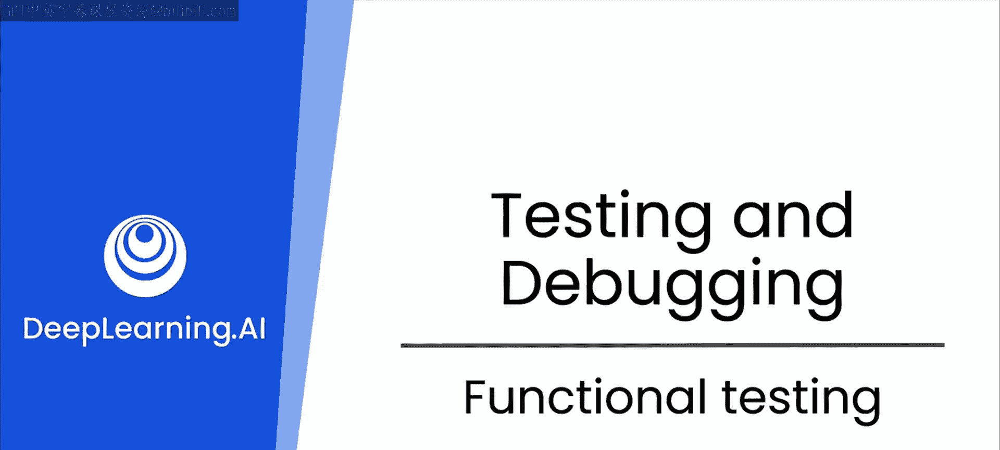
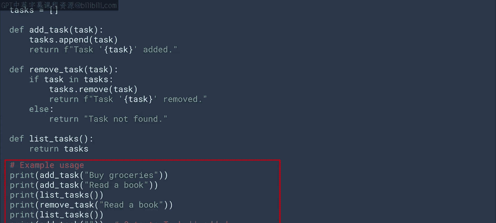
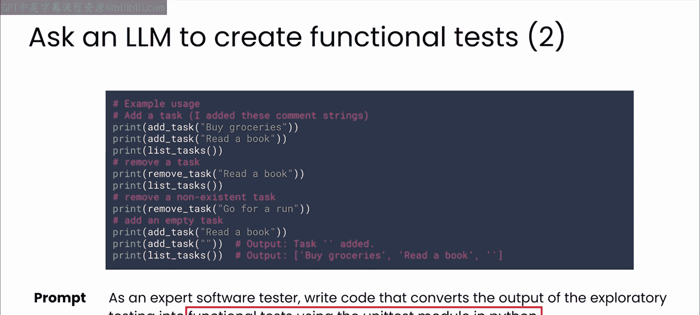
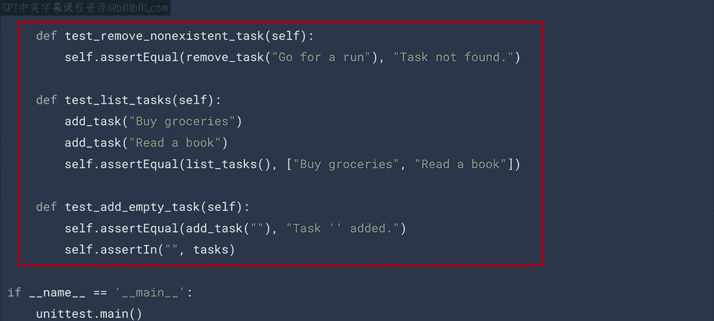
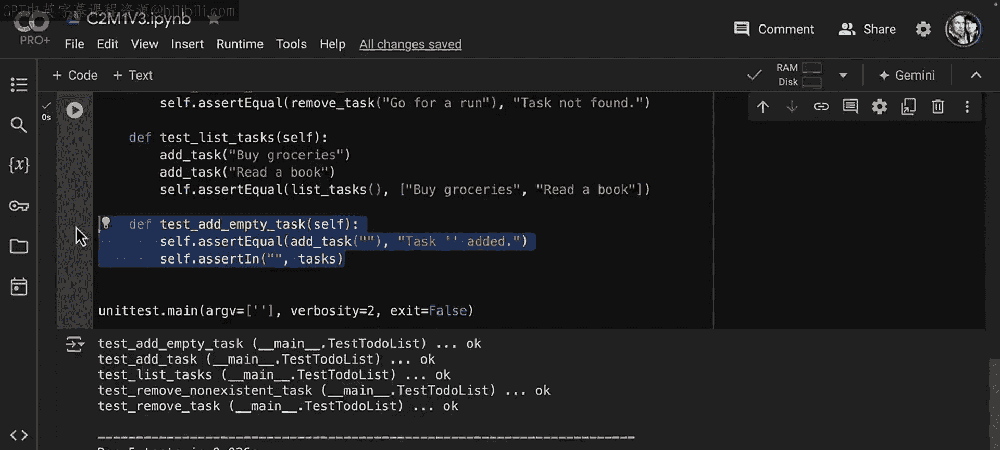
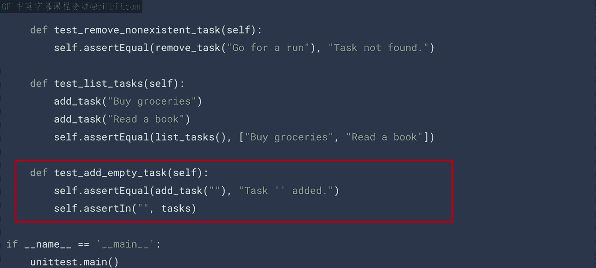
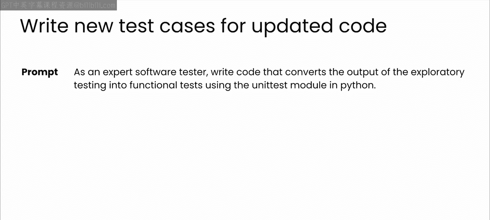

# 29：4_功能测试




在本节课中，我们将要学习功能测试。功能测试是手动探索性测试之后的逻辑步骤。它将探索性测试中用于检查代码是否按预期工作的部分提取出来，并赋予其结构，以便在后续自动化测试时发挥作用。

## 从探索性测试到功能测试 🚀



上一节我们介绍了手动探索性测试。本节中我们来看看如何将其转化为更有结构的功能测试。

在手动测试阶段结束时，你可能会得到一些简单的测试代码。以下是上一视频中待办事项列表应用的示例。

```python
# 示例：待办事项列表应用的使用代码
# 这段代码测试了应用的所有功能，并探索了一些边界情况。
```

这类代码可能由开发者、人工测试员编写，也可能由作为结对程序员的LLM（大语言模型）建议生成。



## 功能测试的目标与价值 🎯

功能测试的目标是根据预定义的需求检查应用程序的功能。这是验证应用程序是否正确运行并符合规范的关键步骤。

对于这种测试，你需要编写测试用例来确保代码的每个功能都按预期工作。LLM非常擅长此道。你可以向LLM提供你的代码和探索性测试得出的结果，并要求它应用一种结构，使其适用于更正式的测试。此时，你的专业知识可以帮助你快速获得所需代码，例如，通过指定你想使用 `unittest` 包来编写测试。

## 利用LLM生成结构化测试代码 🤖

当然，如果你不确定该使用哪个好的包，你可以随时与LLM交流，让它为你推荐选项。



以下是LLM编写的 `unittest` 代码。你可以看到多个测试用例，用于检查应用程序的不同功能。

```python
import unittest

class TestTodoList(unittest.TestCase):
    def setUp(self):
        # 在每个测试前重置任务列表，确保测试独立性
        self.tasks = []

    def test_add_task(self):
        # 测试成功添加任务
        result = add_task(self.tasks, "Buy groceries")
        self.assertEqual(result, "Task 'Buy groceries' added.")
        self.assertIn("Buy groceries", self.tasks)

    def test_remove_task(self):
        # 测试成功移除任务
        add_task(self.tasks, "Buy groceries")
        result = remove_task(self.tasks, "Buy groceries")
        self.assertEqual(result, "Task 'Buy groceries' removed.")
        self.assertNotIn("Buy groceries", self.tasks)

    def test_remove_nonexistent_task(self):
        # 测试移除不存在的任务
        result = remove_task(self.tasks, "Non-existent task")
        self.assertEqual(result, "Task 'Non-existent task' not found.")

    def test_list_tasks(self):
        # 测试正确列出任务
        add_task(self.tasks, "Task 1")
        add_task(self.tasks, "Task 2")
        result = list_tasks(self.tasks)
        expected_output = "Tasks:\n1. Task 1\n2. Task 2"
        self.assertEqual(result, expected_output)

    def test_add_empty_task(self):
        # 测试添加空任务
        result = add_task(self.tasks, "")
        self.assertEqual(result, "Task '' added.")
```

实际上，模型已经为你提示中给出的每个示例用例设计了一个测试。模型还创建了一个 `setUp` 方法，确保在每个测试前都从一个干净的状态开始。这很重要，可以避免不同测试之间的副作用。

*   **`test_add_task` 方法**：检查任务是否成功添加，然后验证它出现在任务列表中。
*   **`test_remove_task` 方法**：先添加任务，然后移除它，检查它是否从列表中移除。
*   **`test_remove_nonexistent_task` 方法**：验证尝试移除不存在的任务是否会返回正确的消息。
*   **`test_list_tasks` 方法**：检查任务列表是否正确返回。
*   **`test_add_empty_task` 方法**：检查应用程序是否处理添加空任务的情况。

## 运行测试并保持批判性思维 🧐

请记住，如果你对 `unittest` 模块的工作原理有任何疑问，一定要向LLM提出后续问题，以便理解代码并知道如何正确使用它。

下一步是尝试运行LLM编写的代码。像之前一样，我们有简单的任务列表和三个用于添加、移除和列出任务的函数。这里我们有一个新的类，旨在对该代码进行单元测试。这里有多个测试用例，如添加任务、移除任务、移除不存在的任务等。



运行这些测试后，查看结果，会发现所有测试都已通过。这看起来似乎是件好事。

但让我们思考一下这里实际发生了什么。我们可以看到，我正在测试添加一个空任务，并检查添加空任务是否返回“task '' added”，并且测试通过了。但从需求角度来看，如果我们正在构建一个任务列表，我们真的希望允许添加空任务吗？我认为答案应该是否定的。这个功能不是我们想要的。

这正是为什么手动测试、亲自探索、通读代码并思考测试用例最终变得非常有用的原因。因为归根结底，我们可能希望在这里添加一个检查，看看任务是否为空。如果任务为空，我们应该拒绝添加该任务，然后返回某种错误消息，然后我们的测试应该针对该错误消息进行测试。




## 测试用例的维护与更新 🔄

再次强调，这是一个很好的例子，说明单纯信任LLM可能会给你带来麻烦。这就是为什么我总是鼓励你不要变得懒惰，也不要过度依赖它们，即使它们变得越来越先进和强大。

此时，为了测试你自己，可以尝试暂停视频，更新待办事项列表代码，禁止添加空任务。完成后，继续更新测试用例，使其仅在尝试添加空任务时看到正确的错误返回时才通过。



还有一点很重要，随着应用程序的发展，需要维护和更新你的测试用例。当添加新功能或修改现有功能时，你应该编写新测试或更新现有测试以覆盖这些更改。这有助于确保你的应用程序随着时间的推移保持可靠性。而这项维护工作又是LLM可以成为你朋友的绝佳场所。你可以给它提供更新后的代码和当前的测试用例，让它帮助你找出如何更新你的测试用例，根据需要添加、编辑或删除。

## 总结 📝

本节课中我们一起学习了功能测试。功能测试确保你的应用程序在预定义条件下按预期运行。正确进行这些测试非常重要，因为你的许多同事，特别是那些负责在生产环境中维护你应用程序的同事，都依赖它们正常工作，以便有效地完成工作。

正如你所看到的，LLM在编写良好的手动测试方面非常有用，但仅靠这些永远不够。对于现实世界中的大型代码库，自动化测试至关重要。请继续观看下一个视频，了解LLM如何让你和你的整个团队更轻松地进行自动化测试。